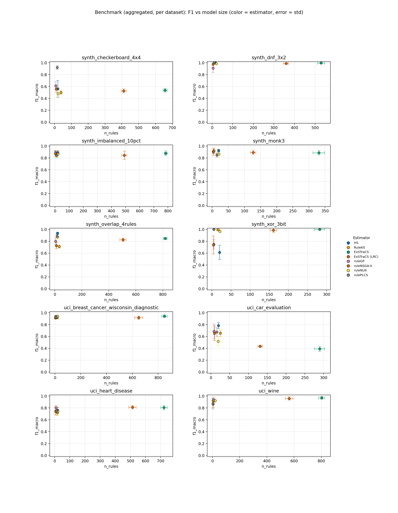
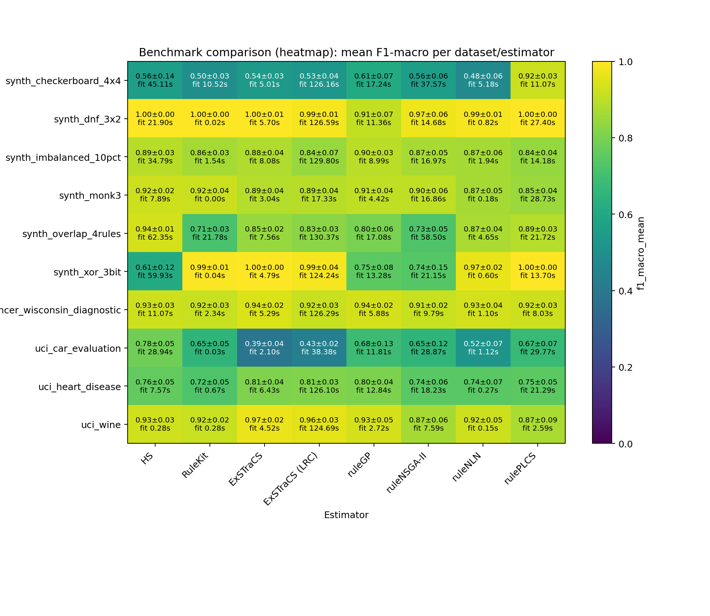

# ScoredRuleSets Revision Benchmark – Extended Replication Study (10 repeats)

## Summary

- **datasets**: `10`
- **estimators**: `8`
- **warning_runs**: `0`
- **warning_models**: `0`
- **top_1_model**: `synth_dnf_3x2 / RuleKit` (f1=1.0000, rules=11.0000, fit_s=0.0221)

## Configuration

- **datasets**: `sklearn_breast_cancer, sklearn_wine, uci_car_evaluation, uci_heart_disease, synth_dnf_3x2, synth_overlap_4rules, synth_monk3, synth_xor_3bit, synth_imbalanced_10pct, synth_checkerboard_4x4`
- **estimators**: `HS, RuleKit, ExSTraCS, ExSTraCS (LRC), ruleGP, ruleNLN, rulePLCS, ruleNSGA-II`
- **repeats**: `10`
- **timeout_seconds**: `300s`
- **design**: `8 Rule-Based Classifiers x 10 Datasets (4 real-world, 6 synthetic), 10 repeats`

## Artifacts

- **raw_csv**: [benchmark_results.csv](benchmark_results.csv)
- **raw_json**: [benchmark_results.json](benchmark_results.json)
- **aggregated_csv**: [benchmark_results_aggregated.csv](benchmark_results_aggregated.csv)
- **aggregated_json**: [benchmark_results_aggregated.json](benchmark_results_aggregated.json)
- **plot_png**: [benchmark_results.png](benchmark_results.png)
- **plot_pdf**: [benchmark_results.pdf](benchmark_results.pdf)
- **heatmap_png**: [benchmark_results_heatmap.png](benchmark_results_heatmap.png)
- **heatmap_pdf**: [benchmark_results_heatmap.pdf](benchmark_results_heatmap.pdf)
- **combined_heatmap_png**: [benchmark_results_heatmap_combined.png](benchmark_results_heatmap_combined.png)
- **combined_heatmap_pdf**: [benchmark_results_heatmap_combined.pdf](benchmark_results_heatmap_combined.pdf)
- **combined_dot_png**: [benchmark_results_combined_dot.png](benchmark_results_combined_dot.png)
- **combined_dot_pdf**: [benchmark_results_combined_dot.pdf](benchmark_results_combined_dot.pdf)
- **pareto_png**: [benchmark_results_pareto.png](benchmark_results_pareto.png)
- **pareto_pdf**: [benchmark_results_pareto.pdf](benchmark_results_pareto.pdf)
- **cd_png**: [benchmark_results_cd.png](benchmark_results_cd.png)
- **cd_pdf**: [benchmark_results_cd.pdf](benchmark_results_cd.pdf)
- **wtl_png**: [benchmark_results_wtl.png](benchmark_results_wtl.png)
- **wtl_pdf**: [benchmark_results_wtl.pdf](benchmark_results_wtl.pdf)
- **wtl_size_png**: [benchmark_results_wtl_size.png](benchmark_results_wtl_size.png)
- **wtl_size_pdf**: [benchmark_results_wtl_size.pdf](benchmark_results_wtl_size.pdf)
- **wtl_pareto_png**: [benchmark_results_wtl_pareto.png](benchmark_results_wtl_pareto.png)
- **wtl_pareto_pdf**: [benchmark_results_wtl_pareto.pdf](benchmark_results_wtl_pareto.pdf)
- **wtl_triangular_png**: [benchmark_results_wtl_triangular.png](benchmark_results_wtl_triangular.png)
- **wtl_triangular_pdf**: [benchmark_results_wtl_triangular.pdf](benchmark_results_wtl_triangular.pdf)
- **efficiency_png**: [benchmark_results_efficiency.png](benchmark_results_efficiency.png)
- **efficiency_pdf**: [benchmark_results_efficiency.pdf](benchmark_results_efficiency.pdf)
- **dual_cd_png**: [benchmark_results_dual_cd.png](benchmark_results_dual_cd.png)
- **dual_cd_pdf**: [benchmark_results_dual_cd.pdf](benchmark_results_dual_cd.pdf)
- **rank2d_png**: [benchmark_results_rank2d.png](benchmark_results_rank2d.png)
- **rank2d_pdf**: [benchmark_results_rank2d.pdf](benchmark_results_rank2d.pdf)

## Plot Preview

_Heatmap add-on: compact overview of aggregated F1 values and fit times per dataset/estimator._

## Notes

- Paper Benchmark: 7 rule-based classifiers on 10 selected datasets.
- Real-world datasets: sklearn_breast_cancer, sklearn_wine, uci_car_evaluation, uci_heart_disease.
- Synthetic datasets chosen for concept diversity: DNF rules, overlapping rules, MONK-3 noise, XOR/parity, class imbalance, geometric complexity.
- ExSTraCS (LRC) applies Lossy Rule Compaction post-hoc (interval merge + conservative pruning; 0-6% F1 loss, 29-98% rule reduction).
- Timeout per run: 300s. 10 repeats, random_state=42.

## Top per Dataset

### synth_dnf_3x2

- **best_model**: `RuleKit` (f1=1.0000, rules=11.0000, fit_s=0.0221)
- **smallest_model**: `ruleNSGA-II` (rules=4.7000, atoms=5.9000, f1=0.9733)
- **fastest_model**: `RuleKit` (fit_s=0.0221, f1=1.0000, rules=11.0000)

### synth_xor_3bit

- **best_model**: `ExSTraCS` (f1=1.0000, rules=281.8000, fit_s=4.7859)
- **smallest_model**: `ruleNSGA-II` (rules=3.9000, atoms=6.3000, f1=0.7379)
- **fastest_model**: `RuleKit` (fit_s=0.0437, f1=0.9936, rules=16.1000)

### uci_wine

- **best_model**: `ExSTraCS` (f1=0.9694, rules=802.5000, fit_s=4.5188)
- **smallest_model**: `rulePLCS` (rules=3.6000, atoms=10.4000, f1=0.8711)
- **fastest_model**: `ruleNLN` (fit_s=0.1528, f1=0.9231, rules=21.0000)

### uci_breast_cancer_wisconsin_diagnostic

- **best_model**: `ExSTraCS` (f1=0.9416, rules=849.3000, fit_s=5.2949)
- **smallest_model**: `ruleNSGA-II` (rules=4.2000, atoms=4.4000, f1=0.9148)
- **fastest_model**: `ruleNLN` (fit_s=1.1004, f1=0.9322, rules=21.0000)

### synth_overlap_4rules

- **best_model**: `HS` (f1=0.9364, rules=20.0000, fit_s=62.3549)
- **smallest_model**: `ruleGP` (rules=5.8000, atoms=6.8000, f1=0.7991)
- **fastest_model**: `ruleNLN` (fit_s=4.6480, f1=0.8723, rules=21.0000)

### synth_monk3

- **best_model**: `HS` (f1=0.9228, rules=20.0000, fit_s=7.8922)
- **smallest_model**: `ruleGP` (rules=3.2000, atoms=3.5000, f1=0.9062)
- **fastest_model**: `RuleKit` (fit_s=0.0044, f1=0.9203, rules=5.5000)

### synth_checkerboard_4x4

- **best_model**: `rulePLCS` (f1=0.9215, rules=16.0000, fit_s=11.0727)
- **smallest_model**: `ruleGP` (rules=7.7000, atoms=10.0000, f1=0.6125)
- **fastest_model**: `ExSTraCS` (fit_s=5.0140, f1=0.5364, rules=656.8000)

### synth_imbalanced_10pct

- **best_model**: `ruleGP` (f1=0.8953, rules=3.4000, fit_s=8.9930)
- **smallest_model**: `ruleGP` (rules=3.4000, atoms=3.1000, f1=0.8953)
- **fastest_model**: `RuleKit` (fit_s=1.5363, f1=0.8639, rules=4.6000)

### uci_heart_disease

- **best_model**: `ExSTraCS (LRC)` (f1=0.8111, rules=513.7000, fit_s=126.0986)
- **smallest_model**: `ruleNSGA-II` (rules=6.0000, atoms=7.4000, f1=0.7426)
- **fastest_model**: `ruleNLN` (fit_s=0.2741, f1=0.7435, rules=21.0000)

### uci_car_evaluation

- **best_model**: `HS` (f1=0.7838, rules=20.0000, fit_s=28.9386)
- **smallest_model**: `ruleGP` (rules=8.4000, atoms=8.5000, f1=0.6842)
- **fastest_model**: `RuleKit` (fit_s=0.0346, f1=0.6549, rules=25.0000)

## Pareto Front (F1 vs Model Size)

### synth_dnf_3x2

| estimator | f1_mean | atoms | rules |
| --- | ---: | ---: | ---: |
| HS | 1.0000 | 18.0000 | 15.0000 |
| ruleNSGA-II | 0.9733 | 5.9000 | 4.7000 |

### synth_xor_3bit

| estimator | f1_mean | atoms | rules |
| --- | ---: | ---: | ---: |
| ExSTraCS | 1.0000 | 1144.0000 | 281.8000 |
| rulePLCS | 0.9994 | 13.5000 | 5.1000 |
| ruleGP | 0.7490 | 7.2000 | 5.3000 |
| ruleNSGA-II | 0.7379 | 6.3000 | 3.9000 |

### uci_wine

| estimator | f1_mean | atoms | rules |
| --- | ---: | ---: | ---: |
| ExSTraCS | 0.9694 | 7064.4000 | 802.5000 |
| ExSTraCS (LRC) | 0.9590 | 3685.9000 | 563.7000 |
| ruleGP | 0.9346 | 4.6000 | 5.3000 |
| ruleNSGA-II | 0.8650 | 3.4000 | 4.1000 |

### uci_breast_cancer_wisconsin_diagnostic

| estimator | f1_mean | atoms | rules |
| --- | ---: | ---: | ---: |
| ExSTraCS | 0.9416 | 8546.2000 | 849.3000 |
| ruleGP | 0.9357 | 5.4000 | 5.9000 |
| ruleNSGA-II | 0.9148 | 4.4000 | 4.2000 |

### synth_overlap_4rules

| estimator | f1_mean | atoms | rules |
| --- | ---: | ---: | ---: |
| HS | 0.9364 | 48.7000 | 20.0000 |
| ruleGP | 0.7991 | 6.8000 | 5.8000 |

### synth_monk3

| estimator | f1_mean | atoms | rules |
| --- | ---: | ---: | ---: |
| HS | 0.9228 | 29.5000 | 20.0000 |
| RuleKit | 0.9203 | 10.1000 | 5.5000 |
| ruleGP | 0.9062 | 3.5000 | 3.2000 |

### synth_checkerboard_4x4

| estimator | f1_mean | atoms | rules |
| --- | ---: | ---: | ---: |
| rulePLCS | 0.9215 | 54.8000 | 16.0000 |
| ruleGP | 0.6125 | 10.0000 | 7.7000 |

### synth_imbalanced_10pct

| estimator | f1_mean | atoms | rules |
| --- | ---: | ---: | ---: |
| ruleGP | 0.8953 | 3.1000 | 3.4000 |

### uci_heart_disease

| estimator | f1_mean | atoms | rules |
| --- | ---: | ---: | ---: |
| ExSTraCS (LRC) | 0.8111 | 2158.1000 | 513.7000 |
| ruleGP | 0.8046 | 8.4000 | 8.5000 |
| ruleNSGA-II | 0.7426 | 7.4000 | 6.0000 |

### uci_car_evaluation

| estimator | f1_mean | atoms | rules |
| --- | ---: | ---: | ---: |
| HS | 0.7838 | 32.9000 | 20.0000 |
| ruleGP | 0.6842 | 8.5000 | 8.4000 |

## Leaderboard

| rank | dataset | estimator | repeats | f1_mean | f1_err | fit_s | rules | atoms |
| ---: | --- | --- | ---: | ---: | ---: | ---: | ---: | ---: |
| 1 | synth_dnf_3x2 | RuleKit | 10 | 1.0000 | 0.0000 | 0.0221 | 11.0000 | 26.0000 |
| 2 | synth_xor_3bit | ExSTraCS | 10 | 1.0000 | 0.0000 | 4.7859 | 281.8000 | 1144.0000 |
| 3 | synth_dnf_3x2 | HS | 10 | 1.0000 | 0.0000 | 21.9010 | 15.0000 | 18.0000 |
| 4 | synth_dnf_3x2 | rulePLCS | 10 | 1.0000 | 0.0000 | 27.4015 | 9.0000 | 25.3000 |
| 5 | synth_xor_3bit | rulePLCS | 10 | 0.9994 | 0.0019 | 13.6972 | 5.1000 | 13.5000 |
| 6 | synth_dnf_3x2 | ExSTraCS | 10 | 0.9961 | 0.0050 | 5.6963 | 529.6000 | 1779.3000 |
| 7 | synth_xor_3bit | RuleKit | 10 | 0.9936 | 0.0146 | 0.0437 | 16.1000 | 51.7000 |
| 8 | synth_dnf_3x2 | ExSTraCS (LRC) | 10 | 0.9882 | 0.0115 | 126.5863 | 359.5000 | 1245.4000 |
| 9 | synth_dnf_3x2 | ruleNLN | 10 | 0.9859 | 0.0116 | 0.8150 | 21.0000 | 58.5000 |
| 10 | synth_xor_3bit | ExSTraCS (LRC) | 10 | 0.9859 | 0.0398 | 124.2436 | 160.9000 | 428.7000 |
| 11 | synth_dnf_3x2 | ruleNSGA-II | 10 | 0.9733 | 0.0564 | 14.6783 | 4.7000 | 5.9000 |
| 12 | uci_wine | ExSTraCS | 10 | 0.9694 | 0.0227 | 4.5188 | 802.5000 | 7064.4000 |
| 13 | synth_xor_3bit | ruleNLN | 10 | 0.9672 | 0.0211 | 0.5999 | 21.0000 | 70.1000 |
| 14 | uci_wine | ExSTraCS (LRC) | 10 | 0.9590 | 0.0282 | 124.6922 | 563.7000 | 3685.9000 |
| 15 | uci_breast_cancer_wisconsin_diagnostic | ExSTraCS | 10 | 0.9416 | 0.0226 | 5.2949 | 849.3000 | 8546.2000 |
| 16 | synth_overlap_4rules | HS | 10 | 0.9364 | 0.0143 | 62.3549 | 20.0000 | 48.7000 |
| 17 | uci_breast_cancer_wisconsin_diagnostic | ruleGP | 10 | 0.9357 | 0.0203 | 5.8757 | 5.9000 | 5.4000 |
| 18 | uci_wine | ruleGP | 10 | 0.9346 | 0.0470 | 2.7221 | 5.3000 | 4.6000 |
| 19 | uci_breast_cancer_wisconsin_diagnostic | ruleNLN | 10 | 0.9322 | 0.0433 | 1.1004 | 21.0000 | 106.4000 |
| 20 | uci_wine | HS | 10 | 0.9274 | 0.0307 | 0.2787 | 8.8000 | 12.4000 |
| 21 | uci_breast_cancer_wisconsin_diagnostic | HS | 10 | 0.9252 | 0.0291 | 11.0686 | 18.2000 | 32.8000 |
| 22 | uci_breast_cancer_wisconsin_diagnostic | rulePLCS | 10 | 0.9240 | 0.0276 | 8.0335 | 8.3000 | 37.0000 |
| 23 | uci_wine | ruleNLN | 10 | 0.9231 | 0.0491 | 0.1528 | 21.0000 | 106.5000 |
| 24 | synth_monk3 | HS | 10 | 0.9228 | 0.0236 | 7.8922 | 20.0000 | 29.5000 |
| 25 | synth_checkerboard_4x4 | rulePLCS | 10 | 0.9215 | 0.0344 | 11.0727 | 16.0000 | 54.8000 |
| 26 | synth_monk3 | RuleKit | 10 | 0.9203 | 0.0446 | 0.0044 | 5.5000 | 10.1000 |
| 27 | uci_breast_cancer_wisconsin_diagnostic | RuleKit | 10 | 0.9173 | 0.0304 | 2.3361 | 7.4000 | 18.6000 |
| 28 | uci_wine | RuleKit | 10 | 0.9171 | 0.0194 | 0.2756 | 5.2000 | 10.7000 |
| 29 | uci_breast_cancer_wisconsin_diagnostic | ExSTraCS (LRC) | 10 | 0.9163 | 0.0289 | 126.2931 | 649.1000 | 6587.7000 |
| 30 | uci_breast_cancer_wisconsin_diagnostic | ruleNSGA-II | 10 | 0.9148 | 0.0178 | 9.7874 | 4.2000 | 4.4000 |
| 31 | synth_dnf_3x2 | ruleGP | 10 | 0.9081 | 0.0729 | 11.3556 | 4.9000 | 5.9000 |
| 32 | synth_monk3 | ruleGP | 10 | 0.9062 | 0.0390 | 4.4231 | 3.2000 | 3.5000 |
| 33 | synth_monk3 | ruleNSGA-II | 10 | 0.9033 | 0.0601 | 16.8562 | 3.5000 | 4.6000 |
| 34 | synth_imbalanced_10pct | ruleGP | 10 | 0.8953 | 0.0342 | 8.9930 | 3.4000 | 3.1000 |
| 35 | synth_monk3 | ExSTraCS (LRC) | 10 | 0.8914 | 0.0397 | 17.3252 | 127.1000 | 178.1000 |
| 36 | synth_imbalanced_10pct | HS | 10 | 0.8910 | 0.0304 | 34.7948 | 20.0000 | 33.0000 |
| 37 | synth_overlap_4rules | rulePLCS | 10 | 0.8883 | 0.0256 | 21.7158 | 16.0000 | 76.5000 |
| 38 | synth_monk3 | ExSTraCS | 10 | 0.8871 | 0.0368 | 3.0409 | 330.7000 | 1007.2000 |
| 39 | synth_imbalanced_10pct | ExSTraCS | 10 | 0.8797 | 0.0383 | 8.0778 | 785.0000 | 6975.0000 |
| 40 | synth_overlap_4rules | ruleNLN | 10 | 0.8723 | 0.0431 | 4.6480 | 21.0000 | 83.5000 |
| 41 | uci_wine | rulePLCS | 10 | 0.8711 | 0.0899 | 2.5940 | 3.6000 | 10.4000 |
| 42 | synth_imbalanced_10pct | ruleNSGA-II | 10 | 0.8697 | 0.0488 | 16.9741 | 3.6000 | 4.3000 |
| 43 | synth_imbalanced_10pct | ruleNLN | 10 | 0.8666 | 0.0641 | 1.9376 | 21.0000 | 82.6000 |
| 44 | synth_monk3 | ruleNLN | 10 | 0.8665 | 0.0514 | 0.1786 | 21.0000 | 71.4000 |
| 45 | uci_wine | ruleNSGA-II | 10 | 0.8650 | 0.0583 | 7.5947 | 4.1000 | 3.4000 |
| 46 | synth_imbalanced_10pct | RuleKit | 10 | 0.8639 | 0.0341 | 1.5363 | 4.6000 | 7.6000 |
| 47 | synth_monk3 | rulePLCS | 10 | 0.8495 | 0.0368 | 28.7305 | 14.6000 | 57.3000 |
| 48 | synth_overlap_4rules | ExSTraCS | 10 | 0.8476 | 0.0177 | 7.5636 | 817.6000 | 5993.8000 |
| 49 | synth_imbalanced_10pct | ExSTraCS (LRC) | 10 | 0.8448 | 0.0700 | 129.7972 | 491.2000 | 4552.8000 |
| 50 | synth_imbalanced_10pct | rulePLCS | 10 | 0.8430 | 0.0409 | 14.1794 | 11.5000 | 41.3000 |
| 51 | synth_overlap_4rules | ExSTraCS (LRC) | 10 | 0.8264 | 0.0289 | 130.3741 | 504.9000 | 3925.4000 |
| 52 | uci_heart_disease | ExSTraCS (LRC) | 10 | 0.8111 | 0.0317 | 126.0986 | 513.7000 | 2158.1000 |
| 53 | uci_heart_disease | ExSTraCS | 10 | 0.8051 | 0.0391 | 6.4274 | 722.0000 | 4183.9000 |
| 54 | uci_heart_disease | ruleGP | 10 | 0.8046 | 0.0370 | 12.8425 | 8.5000 | 8.4000 |
| 55 | synth_overlap_4rules | ruleGP | 10 | 0.7991 | 0.0561 | 17.0795 | 5.8000 | 6.8000 |
| 56 | uci_car_evaluation | HS | 10 | 0.7838 | 0.0509 | 28.9386 | 20.0000 | 32.9000 |
| 57 | uci_heart_disease | HS | 10 | 0.7594 | 0.0499 | 7.5745 | 20.0000 | 44.9000 |
| 58 | uci_heart_disease | rulePLCS | 10 | 0.7491 | 0.0493 | 21.2912 | 13.8000 | 49.6000 |
| 59 | synth_xor_3bit | ruleGP | 10 | 0.7490 | 0.0790 | 13.2804 | 5.3000 | 7.2000 |
| 60 | uci_heart_disease | ruleNLN | 10 | 0.7435 | 0.0748 | 0.2741 | 21.0000 | 87.8000 |
| 61 | uci_heart_disease | ruleNSGA-II | 10 | 0.7426 | 0.0625 | 18.2282 | 6.0000 | 7.4000 |
| 62 | synth_xor_3bit | ruleNSGA-II | 10 | 0.7379 | 0.1528 | 21.1462 | 3.9000 | 6.3000 |
| 63 | synth_overlap_4rules | ruleNSGA-II | 10 | 0.7250 | 0.0541 | 58.4983 | 11.2000 | 16.9000 |
| 64 | uci_heart_disease | RuleKit | 10 | 0.7230 | 0.0507 | 0.6719 | 17.1000 | 49.5000 |
| 65 | synth_overlap_4rules | RuleKit | 10 | 0.7122 | 0.0269 | 21.7780 | 32.7000 | 101.6000 |
| 66 | uci_car_evaluation | ruleGP | 10 | 0.6842 | 0.1258 | 11.8107 | 8.4000 | 8.5000 |
| 67 | uci_car_evaluation | rulePLCS | 10 | 0.6738 | 0.0732 | 29.7738 | 16.0000 | 78.7000 |
| 68 | uci_car_evaluation | RuleKit | 10 | 0.6549 | 0.0548 | 0.0346 | 25.0000 | 124.1000 |
| 69 | uci_car_evaluation | ruleNSGA-II | 10 | 0.6532 | 0.1242 | 28.8724 | 9.7000 | 11.9000 |
| 70 | synth_checkerboard_4x4 | ruleGP | 10 | 0.6125 | 0.0748 | 17.2413 | 7.7000 | 10.0000 |
| 71 | synth_xor_3bit | HS | 10 | 0.6115 | 0.1210 | 59.9330 | 20.0000 | 46.7000 |
| 72 | synth_checkerboard_4x4 | HS | 10 | 0.5613 | 0.1414 | 45.1102 | 20.0000 | 40.5000 |
| 73 | synth_checkerboard_4x4 | ruleNSGA-II | 10 | 0.5580 | 0.0557 | 37.5739 | 10.2000 | 17.5000 |
| 74 | synth_checkerboard_4x4 | ExSTraCS | 10 | 0.5364 | 0.0323 | 5.0140 | 656.8000 | 4807.8000 |
| 75 | synth_checkerboard_4x4 | ExSTraCS (LRC) | 9 | 0.5256 | 0.0356 | 126.1605 | 410.7778 | 3010.8889 |
| 76 | uci_car_evaluation | ruleNLN | 10 | 0.5159 | 0.0706 | 1.1171 | 19.2000 | 38.9000 |
| 77 | synth_checkerboard_4x4 | RuleKit | 10 | 0.4995 | 0.0323 | 10.5240 | 38.0000 | 155.6000 |
| 78 | synth_checkerboard_4x4 | ruleNLN | 10 | 0.4768 | 0.0642 | 5.1794 | 20.9000 | 72.8000 |
| 79 | uci_car_evaluation | ExSTraCS (LRC) | 10 | 0.4335 | 0.0184 | 38.3801 | 131.2000 | 216.1000 |
| 80 | uci_car_evaluation | ExSTraCS | 10 | 0.3926 | 0.0422 | 2.0957 | 289.6000 | 936.7000 |

## Dataset: synth_dnf_3x2

- **best_model**: `RuleKit` (f1=1.0000, rules=11.0000, fit_s=0.0221)
- **smallest_model**: `ruleNSGA-II` (rules=4.7000, atoms=5.9000, f1=0.9733)
- **fastest_model**: `RuleKit` (fit_s=0.0221, f1=1.0000, rules=11.0000)

| rank | dataset | estimator | repeats | f1_mean | f1_err | fit_s | rules | atoms |
| ---: | --- | --- | ---: | ---: | ---: | ---: | ---: | ---: |
| 1 | synth_dnf_3x2 | RuleKit | 10 | 1.0000 | 0.0000 | 0.0221 | 11.0000 | 26.0000 |
| 2 | synth_dnf_3x2 | HS | 10 | 1.0000 | 0.0000 | 21.9010 | 15.0000 | 18.0000 |
| 3 | synth_dnf_3x2 | rulePLCS | 10 | 1.0000 | 0.0000 | 27.4015 | 9.0000 | 25.3000 |
| 4 | synth_dnf_3x2 | ExSTraCS | 10 | 0.9961 | 0.0050 | 5.6963 | 529.6000 | 1779.3000 |
| 5 | synth_dnf_3x2 | ExSTraCS (LRC) | 10 | 0.9882 | 0.0115 | 126.5863 | 359.5000 | 1245.4000 |
| 6 | synth_dnf_3x2 | ruleNLN | 10 | 0.9859 | 0.0116 | 0.8150 | 21.0000 | 58.5000 |
| 7 | synth_dnf_3x2 | ruleNSGA-II | 10 | 0.9733 | 0.0564 | 14.6783 | 4.7000 | 5.9000 |
| 8 | synth_dnf_3x2 | ruleGP | 10 | 0.9081 | 0.0729 | 11.3556 | 4.9000 | 5.9000 |

## Dataset: synth_xor_3bit

- **best_model**: `ExSTraCS` (f1=1.0000, rules=281.8000, fit_s=4.7859)
- **smallest_model**: `ruleNSGA-II` (rules=3.9000, atoms=6.3000, f1=0.7379)
- **fastest_model**: `RuleKit` (fit_s=0.0437, f1=0.9936, rules=16.1000)

| rank | dataset | estimator | repeats | f1_mean | f1_err | fit_s | rules | atoms |
| ---: | --- | --- | ---: | ---: | ---: | ---: | ---: | ---: |
| 1 | synth_xor_3bit | ExSTraCS | 10 | 1.0000 | 0.0000 | 4.7859 | 281.8000 | 1144.0000 |
| 2 | synth_xor_3bit | rulePLCS | 10 | 0.9994 | 0.0019 | 13.6972 | 5.1000 | 13.5000 |
| 3 | synth_xor_3bit | RuleKit | 10 | 0.9936 | 0.0146 | 0.0437 | 16.1000 | 51.7000 |
| 4 | synth_xor_3bit | ExSTraCS (LRC) | 10 | 0.9859 | 0.0398 | 124.2436 | 160.9000 | 428.7000 |
| 5 | synth_xor_3bit | ruleNLN | 10 | 0.9672 | 0.0211 | 0.5999 | 21.0000 | 70.1000 |
| 6 | synth_xor_3bit | ruleGP | 10 | 0.7490 | 0.0790 | 13.2804 | 5.3000 | 7.2000 |
| 7 | synth_xor_3bit | ruleNSGA-II | 10 | 0.7379 | 0.1528 | 21.1462 | 3.9000 | 6.3000 |
| 8 | synth_xor_3bit | HS | 10 | 0.6115 | 0.1210 | 59.9330 | 20.0000 | 46.7000 |

## Dataset: uci_wine

- **best_model**: `ExSTraCS` (f1=0.9694, rules=802.5000, fit_s=4.5188)
- **smallest_model**: `rulePLCS` (rules=3.6000, atoms=10.4000, f1=0.8711)
- **fastest_model**: `ruleNLN` (fit_s=0.1528, f1=0.9231, rules=21.0000)

| rank | dataset | estimator | repeats | f1_mean | f1_err | fit_s | rules | atoms |
| ---: | --- | --- | ---: | ---: | ---: | ---: | ---: | ---: |
| 1 | uci_wine | ExSTraCS | 10 | 0.9694 | 0.0227 | 4.5188 | 802.5000 | 7064.4000 |
| 2 | uci_wine | ExSTraCS (LRC) | 10 | 0.9590 | 0.0282 | 124.6922 | 563.7000 | 3685.9000 |
| 3 | uci_wine | ruleGP | 10 | 0.9346 | 0.0470 | 2.7221 | 5.3000 | 4.6000 |
| 4 | uci_wine | HS | 10 | 0.9274 | 0.0307 | 0.2787 | 8.8000 | 12.4000 |
| 5 | uci_wine | ruleNLN | 10 | 0.9231 | 0.0491 | 0.1528 | 21.0000 | 106.5000 |
| 6 | uci_wine | RuleKit | 10 | 0.9171 | 0.0194 | 0.2756 | 5.2000 | 10.7000 |
| 7 | uci_wine | rulePLCS | 10 | 0.8711 | 0.0899 | 2.5940 | 3.6000 | 10.4000 |
| 8 | uci_wine | ruleNSGA-II | 10 | 0.8650 | 0.0583 | 7.5947 | 4.1000 | 3.4000 |

## Dataset: uci_breast_cancer_wisconsin_diagnostic

- **best_model**: `ExSTraCS` (f1=0.9416, rules=849.3000, fit_s=5.2949)
- **smallest_model**: `ruleNSGA-II` (rules=4.2000, atoms=4.4000, f1=0.9148)
- **fastest_model**: `ruleNLN` (fit_s=1.1004, f1=0.9322, rules=21.0000)

| rank | dataset | estimator | repeats | f1_mean | f1_err | fit_s | rules | atoms |
| ---: | --- | --- | ---: | ---: | ---: | ---: | ---: | ---: |
| 1 | uci_breast_cancer_wisconsin_diagnostic | ExSTraCS | 10 | 0.9416 | 0.0226 | 5.2949 | 849.3000 | 8546.2000 |
| 2 | uci_breast_cancer_wisconsin_diagnostic | ruleGP | 10 | 0.9357 | 0.0203 | 5.8757 | 5.9000 | 5.4000 |
| 3 | uci_breast_cancer_wisconsin_diagnostic | ruleNLN | 10 | 0.9322 | 0.0433 | 1.1004 | 21.0000 | 106.4000 |
| 4 | uci_breast_cancer_wisconsin_diagnostic | HS | 10 | 0.9252 | 0.0291 | 11.0686 | 18.2000 | 32.8000 |
| 5 | uci_breast_cancer_wisconsin_diagnostic | rulePLCS | 10 | 0.9240 | 0.0276 | 8.0335 | 8.3000 | 37.0000 |
| 6 | uci_breast_cancer_wisconsin_diagnostic | RuleKit | 10 | 0.9173 | 0.0304 | 2.3361 | 7.4000 | 18.6000 |
| 7 | uci_breast_cancer_wisconsin_diagnostic | ExSTraCS (LRC) | 10 | 0.9163 | 0.0289 | 126.2931 | 649.1000 | 6587.7000 |
| 8 | uci_breast_cancer_wisconsin_diagnostic | ruleNSGA-II | 10 | 0.9148 | 0.0178 | 9.7874 | 4.2000 | 4.4000 |

## Dataset: synth_overlap_4rules

- **best_model**: `HS` (f1=0.9364, rules=20.0000, fit_s=62.3549)
- **smallest_model**: `ruleGP` (rules=5.8000, atoms=6.8000, f1=0.7991)
- **fastest_model**: `ruleNLN` (fit_s=4.6480, f1=0.8723, rules=21.0000)

| rank | dataset | estimator | repeats | f1_mean | f1_err | fit_s | rules | atoms |
| ---: | --- | --- | ---: | ---: | ---: | ---: | ---: | ---: |
| 1 | synth_overlap_4rules | HS | 10 | 0.9364 | 0.0143 | 62.3549 | 20.0000 | 48.7000 |
| 2 | synth_overlap_4rules | rulePLCS | 10 | 0.8883 | 0.0256 | 21.7158 | 16.0000 | 76.5000 |
| 3 | synth_overlap_4rules | ruleNLN | 10 | 0.8723 | 0.0431 | 4.6480 | 21.0000 | 83.5000 |
| 4 | synth_overlap_4rules | ExSTraCS | 10 | 0.8476 | 0.0177 | 7.5636 | 817.6000 | 5993.8000 |
| 5 | synth_overlap_4rules | ExSTraCS (LRC) | 10 | 0.8264 | 0.0289 | 130.3741 | 504.9000 | 3925.4000 |
| 6 | synth_overlap_4rules | ruleGP | 10 | 0.7991 | 0.0561 | 17.0795 | 5.8000 | 6.8000 |
| 7 | synth_overlap_4rules | ruleNSGA-II | 10 | 0.7250 | 0.0541 | 58.4983 | 11.2000 | 16.9000 |
| 8 | synth_overlap_4rules | RuleKit | 10 | 0.7122 | 0.0269 | 21.7780 | 32.7000 | 101.6000 |

## Dataset: synth_monk3

- **best_model**: `HS` (f1=0.9228, rules=20.0000, fit_s=7.8922)
- **smallest_model**: `ruleGP` (rules=3.2000, atoms=3.5000, f1=0.9062)
- **fastest_model**: `RuleKit` (fit_s=0.0044, f1=0.9203, rules=5.5000)

| rank | dataset | estimator | repeats | f1_mean | f1_err | fit_s | rules | atoms |
| ---: | --- | --- | ---: | ---: | ---: | ---: | ---: | ---: |
| 1 | synth_monk3 | HS | 10 | 0.9228 | 0.0236 | 7.8922 | 20.0000 | 29.5000 |
| 2 | synth_monk3 | RuleKit | 10 | 0.9203 | 0.0446 | 0.0044 | 5.5000 | 10.1000 |
| 3 | synth_monk3 | ruleGP | 10 | 0.9062 | 0.0390 | 4.4231 | 3.2000 | 3.5000 |
| 4 | synth_monk3 | ruleNSGA-II | 10 | 0.9033 | 0.0601 | 16.8562 | 3.5000 | 4.6000 |
| 5 | synth_monk3 | ExSTraCS (LRC) | 10 | 0.8914 | 0.0397 | 17.3252 | 127.1000 | 178.1000 |
| 6 | synth_monk3 | ExSTraCS | 10 | 0.8871 | 0.0368 | 3.0409 | 330.7000 | 1007.2000 |
| 7 | synth_monk3 | ruleNLN | 10 | 0.8665 | 0.0514 | 0.1786 | 21.0000 | 71.4000 |
| 8 | synth_monk3 | rulePLCS | 10 | 0.8495 | 0.0368 | 28.7305 | 14.6000 | 57.3000 |

## Dataset: synth_checkerboard_4x4

- **best_model**: `rulePLCS` (f1=0.9215, rules=16.0000, fit_s=11.0727)
- **smallest_model**: `ruleGP` (rules=7.7000, atoms=10.0000, f1=0.6125)
- **fastest_model**: `ExSTraCS` (fit_s=5.0140, f1=0.5364, rules=656.8000)

| rank | dataset | estimator | repeats | f1_mean | f1_err | fit_s | rules | atoms |
| ---: | --- | --- | ---: | ---: | ---: | ---: | ---: | ---: |
| 1 | synth_checkerboard_4x4 | rulePLCS | 10 | 0.9215 | 0.0344 | 11.0727 | 16.0000 | 54.8000 |
| 2 | synth_checkerboard_4x4 | ruleGP | 10 | 0.6125 | 0.0748 | 17.2413 | 7.7000 | 10.0000 |
| 3 | synth_checkerboard_4x4 | HS | 10 | 0.5613 | 0.1414 | 45.1102 | 20.0000 | 40.5000 |
| 4 | synth_checkerboard_4x4 | ruleNSGA-II | 10 | 0.5580 | 0.0557 | 37.5739 | 10.2000 | 17.5000 |
| 5 | synth_checkerboard_4x4 | ExSTraCS | 10 | 0.5364 | 0.0323 | 5.0140 | 656.8000 | 4807.8000 |
| 6 | synth_checkerboard_4x4 | ExSTraCS (LRC) | 9 | 0.5256 | 0.0356 | 126.1605 | 410.7778 | 3010.8889 |
| 7 | synth_checkerboard_4x4 | RuleKit | 10 | 0.4995 | 0.0323 | 10.5240 | 38.0000 | 155.6000 |
| 8 | synth_checkerboard_4x4 | ruleNLN | 10 | 0.4768 | 0.0642 | 5.1794 | 20.9000 | 72.8000 |

## Dataset: synth_imbalanced_10pct

- **best_model**: `ruleGP` (f1=0.8953, rules=3.4000, fit_s=8.9930)
- **smallest_model**: `ruleGP` (rules=3.4000, atoms=3.1000, f1=0.8953)
- **fastest_model**: `RuleKit` (fit_s=1.5363, f1=0.8639, rules=4.6000)

| rank | dataset | estimator | repeats | f1_mean | f1_err | fit_s | rules | atoms |
| ---: | --- | --- | ---: | ---: | ---: | ---: | ---: | ---: |
| 1 | synth_imbalanced_10pct | ruleGP | 10 | 0.8953 | 0.0342 | 8.9930 | 3.4000 | 3.1000 |
| 2 | synth_imbalanced_10pct | HS | 10 | 0.8910 | 0.0304 | 34.7948 | 20.0000 | 33.0000 |
| 3 | synth_imbalanced_10pct | ExSTraCS | 10 | 0.8797 | 0.0383 | 8.0778 | 785.0000 | 6975.0000 |
| 4 | synth_imbalanced_10pct | ruleNSGA-II | 10 | 0.8697 | 0.0488 | 16.9741 | 3.6000 | 4.3000 |
| 5 | synth_imbalanced_10pct | ruleNLN | 10 | 0.8666 | 0.0641 | 1.9376 | 21.0000 | 82.6000 |
| 6 | synth_imbalanced_10pct | RuleKit | 10 | 0.8639 | 0.0341 | 1.5363 | 4.6000 | 7.6000 |
| 7 | synth_imbalanced_10pct | ExSTraCS (LRC) | 10 | 0.8448 | 0.0700 | 129.7972 | 491.2000 | 4552.8000 |
| 8 | synth_imbalanced_10pct | rulePLCS | 10 | 0.8430 | 0.0409 | 14.1794 | 11.5000 | 41.3000 |

## Dataset: uci_heart_disease

- **best_model**: `ExSTraCS (LRC)` (f1=0.8111, rules=513.7000, fit_s=126.0986)
- **smallest_model**: `ruleNSGA-II` (rules=6.0000, atoms=7.4000, f1=0.7426)
- **fastest_model**: `ruleNLN` (fit_s=0.2741, f1=0.7435, rules=21.0000)

| rank | dataset | estimator | repeats | f1_mean | f1_err | fit_s | rules | atoms |
| ---: | --- | --- | ---: | ---: | ---: | ---: | ---: | ---: |
| 1 | uci_heart_disease | ExSTraCS (LRC) | 10 | 0.8111 | 0.0317 | 126.0986 | 513.7000 | 2158.1000 |
| 2 | uci_heart_disease | ExSTraCS | 10 | 0.8051 | 0.0391 | 6.4274 | 722.0000 | 4183.9000 |
| 3 | uci_heart_disease | ruleGP | 10 | 0.8046 | 0.0370 | 12.8425 | 8.5000 | 8.4000 |
| 4 | uci_heart_disease | HS | 10 | 0.7594 | 0.0499 | 7.5745 | 20.0000 | 44.9000 |
| 5 | uci_heart_disease | rulePLCS | 10 | 0.7491 | 0.0493 | 21.2912 | 13.8000 | 49.6000 |
| 6 | uci_heart_disease | ruleNLN | 10 | 0.7435 | 0.0748 | 0.2741 | 21.0000 | 87.8000 |
| 7 | uci_heart_disease | ruleNSGA-II | 10 | 0.7426 | 0.0625 | 18.2282 | 6.0000 | 7.4000 |
| 8 | uci_heart_disease | RuleKit | 10 | 0.7230 | 0.0507 | 0.6719 | 17.1000 | 49.5000 |

## Dataset: uci_car_evaluation

- **best_model**: `HS` (f1=0.7838, rules=20.0000, fit_s=28.9386)
- **smallest_model**: `ruleGP` (rules=8.4000, atoms=8.5000, f1=0.6842)
- **fastest_model**: `RuleKit` (fit_s=0.0346, f1=0.6549, rules=25.0000)

| rank | dataset | estimator | repeats | f1_mean | f1_err | fit_s | rules | atoms |
| ---: | --- | --- | ---: | ---: | ---: | ---: | ---: | ---: |
| 1 | uci_car_evaluation | HS | 10 | 0.7838 | 0.0509 | 28.9386 | 20.0000 | 32.9000 |
| 2 | uci_car_evaluation | ruleGP | 10 | 0.6842 | 0.1258 | 11.8107 | 8.4000 | 8.5000 |
| 3 | uci_car_evaluation | rulePLCS | 10 | 0.6738 | 0.0732 | 29.7738 | 16.0000 | 78.7000 |
| 4 | uci_car_evaluation | RuleKit | 10 | 0.6549 | 0.0548 | 0.0346 | 25.0000 | 124.1000 |
| 5 | uci_car_evaluation | ruleNSGA-II | 10 | 0.6532 | 0.1242 | 28.8724 | 9.7000 | 11.9000 |
| 6 | uci_car_evaluation | ruleNLN | 10 | 0.5159 | 0.0706 | 1.1171 | 19.2000 | 38.9000 |
| 7 | uci_car_evaluation | ExSTraCS (LRC) | 10 | 0.4335 | 0.0184 | 38.3801 | 131.2000 | 216.1000 |
| 8 | uci_car_evaluation | ExSTraCS | 10 | 0.3926 | 0.0422 | 2.0957 | 289.6000 | 936.7000 |
