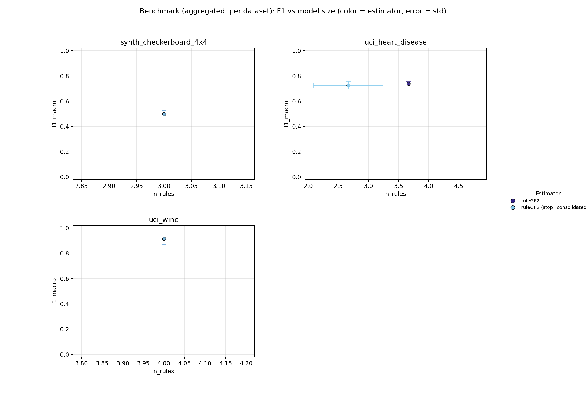
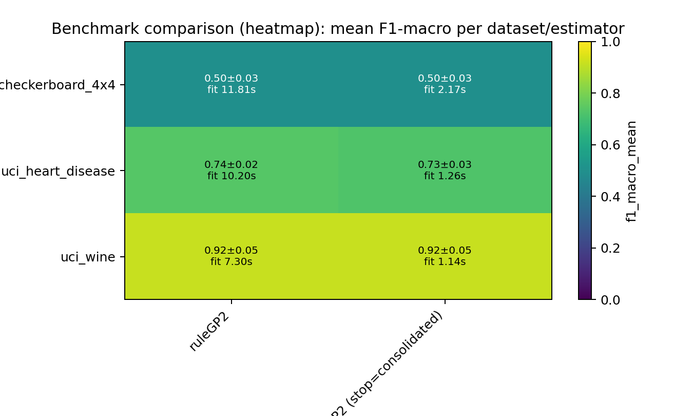

# ScoredRuleSets Paper Benchmark - Rule-Based Classifiers Comparison

## Summary

- **datasets**: `3`
- **estimators**: `2`
- **warning_runs**: `0`
- **warning_models**: `0`
- **top_1_model**: `uci_wine / ruleGP2 (stop=consolidated)` (f1=0.9154, rules=4.0000, fit_s=1.1370)

## Configuration

- **datasets**: `sklearn_wine, uci_heart_disease, synth_checkerboard_4x4`
- **estimators**: `ruleGP2, ruleGP2 (stop=consolidated)`
- **repeats**: `3`
- **timeout_seconds**: `120s`
- **design**: `8 Rule-Based Classifiers x 3 Datasets (2 real-world, 1 synthetic), 3 repeats`

## Artifacts

- **raw_csv**: [benchmark_results.csv](benchmark_results.csv)
- **raw_json**: [benchmark_results.json](benchmark_results.json)
- **aggregated_csv**: [benchmark_results_aggregated.csv](benchmark_results_aggregated.csv)
- **aggregated_json**: [benchmark_results_aggregated.json](benchmark_results_aggregated.json)
- **plot_png**: [benchmark_results.png](benchmark_results.png)
- **plot_pdf**: [benchmark_results.pdf](benchmark_results.pdf)
- **heatmap_png**: [benchmark_results_heatmap.png](benchmark_results_heatmap.png)
- **heatmap_pdf**: [benchmark_results_heatmap.pdf](benchmark_results_heatmap.pdf)
- **combined_heatmap_png**: [benchmark_results_heatmap_combined.png](benchmark_results_heatmap_combined.png)
- **combined_heatmap_pdf**: [benchmark_results_heatmap_combined.pdf](benchmark_results_heatmap_combined.pdf)
- **combined_dot_png**: [benchmark_results_combined_dot.png](benchmark_results_combined_dot.png)
- **combined_dot_pdf**: [benchmark_results_combined_dot.pdf](benchmark_results_combined_dot.pdf)
- **pareto_png**: [benchmark_results_pareto.png](benchmark_results_pareto.png)
- **pareto_pdf**: [benchmark_results_pareto.pdf](benchmark_results_pareto.pdf)
- **cd_png**: [benchmark_results_cd.png](benchmark_results_cd.png)
- **cd_pdf**: [benchmark_results_cd.pdf](benchmark_results_cd.pdf)
- **wtl_png**: [benchmark_results_wtl.png](benchmark_results_wtl.png)
- **wtl_pdf**: [benchmark_results_wtl.pdf](benchmark_results_wtl.pdf)
- **wtl_size_png**: [benchmark_results_wtl_size.png](benchmark_results_wtl_size.png)
- **wtl_size_pdf**: [benchmark_results_wtl_size.pdf](benchmark_results_wtl_size.pdf)
- **wtl_pareto_png**: [benchmark_results_wtl_pareto.png](benchmark_results_wtl_pareto.png)
- **wtl_pareto_pdf**: [benchmark_results_wtl_pareto.pdf](benchmark_results_wtl_pareto.pdf)
- **wtl_triangular_png**: [benchmark_results_wtl_triangular.png](benchmark_results_wtl_triangular.png)
- **wtl_triangular_pdf**: [benchmark_results_wtl_triangular.pdf](benchmark_results_wtl_triangular.pdf)
- **efficiency_png**: [benchmark_results_efficiency.png](benchmark_results_efficiency.png)
- **efficiency_pdf**: [benchmark_results_efficiency.pdf](benchmark_results_efficiency.pdf)

## Plot Preview

_Heatmap add-on: compact overview of aggregated F1 values and fit times per dataset/estimator._

## Notes

- Paper Benchmark: 8 rule-based classifiers on 10 selected datasets.
- Real-world datasets: sklearn_breast_cancer, sklearn_wine, uci_car_evaluation, uci_heart_disease.
- Synthetic datasets chosen for concept diversity: DNF rules, overlapping rules, MONK-3 noise, XOR/parity, class imbalance, geometric complexity.
- ExSTraCS (LRC) applies Lossy Rule Compaction post-hoc (interval merge + conservative pruning; 0-6% F1 loss, 29-98% rule reduction).
- Timeout per run: 120s. 3 repeats, random_state=42.

## Top per Dataset

### uci_wine

- **best_model**: `ruleGP2 (stop=consolidated)` (f1=0.9154, rules=4.0000, fit_s=1.1370)
- **smallest_model**: `ruleGP2 (stop=consolidated)` (rules=4.0000, atoms=3.0000, f1=0.9154)
- **fastest_model**: `ruleGP2 (stop=consolidated)` (fit_s=1.1370, f1=0.9154, rules=4.0000)

### uci_heart_disease

- **best_model**: `ruleGP2` (f1=0.7378, rules=3.6667, fit_s=10.2048)
- **smallest_model**: `ruleGP2 (stop=consolidated)` (rules=2.6667, atoms=2.0000, f1=0.7257)
- **fastest_model**: `ruleGP2 (stop=consolidated)` (fit_s=1.2553, f1=0.7257, rules=2.6667)

### synth_checkerboard_4x4

- **best_model**: `ruleGP2 (stop=consolidated)` (f1=0.4990, rules=3.0000, fit_s=2.1669)
- **smallest_model**: `ruleGP2 (stop=consolidated)` (rules=3.0000, atoms=2.3333, f1=0.4990)
- **fastest_model**: `ruleGP2 (stop=consolidated)` (fit_s=2.1669, f1=0.4990, rules=3.0000)

## Pareto Front (F1 vs Model Size)

### uci_wine

| estimator | f1_mean | atoms | rules |
| --- | ---: | ---: | ---: |
| ruleGP2 (stop=consolidated) | 0.9154 | 3.0000 | 4.0000 |

### uci_heart_disease

| estimator | f1_mean | atoms | rules |
| --- | ---: | ---: | ---: |
| ruleGP2 | 0.7378 | 3.3333 | 3.6667 |
| ruleGP2 (stop=consolidated) | 0.7257 | 2.0000 | 2.6667 |

### synth_checkerboard_4x4

| estimator | f1_mean | atoms | rules |
| --- | ---: | ---: | ---: |
| ruleGP2 (stop=consolidated) | 0.4990 | 2.3333 | 3.0000 |

## Leaderboard

| rank | dataset | estimator | repeats | f1_mean | f1_err | fit_s | rules | atoms |
| ---: | --- | --- | ---: | ---: | ---: | ---: | ---: | ---: |
| 1 | uci_wine | ruleGP2 (stop=consolidated) | 3 | 0.9154 | 0.0454 | 1.1370 | 4.0000 | 3.0000 |
| 2 | uci_wine | ruleGP2 | 3 | 0.9154 | 0.0454 | 7.3046 | 4.0000 | 3.0000 |
| 3 | uci_heart_disease | ruleGP2 | 3 | 0.7378 | 0.0161 | 10.2048 | 3.6667 | 3.3333 |
| 4 | uci_heart_disease | ruleGP2 (stop=consolidated) | 3 | 0.7257 | 0.0299 | 1.2553 | 2.6667 | 2.0000 |
| 5 | synth_checkerboard_4x4 | ruleGP2 (stop=consolidated) | 3 | 0.4990 | 0.0255 | 2.1669 | 3.0000 | 2.3333 |
| 6 | synth_checkerboard_4x4 | ruleGP2 | 3 | 0.4990 | 0.0255 | 11.8138 | 3.0000 | 2.3333 |

## Dataset: uci_wine

- **best_model**: `ruleGP2 (stop=consolidated)` (f1=0.9154, rules=4.0000, fit_s=1.1370)
- **smallest_model**: `ruleGP2 (stop=consolidated)` (rules=4.0000, atoms=3.0000, f1=0.9154)
- **fastest_model**: `ruleGP2 (stop=consolidated)` (fit_s=1.1370, f1=0.9154, rules=4.0000)

| rank | dataset | estimator | repeats | f1_mean | f1_err | fit_s | rules | atoms |
| ---: | --- | --- | ---: | ---: | ---: | ---: | ---: | ---: |
| 1 | uci_wine | ruleGP2 (stop=consolidated) | 3 | 0.9154 | 0.0454 | 1.1370 | 4.0000 | 3.0000 |
| 2 | uci_wine | ruleGP2 | 3 | 0.9154 | 0.0454 | 7.3046 | 4.0000 | 3.0000 |

## Dataset: uci_heart_disease

- **best_model**: `ruleGP2` (f1=0.7378, rules=3.6667, fit_s=10.2048)
- **smallest_model**: `ruleGP2 (stop=consolidated)` (rules=2.6667, atoms=2.0000, f1=0.7257)
- **fastest_model**: `ruleGP2 (stop=consolidated)` (fit_s=1.2553, f1=0.7257, rules=2.6667)

| rank | dataset | estimator | repeats | f1_mean | f1_err | fit_s | rules | atoms |
| ---: | --- | --- | ---: | ---: | ---: | ---: | ---: | ---: |
| 1 | uci_heart_disease | ruleGP2 | 3 | 0.7378 | 0.0161 | 10.2048 | 3.6667 | 3.3333 |
| 2 | uci_heart_disease | ruleGP2 (stop=consolidated) | 3 | 0.7257 | 0.0299 | 1.2553 | 2.6667 | 2.0000 |

## Dataset: synth_checkerboard_4x4

- **best_model**: `ruleGP2 (stop=consolidated)` (f1=0.4990, rules=3.0000, fit_s=2.1669)
- **smallest_model**: `ruleGP2 (stop=consolidated)` (rules=3.0000, atoms=2.3333, f1=0.4990)
- **fastest_model**: `ruleGP2 (stop=consolidated)` (fit_s=2.1669, f1=0.4990, rules=3.0000)

| rank | dataset | estimator | repeats | f1_mean | f1_err | fit_s | rules | atoms |
| ---: | --- | --- | ---: | ---: | ---: | ---: | ---: | ---: |
| 1 | synth_checkerboard_4x4 | ruleGP2 (stop=consolidated) | 3 | 0.4990 | 0.0255 | 2.1669 | 3.0000 | 2.3333 |
| 2 | synth_checkerboard_4x4 | ruleGP2 | 3 | 0.4990 | 0.0255 | 11.8138 | 3.0000 | 2.3333 |
