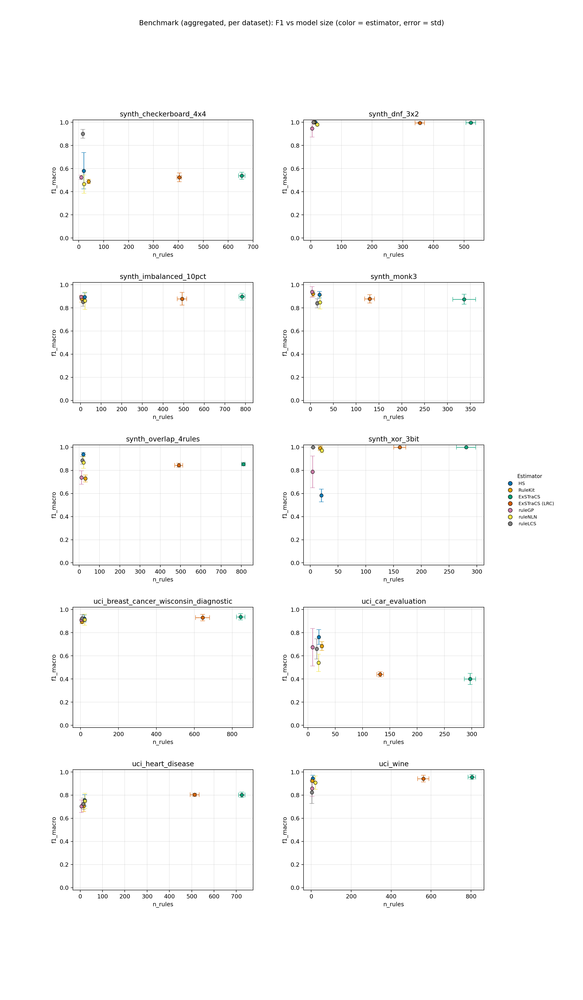
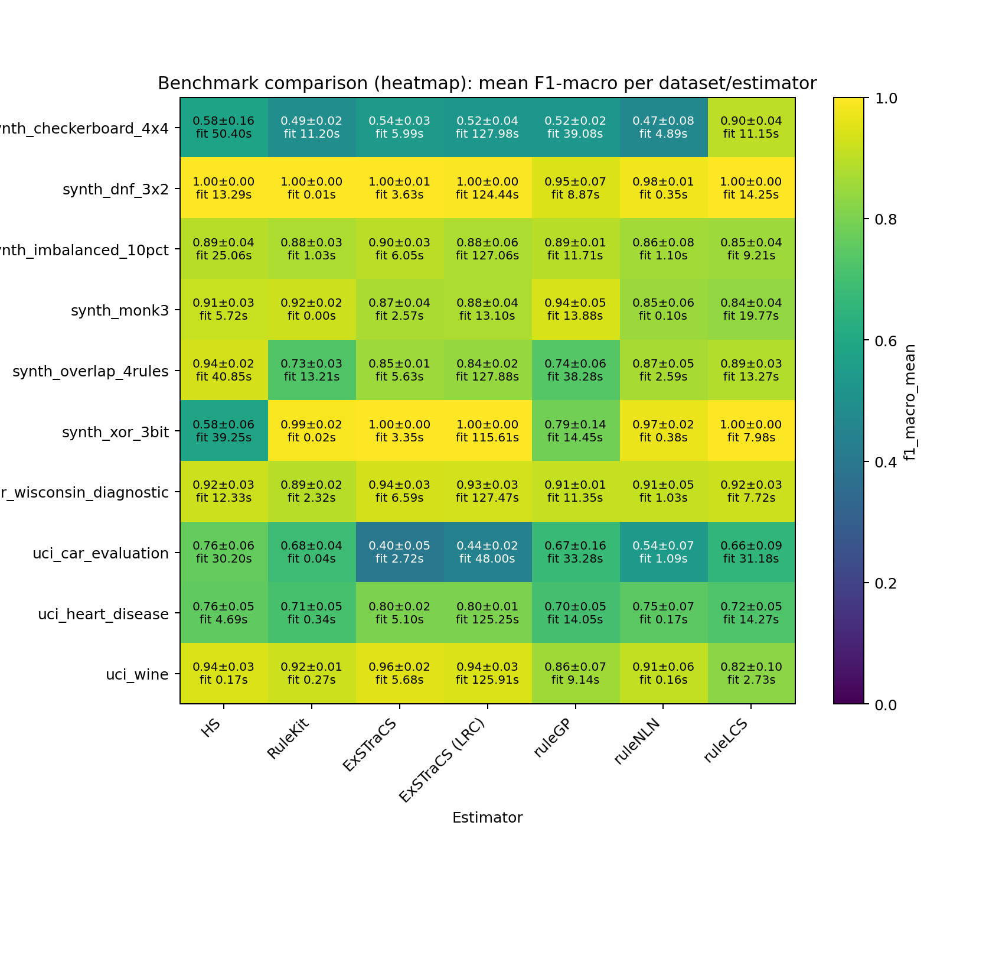

# ScoredRuleSets Benchmark Report

## Summary

- **datasets**: `10`
- **estimators**: `7`
- **warning_runs**: `0`
- **warning_models**: `0`
- **top_1_model**: `synth_dnf_3x2 / RuleKit` (f1=1.0000, rules=11.0000, fit_s=0.0128)

## Configuration

- **config**: `Custom`

## Artifacts

- **raw_csv**: [benchmark_results.csv](benchmark_results.csv)
- **raw_json**: [benchmark_results.json](benchmark_results.json)
- **aggregated_csv**: [benchmark_results_aggregated.csv](benchmark_results_aggregated.csv)
- **aggregated_json**: [benchmark_results_aggregated.json](benchmark_results_aggregated.json)
- **plot_png**: [benchmark_results.png](benchmark_results.png)
- **plot_pdf**: [benchmark_results.pdf](benchmark_results.pdf)
- **heatmap_png**: [benchmark_results_heatmap.png](benchmark_results_heatmap.png)
- **heatmap_pdf**: [benchmark_results_heatmap.pdf](benchmark_results_heatmap.pdf)
- **combined_heatmap_png**: [benchmark_results_heatmap_combined.png](benchmark_results_heatmap_combined.png)
- **combined_heatmap_pdf**: [benchmark_results_heatmap_combined.pdf](benchmark_results_heatmap_combined.pdf)
- **combined_dot_png**: [benchmark_results_combined_dot.png](benchmark_results_combined_dot.png)
- **combined_dot_pdf**: [benchmark_results_combined_dot.pdf](benchmark_results_combined_dot.pdf)
- **pareto_png**: [benchmark_results_pareto.png](benchmark_results_pareto.png)
- **pareto_pdf**: [benchmark_results_pareto.pdf](benchmark_results_pareto.pdf)
- **cd_png**: [benchmark_results_cd.png](benchmark_results_cd.png)
- **cd_pdf**: [benchmark_results_cd.pdf](benchmark_results_cd.pdf)
- **wtl_png**: [benchmark_results_wtl.png](benchmark_results_wtl.png)
- **wtl_pdf**: [benchmark_results_wtl.pdf](benchmark_results_wtl.pdf)
- **wtl_size_png**: [benchmark_results_wtl_size.png](benchmark_results_wtl_size.png)
- **wtl_size_pdf**: [benchmark_results_wtl_size.pdf](benchmark_results_wtl_size.pdf)
- **wtl_pareto_png**: [benchmark_results_wtl_pareto.png](benchmark_results_wtl_pareto.png)
- **wtl_pareto_pdf**: [benchmark_results_wtl_pareto.pdf](benchmark_results_wtl_pareto.pdf)
- **wtl_triangular_png**: [benchmark_results_wtl_triangular.png](benchmark_results_wtl_triangular.png)
- **wtl_triangular_pdf**: [benchmark_results_wtl_triangular.pdf](benchmark_results_wtl_triangular.pdf)
- **efficiency_png**: [benchmark_results_efficiency.png](benchmark_results_efficiency.png)
- **efficiency_pdf**: [benchmark_results_efficiency.pdf](benchmark_results_efficiency.pdf)
- **dual_cd_png**: [benchmark_results_dual_cd.png](benchmark_results_dual_cd.png)
- **dual_cd_pdf**: [benchmark_results_dual_cd.pdf](benchmark_results_dual_cd.pdf)
- **rank2d_png**: [benchmark_results_rank2d.png](benchmark_results_rank2d.png)
- **rank2d_pdf**: [benchmark_results_rank2d.pdf](benchmark_results_rank2d.pdf)

## Plot Preview

_Heatmap add-on: compact overview of aggregated F1 values and fit times per dataset/estimator._

## Top per Dataset

### synth_dnf_3x2

- **best_model**: `RuleKit` (f1=1.0000, rules=11.0000, fit_s=0.0128)
- **smallest_model**: `ruleGP` (rules=4.6000, atoms=5.6000, f1=0.9466)
- **fastest_model**: `RuleKit` (fit_s=0.0128, f1=1.0000, rules=11.0000)

### synth_xor_3bit

- **best_model**: `ExSTraCS` (f1=1.0000, rules=280.8000, fit_s=3.3466)
- **smallest_model**: `ruleGP` (rules=4.2000, atoms=6.6000, f1=0.7870)
- **fastest_model**: `RuleKit` (fit_s=0.0213, f1=0.9908, rules=18.0000)

### uci_wine

- **best_model**: `ExSTraCS` (f1=0.9568, rules=804.6000, fit_s=5.6828)
- **smallest_model**: `ruleLCS` (rules=3.6000, atoms=9.8000, f1=0.8249)
- **fastest_model**: `ruleNLN` (fit_s=0.1581, f1=0.9080, rules=21.0000)

### synth_monk3

- **best_model**: `ruleGP` (f1=0.9382, rules=3.6000, fit_s=13.8828)
- **smallest_model**: `ruleGP` (rules=3.6000, atoms=4.2000, f1=0.9382)
- **fastest_model**: `RuleKit` (fit_s=0.0032, f1=0.9227, rules=5.6000)

### uci_breast_cancer_wisconsin_diagnostic

- **best_model**: `ExSTraCS` (f1=0.9374, rules=844.8000, fit_s=6.5881)
- **smallest_model**: `ruleGP` (rules=4.0000, atoms=3.8000, f1=0.9105)
- **fastest_model**: `ruleNLN` (fit_s=1.0261, f1=0.9132, rules=21.0000)

### synth_overlap_4rules

- **best_model**: `HS` (f1=0.9368, rules=20.0000, fit_s=40.8511)
- **smallest_model**: `ruleGP` (rules=10.8000, atoms=17.0000, f1=0.7374)
- **fastest_model**: `ruleNLN` (fit_s=2.5895, f1=0.8680, rules=21.0000)

### synth_checkerboard_4x4

- **best_model**: `ruleLCS` (f1=0.8999, rules=16.0000, fit_s=11.1475)
- **smallest_model**: `ruleGP` (rules=10.2000, atoms=17.2000, f1=0.5242)
- **fastest_model**: `ruleNLN` (fit_s=4.8893, f1=0.4658, rules=21.0000)

### synth_imbalanced_10pct

- **best_model**: `ExSTraCS` (f1=0.8977, rules=783.6000, fit_s=6.0516)
- **smallest_model**: `ruleGP` (rules=3.0000, atoms=3.6000, f1=0.8932)
- **fastest_model**: `RuleKit` (fit_s=1.0328, f1=0.8771, rules=4.8000)

### uci_heart_disease

- **best_model**: `ExSTraCS (LRC)` (f1=0.8031, rules=513.2000, fit_s=125.2493)
- **smallest_model**: `ruleGP` (rules=5.6000, atoms=6.6000, f1=0.7038)
- **fastest_model**: `ruleNLN` (fit_s=0.1703, f1=0.7492, rules=21.0000)

### uci_car_evaluation

- **best_model**: `HS` (f1=0.7627, rules=20.0000, fit_s=30.2025)
- **smallest_model**: `ruleGP` (rules=8.6000, atoms=10.2000, f1=0.6748)
- **fastest_model**: `RuleKit` (fit_s=0.0368, f1=0.6846, rules=25.2000)

## Pareto Front (F1 vs Model Size)

### synth_dnf_3x2

| estimator | f1_mean | atoms | rules |
| --- | ---: | ---: | ---: |
| HS | 1.0000 | 18.0000 | 15.0000 |
| ruleGP | 0.9466 | 5.6000 | 4.6000 |

### synth_xor_3bit

| estimator | f1_mean | atoms | rules |
| --- | ---: | ---: | ---: |
| ExSTraCS (LRC) | 1.0000 | 264.4000 | 161.2000 |
| ruleLCS | 0.9988 | 13.8000 | 5.2000 |
| ruleGP | 0.7870 | 6.6000 | 4.2000 |

### uci_wine

| estimator | f1_mean | atoms | rules |
| --- | ---: | ---: | ---: |
| ExSTraCS | 0.9568 | 7061.6000 | 804.6000 |
| HS | 0.9438 | 9.6000 | 7.4000 |
| ruleGP | 0.8590 | 3.2000 | 3.8000 |

### synth_monk3

| estimator | f1_mean | atoms | rules |
| --- | ---: | ---: | ---: |
| ruleGP | 0.9382 | 4.2000 | 3.6000 |

### uci_breast_cancer_wisconsin_diagnostic

| estimator | f1_mean | atoms | rules |
| --- | ---: | ---: | ---: |
| ExSTraCS | 0.9374 | 8517.6000 | 844.8000 |
| ExSTraCS (LRC) | 0.9312 | 6599.0000 | 643.6000 |
| ruleLCS | 0.9249 | 34.0000 | 8.0000 |
| ruleGP | 0.9105 | 3.8000 | 4.0000 |

### synth_overlap_4rules

| estimator | f1_mean | atoms | rules |
| --- | ---: | ---: | ---: |
| HS | 0.9368 | 49.8000 | 20.0000 |
| ruleGP | 0.7374 | 17.0000 | 10.8000 |

### synth_checkerboard_4x4

| estimator | f1_mean | atoms | rules |
| --- | ---: | ---: | ---: |
| ruleLCS | 0.8999 | 58.2000 | 16.0000 |
| HS | 0.5811 | 39.2000 | 20.0000 |
| ruleGP | 0.5242 | 17.2000 | 10.2000 |

### synth_imbalanced_10pct

| estimator | f1_mean | atoms | rules |
| --- | ---: | ---: | ---: |
| ExSTraCS | 0.8977 | 7012.4000 | 783.6000 |
| HS | 0.8941 | 34.0000 | 20.0000 |
| ruleGP | 0.8932 | 3.6000 | 3.0000 |

### uci_heart_disease

| estimator | f1_mean | atoms | rules |
| --- | ---: | ---: | ---: |
| ExSTraCS (LRC) | 0.8031 | 1980.8000 | 513.2000 |
| HS | 0.7553 | 45.6000 | 20.0000 |
| ruleGP | 0.7038 | 6.6000 | 5.6000 |

### uci_car_evaluation

| estimator | f1_mean | atoms | rules |
| --- | ---: | ---: | ---: |
| HS | 0.7627 | 34.0000 | 20.0000 |
| ruleGP | 0.6748 | 10.2000 | 8.6000 |

## Leaderboard

| rank | dataset | estimator | repeats | f1_mean | f1_err | fit_s | rules | atoms |
| ---: | --- | --- | ---: | ---: | ---: | ---: | ---: | ---: |
| 1 | synth_dnf_3x2 | RuleKit | 5 | 1.0000 | 0.0000 | 0.0128 | 11.0000 | 26.0000 |
| 2 | synth_xor_3bit | ExSTraCS | 5 | 1.0000 | 0.0000 | 3.3466 | 280.8000 | 1144.4000 |
| 3 | synth_dnf_3x2 | HS | 5 | 1.0000 | 0.0000 | 13.2856 | 15.0000 | 18.0000 |
| 4 | synth_dnf_3x2 | ruleLCS | 5 | 1.0000 | 0.0000 | 14.2467 | 9.0000 | 25.2000 |
| 5 | synth_xor_3bit | ExSTraCS (LRC) | 5 | 1.0000 | 0.0000 | 115.6112 | 161.2000 | 264.4000 |
| 6 | synth_xor_3bit | ruleLCS | 5 | 0.9988 | 0.0027 | 7.9821 | 5.2000 | 13.8000 |
| 7 | synth_dnf_3x2 | ExSTraCS | 5 | 0.9971 | 0.0053 | 3.6300 | 521.8000 | 1736.0000 |
| 8 | synth_dnf_3x2 | ExSTraCS (LRC) | 5 | 0.9955 | 0.0030 | 124.4351 | 355.6000 | 1134.8000 |
| 9 | synth_xor_3bit | RuleKit | 5 | 0.9908 | 0.0206 | 0.0213 | 18.0000 | 61.6000 |
| 10 | synth_dnf_3x2 | ruleNLN | 5 | 0.9800 | 0.0121 | 0.3537 | 21.0000 | 57.6000 |
| 11 | synth_xor_3bit | ruleNLN | 5 | 0.9711 | 0.0199 | 0.3833 | 21.0000 | 73.0000 |
| 12 | uci_wine | ExSTraCS | 5 | 0.9568 | 0.0206 | 5.6828 | 804.6000 | 7061.6000 |
| 13 | synth_dnf_3x2 | ruleGP | 5 | 0.9466 | 0.0734 | 8.8674 | 4.6000 | 5.6000 |
| 14 | uci_wine | HS | 5 | 0.9438 | 0.0290 | 0.1659 | 7.4000 | 9.6000 |
| 15 | uci_wine | ExSTraCS (LRC) | 5 | 0.9428 | 0.0297 | 125.9140 | 561.0000 | 3853.0000 |
| 16 | synth_monk3 | ruleGP | 5 | 0.9382 | 0.0457 | 13.8828 | 3.6000 | 4.2000 |
| 17 | uci_breast_cancer_wisconsin_diagnostic | ExSTraCS | 5 | 0.9374 | 0.0270 | 6.5881 | 844.8000 | 8517.6000 |
| 18 | synth_overlap_4rules | HS | 5 | 0.9368 | 0.0170 | 40.8511 | 20.0000 | 49.8000 |
| 19 | uci_breast_cancer_wisconsin_diagnostic | ExSTraCS (LRC) | 5 | 0.9312 | 0.0276 | 127.4744 | 643.6000 | 6599.0000 |
| 20 | uci_breast_cancer_wisconsin_diagnostic | ruleLCS | 5 | 0.9249 | 0.0327 | 7.7245 | 8.0000 | 34.0000 |
| 21 | uci_wine | RuleKit | 5 | 0.9238 | 0.0116 | 0.2721 | 5.0000 | 10.0000 |
| 22 | uci_breast_cancer_wisconsin_diagnostic | HS | 5 | 0.9229 | 0.0292 | 12.3333 | 19.2000 | 34.6000 |
| 23 | synth_monk3 | RuleKit | 5 | 0.9227 | 0.0241 | 0.0032 | 5.6000 | 10.4000 |
| 24 | synth_monk3 | HS | 5 | 0.9147 | 0.0281 | 5.7201 | 20.0000 | 29.8000 |
| 25 | uci_breast_cancer_wisconsin_diagnostic | ruleNLN | 5 | 0.9132 | 0.0479 | 1.0261 | 21.0000 | 104.0000 |
| 26 | uci_breast_cancer_wisconsin_diagnostic | ruleGP | 5 | 0.9105 | 0.0078 | 11.3490 | 4.0000 | 3.8000 |
| 27 | uci_wine | ruleNLN | 5 | 0.9080 | 0.0586 | 0.1581 | 21.0000 | 103.2000 |
| 28 | synth_checkerboard_4x4 | ruleLCS | 5 | 0.8999 | 0.0379 | 11.1475 | 16.0000 | 58.2000 |
| 29 | synth_imbalanced_10pct | ExSTraCS | 5 | 0.8977 | 0.0287 | 6.0516 | 783.6000 | 7012.4000 |
| 30 | uci_breast_cancer_wisconsin_diagnostic | RuleKit | 5 | 0.8943 | 0.0161 | 2.3235 | 7.2000 | 16.6000 |
| 31 | synth_imbalanced_10pct | HS | 5 | 0.8941 | 0.0359 | 25.0567 | 20.0000 | 34.0000 |
| 32 | synth_imbalanced_10pct | ruleGP | 5 | 0.8932 | 0.0144 | 11.7077 | 3.0000 | 3.6000 |
| 33 | synth_overlap_4rules | ruleLCS | 5 | 0.8860 | 0.0329 | 13.2703 | 16.0000 | 79.4000 |
| 34 | synth_imbalanced_10pct | ExSTraCS (LRC) | 5 | 0.8787 | 0.0555 | 127.0626 | 492.4000 | 4535.2000 |
| 35 | synth_monk3 | ExSTraCS (LRC) | 5 | 0.8779 | 0.0362 | 13.1004 | 129.6000 | 183.6000 |
| 36 | synth_imbalanced_10pct | RuleKit | 5 | 0.8771 | 0.0274 | 1.0328 | 4.8000 | 7.4000 |
| 37 | synth_monk3 | ExSTraCS | 5 | 0.8744 | 0.0429 | 2.5717 | 336.6000 | 1034.0000 |
| 38 | synth_overlap_4rules | ruleNLN | 5 | 0.8680 | 0.0504 | 2.5895 | 21.0000 | 86.0000 |
| 39 | synth_imbalanced_10pct | ruleNLN | 5 | 0.8614 | 0.0751 | 1.0996 | 21.0000 | 81.4000 |
| 40 | uci_wine | ruleGP | 5 | 0.8590 | 0.0698 | 9.1427 | 3.8000 | 3.2000 |
| 41 | synth_overlap_4rules | ExSTraCS | 5 | 0.8534 | 0.0107 | 5.6268 | 809.6000 | 5785.2000 |
| 42 | synth_imbalanced_10pct | ruleLCS | 5 | 0.8524 | 0.0381 | 9.2116 | 12.2000 | 44.4000 |
| 43 | synth_monk3 | ruleNLN | 5 | 0.8487 | 0.0578 | 0.1045 | 21.0000 | 71.0000 |
| 44 | synth_overlap_4rules | ExSTraCS (LRC) | 5 | 0.8437 | 0.0173 | 127.8836 | 491.0000 | 3698.4000 |
| 45 | synth_monk3 | ruleLCS | 5 | 0.8391 | 0.0391 | 19.7722 | 14.6000 | 58.2000 |
| 46 | uci_wine | ruleLCS | 5 | 0.8249 | 0.0962 | 2.7263 | 3.6000 | 9.8000 |
| 47 | uci_heart_disease | ExSTraCS (LRC) | 5 | 0.8031 | 0.0132 | 125.2493 | 513.2000 | 1980.8000 |
| 48 | uci_heart_disease | ExSTraCS | 5 | 0.8029 | 0.0229 | 5.0986 | 724.2000 | 4244.2000 |
| 49 | synth_xor_3bit | ruleGP | 5 | 0.7870 | 0.1373 | 14.4507 | 4.2000 | 6.6000 |
| 50 | uci_car_evaluation | HS | 5 | 0.7627 | 0.0632 | 30.2025 | 20.0000 | 34.0000 |
| 51 | uci_heart_disease | HS | 5 | 0.7553 | 0.0493 | 4.6872 | 20.0000 | 45.6000 |
| 52 | uci_heart_disease | ruleNLN | 5 | 0.7492 | 0.0660 | 0.1703 | 21.0000 | 79.6000 |
| 53 | synth_overlap_4rules | ruleGP | 5 | 0.7374 | 0.0584 | 38.2823 | 10.8000 | 17.0000 |
| 54 | synth_overlap_4rules | RuleKit | 5 | 0.7293 | 0.0294 | 13.2135 | 30.6000 | 97.4000 |
| 55 | uci_heart_disease | ruleLCS | 5 | 0.7248 | 0.0489 | 14.2732 | 13.4000 | 46.8000 |
| 56 | uci_heart_disease | RuleKit | 5 | 0.7081 | 0.0510 | 0.3419 | 16.4000 | 47.8000 |
| 57 | uci_heart_disease | ruleGP | 5 | 0.7038 | 0.0546 | 14.0452 | 5.6000 | 6.6000 |
| 58 | uci_car_evaluation | RuleKit | 5 | 0.6846 | 0.0376 | 0.0368 | 25.2000 | 126.6000 |
| 59 | uci_car_evaluation | ruleGP | 5 | 0.6748 | 0.1628 | 33.2767 | 8.6000 | 10.2000 |
| 60 | uci_car_evaluation | ruleLCS | 5 | 0.6600 | 0.0866 | 31.1814 | 16.0000 | 78.0000 |
| 61 | synth_xor_3bit | HS | 5 | 0.5824 | 0.0551 | 39.2549 | 20.0000 | 46.8000 |
| 62 | synth_checkerboard_4x4 | HS | 5 | 0.5811 | 0.1571 | 50.3970 | 20.0000 | 39.2000 |
| 63 | uci_car_evaluation | ruleNLN | 5 | 0.5397 | 0.0742 | 1.0927 | 19.6000 | 42.4000 |
| 64 | synth_checkerboard_4x4 | ExSTraCS | 5 | 0.5392 | 0.0298 | 5.9908 | 654.2000 | 4784.8000 |
| 65 | synth_checkerboard_4x4 | ExSTraCS (LRC) | 5 | 0.5244 | 0.0374 | 127.9825 | 403.6000 | 2960.6000 |
| 66 | synth_checkerboard_4x4 | ruleGP | 5 | 0.5242 | 0.0181 | 39.0832 | 10.2000 | 17.2000 |
| 67 | synth_checkerboard_4x4 | RuleKit | 5 | 0.4886 | 0.0178 | 11.1969 | 40.0000 | 164.4000 |
| 68 | synth_checkerboard_4x4 | ruleNLN | 5 | 0.4658 | 0.0783 | 4.8893 | 21.0000 | 70.4000 |
| 69 | uci_car_evaluation | ExSTraCS (LRC) | 5 | 0.4408 | 0.0221 | 48.0016 | 132.2000 | 218.8000 |
| 70 | uci_car_evaluation | ExSTraCS | 5 | 0.4007 | 0.0481 | 2.7225 | 296.8000 | 965.2000 |

## Dataset: synth_dnf_3x2

- **best_model**: `RuleKit` (f1=1.0000, rules=11.0000, fit_s=0.0128)
- **smallest_model**: `ruleGP` (rules=4.6000, atoms=5.6000, f1=0.9466)
- **fastest_model**: `RuleKit` (fit_s=0.0128, f1=1.0000, rules=11.0000)

| rank | dataset | estimator | repeats | f1_mean | f1_err | fit_s | rules | atoms |
| ---: | --- | --- | ---: | ---: | ---: | ---: | ---: | ---: |
| 1 | synth_dnf_3x2 | RuleKit | 5 | 1.0000 | 0.0000 | 0.0128 | 11.0000 | 26.0000 |
| 2 | synth_dnf_3x2 | HS | 5 | 1.0000 | 0.0000 | 13.2856 | 15.0000 | 18.0000 |
| 3 | synth_dnf_3x2 | ruleLCS | 5 | 1.0000 | 0.0000 | 14.2467 | 9.0000 | 25.2000 |
| 4 | synth_dnf_3x2 | ExSTraCS | 5 | 0.9971 | 0.0053 | 3.6300 | 521.8000 | 1736.0000 |
| 5 | synth_dnf_3x2 | ExSTraCS (LRC) | 5 | 0.9955 | 0.0030 | 124.4351 | 355.6000 | 1134.8000 |
| 6 | synth_dnf_3x2 | ruleNLN | 5 | 0.9800 | 0.0121 | 0.3537 | 21.0000 | 57.6000 |
| 7 | synth_dnf_3x2 | ruleGP | 5 | 0.9466 | 0.0734 | 8.8674 | 4.6000 | 5.6000 |

## Dataset: synth_xor_3bit

- **best_model**: `ExSTraCS` (f1=1.0000, rules=280.8000, fit_s=3.3466)
- **smallest_model**: `ruleGP` (rules=4.2000, atoms=6.6000, f1=0.7870)
- **fastest_model**: `RuleKit` (fit_s=0.0213, f1=0.9908, rules=18.0000)

| rank | dataset | estimator | repeats | f1_mean | f1_err | fit_s | rules | atoms |
| ---: | --- | --- | ---: | ---: | ---: | ---: | ---: | ---: |
| 1 | synth_xor_3bit | ExSTraCS | 5 | 1.0000 | 0.0000 | 3.3466 | 280.8000 | 1144.4000 |
| 2 | synth_xor_3bit | ExSTraCS (LRC) | 5 | 1.0000 | 0.0000 | 115.6112 | 161.2000 | 264.4000 |
| 3 | synth_xor_3bit | ruleLCS | 5 | 0.9988 | 0.0027 | 7.9821 | 5.2000 | 13.8000 |
| 4 | synth_xor_3bit | RuleKit | 5 | 0.9908 | 0.0206 | 0.0213 | 18.0000 | 61.6000 |
| 5 | synth_xor_3bit | ruleNLN | 5 | 0.9711 | 0.0199 | 0.3833 | 21.0000 | 73.0000 |
| 6 | synth_xor_3bit | ruleGP | 5 | 0.7870 | 0.1373 | 14.4507 | 4.2000 | 6.6000 |
| 7 | synth_xor_3bit | HS | 5 | 0.5824 | 0.0551 | 39.2549 | 20.0000 | 46.8000 |

## Dataset: uci_wine

- **best_model**: `ExSTraCS` (f1=0.9568, rules=804.6000, fit_s=5.6828)
- **smallest_model**: `ruleLCS` (rules=3.6000, atoms=9.8000, f1=0.8249)
- **fastest_model**: `ruleNLN` (fit_s=0.1581, f1=0.9080, rules=21.0000)

| rank | dataset | estimator | repeats | f1_mean | f1_err | fit_s | rules | atoms |
| ---: | --- | --- | ---: | ---: | ---: | ---: | ---: | ---: |
| 1 | uci_wine | ExSTraCS | 5 | 0.9568 | 0.0206 | 5.6828 | 804.6000 | 7061.6000 |
| 2 | uci_wine | HS | 5 | 0.9438 | 0.0290 | 0.1659 | 7.4000 | 9.6000 |
| 3 | uci_wine | ExSTraCS (LRC) | 5 | 0.9428 | 0.0297 | 125.9140 | 561.0000 | 3853.0000 |
| 4 | uci_wine | RuleKit | 5 | 0.9238 | 0.0116 | 0.2721 | 5.0000 | 10.0000 |
| 5 | uci_wine | ruleNLN | 5 | 0.9080 | 0.0586 | 0.1581 | 21.0000 | 103.2000 |
| 6 | uci_wine | ruleGP | 5 | 0.8590 | 0.0698 | 9.1427 | 3.8000 | 3.2000 |
| 7 | uci_wine | ruleLCS | 5 | 0.8249 | 0.0962 | 2.7263 | 3.6000 | 9.8000 |

## Dataset: synth_monk3

- **best_model**: `ruleGP` (f1=0.9382, rules=3.6000, fit_s=13.8828)
- **smallest_model**: `ruleGP` (rules=3.6000, atoms=4.2000, f1=0.9382)
- **fastest_model**: `RuleKit` (fit_s=0.0032, f1=0.9227, rules=5.6000)

| rank | dataset | estimator | repeats | f1_mean | f1_err | fit_s | rules | atoms |
| ---: | --- | --- | ---: | ---: | ---: | ---: | ---: | ---: |
| 1 | synth_monk3 | ruleGP | 5 | 0.9382 | 0.0457 | 13.8828 | 3.6000 | 4.2000 |
| 2 | synth_monk3 | RuleKit | 5 | 0.9227 | 0.0241 | 0.0032 | 5.6000 | 10.4000 |
| 3 | synth_monk3 | HS | 5 | 0.9147 | 0.0281 | 5.7201 | 20.0000 | 29.8000 |
| 4 | synth_monk3 | ExSTraCS (LRC) | 5 | 0.8779 | 0.0362 | 13.1004 | 129.6000 | 183.6000 |
| 5 | synth_monk3 | ExSTraCS | 5 | 0.8744 | 0.0429 | 2.5717 | 336.6000 | 1034.0000 |
| 6 | synth_monk3 | ruleNLN | 5 | 0.8487 | 0.0578 | 0.1045 | 21.0000 | 71.0000 |
| 7 | synth_monk3 | ruleLCS | 5 | 0.8391 | 0.0391 | 19.7722 | 14.6000 | 58.2000 |

## Dataset: uci_breast_cancer_wisconsin_diagnostic

- **best_model**: `ExSTraCS` (f1=0.9374, rules=844.8000, fit_s=6.5881)
- **smallest_model**: `ruleGP` (rules=4.0000, atoms=3.8000, f1=0.9105)
- **fastest_model**: `ruleNLN` (fit_s=1.0261, f1=0.9132, rules=21.0000)

| rank | dataset | estimator | repeats | f1_mean | f1_err | fit_s | rules | atoms |
| ---: | --- | --- | ---: | ---: | ---: | ---: | ---: | ---: |
| 1 | uci_breast_cancer_wisconsin_diagnostic | ExSTraCS | 5 | 0.9374 | 0.0270 | 6.5881 | 844.8000 | 8517.6000 |
| 2 | uci_breast_cancer_wisconsin_diagnostic | ExSTraCS (LRC) | 5 | 0.9312 | 0.0276 | 127.4744 | 643.6000 | 6599.0000 |
| 3 | uci_breast_cancer_wisconsin_diagnostic | ruleLCS | 5 | 0.9249 | 0.0327 | 7.7245 | 8.0000 | 34.0000 |
| 4 | uci_breast_cancer_wisconsin_diagnostic | HS | 5 | 0.9229 | 0.0292 | 12.3333 | 19.2000 | 34.6000 |
| 5 | uci_breast_cancer_wisconsin_diagnostic | ruleNLN | 5 | 0.9132 | 0.0479 | 1.0261 | 21.0000 | 104.0000 |
| 6 | uci_breast_cancer_wisconsin_diagnostic | ruleGP | 5 | 0.9105 | 0.0078 | 11.3490 | 4.0000 | 3.8000 |
| 7 | uci_breast_cancer_wisconsin_diagnostic | RuleKit | 5 | 0.8943 | 0.0161 | 2.3235 | 7.2000 | 16.6000 |

## Dataset: synth_overlap_4rules

- **best_model**: `HS` (f1=0.9368, rules=20.0000, fit_s=40.8511)
- **smallest_model**: `ruleGP` (rules=10.8000, atoms=17.0000, f1=0.7374)
- **fastest_model**: `ruleNLN` (fit_s=2.5895, f1=0.8680, rules=21.0000)

| rank | dataset | estimator | repeats | f1_mean | f1_err | fit_s | rules | atoms |
| ---: | --- | --- | ---: | ---: | ---: | ---: | ---: | ---: |
| 1 | synth_overlap_4rules | HS | 5 | 0.9368 | 0.0170 | 40.8511 | 20.0000 | 49.8000 |
| 2 | synth_overlap_4rules | ruleLCS | 5 | 0.8860 | 0.0329 | 13.2703 | 16.0000 | 79.4000 |
| 3 | synth_overlap_4rules | ruleNLN | 5 | 0.8680 | 0.0504 | 2.5895 | 21.0000 | 86.0000 |
| 4 | synth_overlap_4rules | ExSTraCS | 5 | 0.8534 | 0.0107 | 5.6268 | 809.6000 | 5785.2000 |
| 5 | synth_overlap_4rules | ExSTraCS (LRC) | 5 | 0.8437 | 0.0173 | 127.8836 | 491.0000 | 3698.4000 |
| 6 | synth_overlap_4rules | ruleGP | 5 | 0.7374 | 0.0584 | 38.2823 | 10.8000 | 17.0000 |
| 7 | synth_overlap_4rules | RuleKit | 5 | 0.7293 | 0.0294 | 13.2135 | 30.6000 | 97.4000 |

## Dataset: synth_checkerboard_4x4

- **best_model**: `ruleLCS` (f1=0.8999, rules=16.0000, fit_s=11.1475)
- **smallest_model**: `ruleGP` (rules=10.2000, atoms=17.2000, f1=0.5242)
- **fastest_model**: `ruleNLN` (fit_s=4.8893, f1=0.4658, rules=21.0000)

| rank | dataset | estimator | repeats | f1_mean | f1_err | fit_s | rules | atoms |
| ---: | --- | --- | ---: | ---: | ---: | ---: | ---: | ---: |
| 1 | synth_checkerboard_4x4 | ruleLCS | 5 | 0.8999 | 0.0379 | 11.1475 | 16.0000 | 58.2000 |
| 2 | synth_checkerboard_4x4 | HS | 5 | 0.5811 | 0.1571 | 50.3970 | 20.0000 | 39.2000 |
| 3 | synth_checkerboard_4x4 | ExSTraCS | 5 | 0.5392 | 0.0298 | 5.9908 | 654.2000 | 4784.8000 |
| 4 | synth_checkerboard_4x4 | ExSTraCS (LRC) | 5 | 0.5244 | 0.0374 | 127.9825 | 403.6000 | 2960.6000 |
| 5 | synth_checkerboard_4x4 | ruleGP | 5 | 0.5242 | 0.0181 | 39.0832 | 10.2000 | 17.2000 |
| 6 | synth_checkerboard_4x4 | RuleKit | 5 | 0.4886 | 0.0178 | 11.1969 | 40.0000 | 164.4000 |
| 7 | synth_checkerboard_4x4 | ruleNLN | 5 | 0.4658 | 0.0783 | 4.8893 | 21.0000 | 70.4000 |

## Dataset: synth_imbalanced_10pct

- **best_model**: `ExSTraCS` (f1=0.8977, rules=783.6000, fit_s=6.0516)
- **smallest_model**: `ruleGP` (rules=3.0000, atoms=3.6000, f1=0.8932)
- **fastest_model**: `RuleKit` (fit_s=1.0328, f1=0.8771, rules=4.8000)

| rank | dataset | estimator | repeats | f1_mean | f1_err | fit_s | rules | atoms |
| ---: | --- | --- | ---: | ---: | ---: | ---: | ---: | ---: |
| 1 | synth_imbalanced_10pct | ExSTraCS | 5 | 0.8977 | 0.0287 | 6.0516 | 783.6000 | 7012.4000 |
| 2 | synth_imbalanced_10pct | HS | 5 | 0.8941 | 0.0359 | 25.0567 | 20.0000 | 34.0000 |
| 3 | synth_imbalanced_10pct | ruleGP | 5 | 0.8932 | 0.0144 | 11.7077 | 3.0000 | 3.6000 |
| 4 | synth_imbalanced_10pct | ExSTraCS (LRC) | 5 | 0.8787 | 0.0555 | 127.0626 | 492.4000 | 4535.2000 |
| 5 | synth_imbalanced_10pct | RuleKit | 5 | 0.8771 | 0.0274 | 1.0328 | 4.8000 | 7.4000 |
| 6 | synth_imbalanced_10pct | ruleNLN | 5 | 0.8614 | 0.0751 | 1.0996 | 21.0000 | 81.4000 |
| 7 | synth_imbalanced_10pct | ruleLCS | 5 | 0.8524 | 0.0381 | 9.2116 | 12.2000 | 44.4000 |

## Dataset: uci_heart_disease

- **best_model**: `ExSTraCS (LRC)` (f1=0.8031, rules=513.2000, fit_s=125.2493)
- **smallest_model**: `ruleGP` (rules=5.6000, atoms=6.6000, f1=0.7038)
- **fastest_model**: `ruleNLN` (fit_s=0.1703, f1=0.7492, rules=21.0000)

| rank | dataset | estimator | repeats | f1_mean | f1_err | fit_s | rules | atoms |
| ---: | --- | --- | ---: | ---: | ---: | ---: | ---: | ---: |
| 1 | uci_heart_disease | ExSTraCS (LRC) | 5 | 0.8031 | 0.0132 | 125.2493 | 513.2000 | 1980.8000 |
| 2 | uci_heart_disease | ExSTraCS | 5 | 0.8029 | 0.0229 | 5.0986 | 724.2000 | 4244.2000 |
| 3 | uci_heart_disease | HS | 5 | 0.7553 | 0.0493 | 4.6872 | 20.0000 | 45.6000 |
| 4 | uci_heart_disease | ruleNLN | 5 | 0.7492 | 0.0660 | 0.1703 | 21.0000 | 79.6000 |
| 5 | uci_heart_disease | ruleLCS | 5 | 0.7248 | 0.0489 | 14.2732 | 13.4000 | 46.8000 |
| 6 | uci_heart_disease | RuleKit | 5 | 0.7081 | 0.0510 | 0.3419 | 16.4000 | 47.8000 |
| 7 | uci_heart_disease | ruleGP | 5 | 0.7038 | 0.0546 | 14.0452 | 5.6000 | 6.6000 |

## Dataset: uci_car_evaluation

- **best_model**: `HS` (f1=0.7627, rules=20.0000, fit_s=30.2025)
- **smallest_model**: `ruleGP` (rules=8.6000, atoms=10.2000, f1=0.6748)
- **fastest_model**: `RuleKit` (fit_s=0.0368, f1=0.6846, rules=25.2000)

| rank | dataset | estimator | repeats | f1_mean | f1_err | fit_s | rules | atoms |
| ---: | --- | --- | ---: | ---: | ---: | ---: | ---: | ---: |
| 1 | uci_car_evaluation | HS | 5 | 0.7627 | 0.0632 | 30.2025 | 20.0000 | 34.0000 |
| 2 | uci_car_evaluation | RuleKit | 5 | 0.6846 | 0.0376 | 0.0368 | 25.2000 | 126.6000 |
| 3 | uci_car_evaluation | ruleGP | 5 | 0.6748 | 0.1628 | 33.2767 | 8.6000 | 10.2000 |
| 4 | uci_car_evaluation | ruleLCS | 5 | 0.6600 | 0.0866 | 31.1814 | 16.0000 | 78.0000 |
| 5 | uci_car_evaluation | ruleNLN | 5 | 0.5397 | 0.0742 | 1.0927 | 19.6000 | 42.4000 |
| 6 | uci_car_evaluation | ExSTraCS (LRC) | 5 | 0.4408 | 0.0221 | 48.0016 | 132.2000 | 218.8000 |
| 7 | uci_car_evaluation | ExSTraCS | 5 | 0.4007 | 0.0481 | 2.7225 | 296.8000 | 965.2000 |
