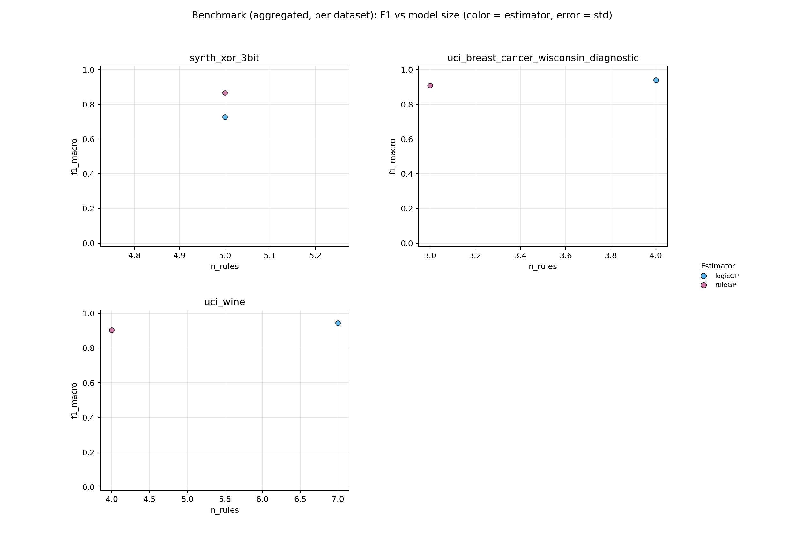
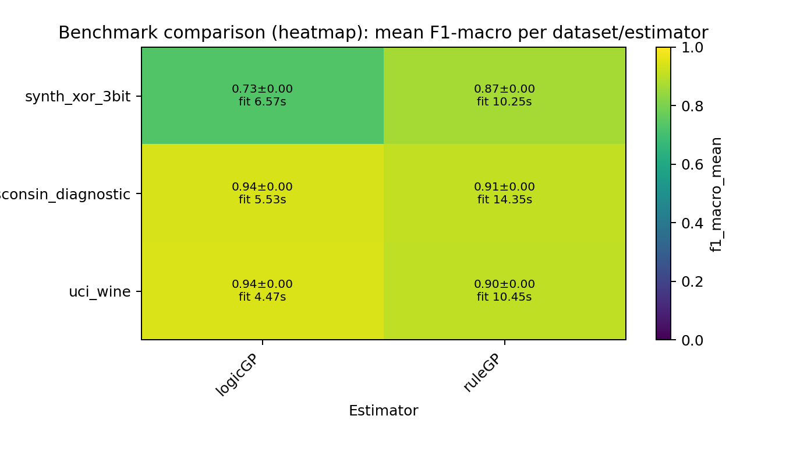

# ScoredRuleSets Paper Benchmark - Rule-Based Classifiers Comparison

## Summary

- **datasets**: `3`
- **estimators**: `2`
- **warning_runs**: `0`
- **warning_models**: `0`
- **top_1_model**: `uci_wine / logicGP` (f1=0.9450, rules=7.0000, fit_s=4.4731)

## Configuration

- **datasets**: `sklearn_breast_cancer, uci_wine, synth_xor_3bit`
- **estimators**: `logicGP, ruleGP`
- **repeats**: `1`
- **timeout_seconds**: `90s`
- **design**: `8 Rule-Based Classifiers x 3 Datasets (2 real-world, 1 synthetic), 1 repeats`

## Artifacts

- **raw_csv**: [benchmark_results.csv](benchmark_results.csv)
- **raw_json**: [benchmark_results.json](benchmark_results.json)
- **aggregated_csv**: [benchmark_results_aggregated.csv](benchmark_results_aggregated.csv)
- **aggregated_json**: [benchmark_results_aggregated.json](benchmark_results_aggregated.json)
- **plot_png**: [benchmark_results.png](benchmark_results.png)
- **plot_pdf**: [benchmark_results.pdf](benchmark_results.pdf)
- **heatmap_png**: [benchmark_results_heatmap.png](benchmark_results_heatmap.png)
- **heatmap_pdf**: [benchmark_results_heatmap.pdf](benchmark_results_heatmap.pdf)
- **combined_heatmap_png**: [benchmark_results_heatmap_combined.png](benchmark_results_heatmap_combined.png)
- **combined_heatmap_pdf**: [benchmark_results_heatmap_combined.pdf](benchmark_results_heatmap_combined.pdf)
- **combined_dot_png**: [benchmark_results_combined_dot.png](benchmark_results_combined_dot.png)
- **combined_dot_pdf**: [benchmark_results_combined_dot.pdf](benchmark_results_combined_dot.pdf)
- **pareto_png**: [benchmark_results_pareto.png](benchmark_results_pareto.png)
- **pareto_pdf**: [benchmark_results_pareto.pdf](benchmark_results_pareto.pdf)
- **cd_png**: [benchmark_results_cd.png](benchmark_results_cd.png)
- **cd_pdf**: [benchmark_results_cd.pdf](benchmark_results_cd.pdf)
- **wtl_png**: [benchmark_results_wtl.png](benchmark_results_wtl.png)
- **wtl_pdf**: [benchmark_results_wtl.pdf](benchmark_results_wtl.pdf)
- **wtl_size_png**: [benchmark_results_wtl_size.png](benchmark_results_wtl_size.png)
- **wtl_size_pdf**: [benchmark_results_wtl_size.pdf](benchmark_results_wtl_size.pdf)
- **wtl_pareto_png**: [benchmark_results_wtl_pareto.png](benchmark_results_wtl_pareto.png)
- **wtl_pareto_pdf**: [benchmark_results_wtl_pareto.pdf](benchmark_results_wtl_pareto.pdf)
- **wtl_triangular_png**: [benchmark_results_wtl_triangular.png](benchmark_results_wtl_triangular.png)
- **wtl_triangular_pdf**: [benchmark_results_wtl_triangular.pdf](benchmark_results_wtl_triangular.pdf)
- **efficiency_png**: [benchmark_results_efficiency.png](benchmark_results_efficiency.png)
- **efficiency_pdf**: [benchmark_results_efficiency.pdf](benchmark_results_efficiency.pdf)

## Plot Preview

_Heatmap add-on: compact overview of aggregated F1 values and fit times per dataset/estimator._

## Notes

- Paper Benchmark: 8 rule-based classifiers on 10 selected datasets.
- Real-world datasets: sklearn_breast_cancer, sklearn_wine, uci_car_evaluation, uci_heart_disease.
- Synthetic datasets chosen for concept diversity: DNF rules, overlapping rules, MONK-3 noise, XOR/parity, class imbalance, geometric complexity.
- ExSTraCS (LRC) applies Lossy Rule Compaction post-hoc (interval merge + conservative pruning; 0-6% F1 loss, 29-98% rule reduction).
- Timeout per run: 90s. 1 repeats, random_state=42.

## Top per Dataset

### uci_wine

- **best_model**: `logicGP` (f1=0.9450, rules=7.0000, fit_s=4.4731)
- **smallest_model**: `ruleGP` (rules=4.0000, atoms=4.0000, f1=0.9046)
- **fastest_model**: `logicGP` (fit_s=4.4731, f1=0.9450, rules=7.0000)

### uci_breast_cancer_wisconsin_diagnostic

- **best_model**: `logicGP` (f1=0.9390, rules=4.0000, fit_s=5.5328)
- **smallest_model**: `ruleGP` (rules=3.0000, atoms=3.0000, f1=0.9086)
- **fastest_model**: `logicGP` (fit_s=5.5328, f1=0.9390, rules=4.0000)

### synth_xor_3bit

- **best_model**: `ruleGP` (f1=0.8664, rules=5.0000, fit_s=10.2493)
- **smallest_model**: `logicGP` (rules=5.0000, atoms=5.0000, f1=0.7271)
- **fastest_model**: `logicGP` (fit_s=6.5697, f1=0.7271, rules=5.0000)

## Pareto Front (F1 vs Model Size)

### uci_wine

| estimator | f1_mean | atoms | rules |
| --- | ---: | ---: | ---: |
| logicGP | 0.9450 | 6.0000 | 7.0000 |
| ruleGP | 0.9046 | 4.0000 | 4.0000 |

### uci_breast_cancer_wisconsin_diagnostic

| estimator | f1_mean | atoms | rules |
| --- | ---: | ---: | ---: |
| logicGP | 0.9390 | 3.0000 | 4.0000 |

### synth_xor_3bit

| estimator | f1_mean | atoms | rules |
| --- | ---: | ---: | ---: |
| ruleGP | 0.8664 | 8.0000 | 5.0000 |
| logicGP | 0.7271 | 5.0000 | 5.0000 |

## Leaderboard

| rank | dataset | estimator | repeats | f1_mean | f1_err | fit_s | rules | atoms |
| ---: | --- | --- | ---: | ---: | ---: | ---: | ---: | ---: |
| 1 | uci_wine | logicGP | 1 | 0.9450 | 0.0000 | 4.4731 | 7.0000 | 6.0000 |
| 2 | uci_breast_cancer_wisconsin_diagnostic | logicGP | 1 | 0.9390 | 0.0000 | 5.5328 | 4.0000 | 3.0000 |
| 3 | uci_breast_cancer_wisconsin_diagnostic | ruleGP | 1 | 0.9086 | 0.0000 | 14.3464 | 3.0000 | 3.0000 |
| 4 | uci_wine | ruleGP | 1 | 0.9046 | 0.0000 | 10.4485 | 4.0000 | 4.0000 |
| 5 | synth_xor_3bit | ruleGP | 1 | 0.8664 | 0.0000 | 10.2493 | 5.0000 | 8.0000 |
| 6 | synth_xor_3bit | logicGP | 1 | 0.7271 | 0.0000 | 6.5697 | 5.0000 | 5.0000 |

## Dataset: uci_wine

- **best_model**: `logicGP` (f1=0.9450, rules=7.0000, fit_s=4.4731)
- **smallest_model**: `ruleGP` (rules=4.0000, atoms=4.0000, f1=0.9046)
- **fastest_model**: `logicGP` (fit_s=4.4731, f1=0.9450, rules=7.0000)

| rank | dataset | estimator | repeats | f1_mean | f1_err | fit_s | rules | atoms |
| ---: | --- | --- | ---: | ---: | ---: | ---: | ---: | ---: |
| 1 | uci_wine | logicGP | 1 | 0.9450 | 0.0000 | 4.4731 | 7.0000 | 6.0000 |
| 2 | uci_wine | ruleGP | 1 | 0.9046 | 0.0000 | 10.4485 | 4.0000 | 4.0000 |

## Dataset: uci_breast_cancer_wisconsin_diagnostic

- **best_model**: `logicGP` (f1=0.9390, rules=4.0000, fit_s=5.5328)
- **smallest_model**: `ruleGP` (rules=3.0000, atoms=3.0000, f1=0.9086)
- **fastest_model**: `logicGP` (fit_s=5.5328, f1=0.9390, rules=4.0000)

| rank | dataset | estimator | repeats | f1_mean | f1_err | fit_s | rules | atoms |
| ---: | --- | --- | ---: | ---: | ---: | ---: | ---: | ---: |
| 1 | uci_breast_cancer_wisconsin_diagnostic | logicGP | 1 | 0.9390 | 0.0000 | 5.5328 | 4.0000 | 3.0000 |
| 2 | uci_breast_cancer_wisconsin_diagnostic | ruleGP | 1 | 0.9086 | 0.0000 | 14.3464 | 3.0000 | 3.0000 |

## Dataset: synth_xor_3bit

- **best_model**: `ruleGP` (f1=0.8664, rules=5.0000, fit_s=10.2493)
- **smallest_model**: `logicGP` (rules=5.0000, atoms=5.0000, f1=0.7271)
- **fastest_model**: `logicGP` (fit_s=6.5697, f1=0.7271, rules=5.0000)

| rank | dataset | estimator | repeats | f1_mean | f1_err | fit_s | rules | atoms |
| ---: | --- | --- | ---: | ---: | ---: | ---: | ---: | ---: |
| 1 | synth_xor_3bit | ruleGP | 1 | 0.8664 | 0.0000 | 10.2493 | 5.0000 | 8.0000 |
| 2 | synth_xor_3bit | logicGP | 1 | 0.7271 | 0.0000 | 6.5697 | 5.0000 | 5.0000 |
