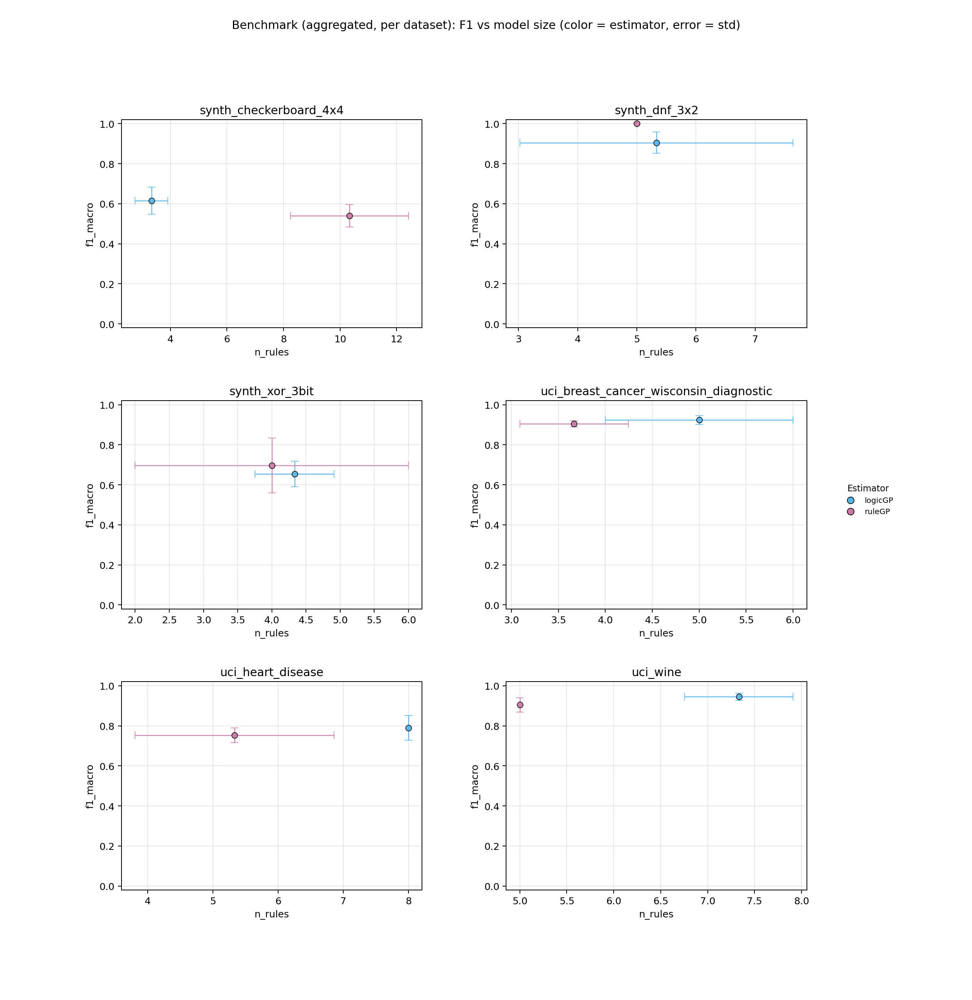
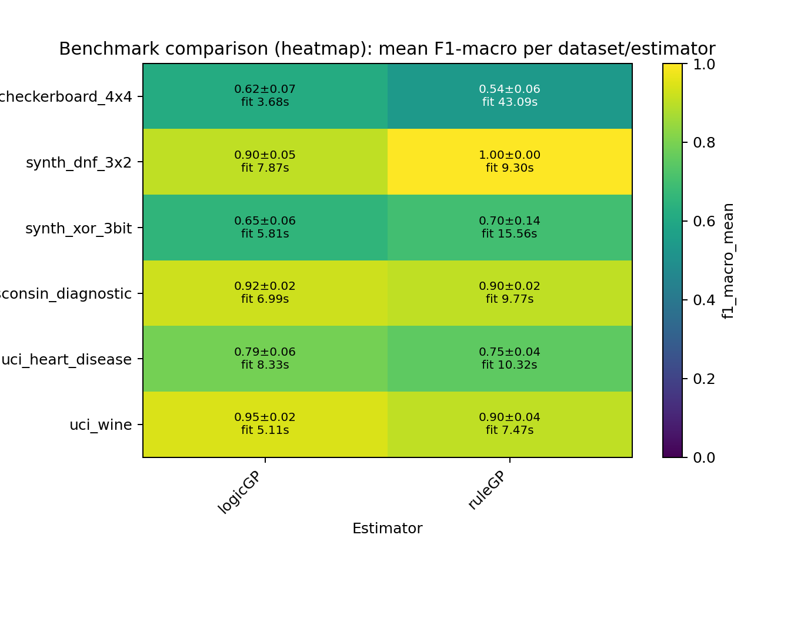

# ScoredRuleSets Paper Benchmark - Rule-Based Classifiers Comparison

## Summary

- **datasets**: `6`
- **estimators**: `2`
- **warning_runs**: `0`
- **warning_models**: `0`
- **top_1_model**: `synth_dnf_3x2 / ruleGP` (f1=1.0000, rules=5.0000, fit_s=9.2972)

## Configuration

- **datasets**: `sklearn_breast_cancer, sklearn_wine, uci_heart_disease, synth_dnf_3x2, synth_xor_3bit, synth_checkerboard_4x4`
- **estimators**: `logicGP, ruleGP`
- **repeats**: `3`
- **timeout_seconds**: `90s`
- **design**: `8 Rule-Based Classifiers x 6 Datasets (3 real-world, 3 synthetic), 3 repeats`

## Artifacts

- **raw_csv**: [benchmark_results.csv](benchmark_results.csv)
- **raw_json**: [benchmark_results.json](benchmark_results.json)
- **aggregated_csv**: [benchmark_results_aggregated.csv](benchmark_results_aggregated.csv)
- **aggregated_json**: [benchmark_results_aggregated.json](benchmark_results_aggregated.json)
- **plot_png**: [benchmark_results.png](benchmark_results.png)
- **plot_pdf**: [benchmark_results.pdf](benchmark_results.pdf)
- **heatmap_png**: [benchmark_results_heatmap.png](benchmark_results_heatmap.png)
- **heatmap_pdf**: [benchmark_results_heatmap.pdf](benchmark_results_heatmap.pdf)
- **combined_heatmap_png**: [benchmark_results_heatmap_combined.png](benchmark_results_heatmap_combined.png)
- **combined_heatmap_pdf**: [benchmark_results_heatmap_combined.pdf](benchmark_results_heatmap_combined.pdf)
- **combined_dot_png**: [benchmark_results_combined_dot.png](benchmark_results_combined_dot.png)
- **combined_dot_pdf**: [benchmark_results_combined_dot.pdf](benchmark_results_combined_dot.pdf)
- **pareto_png**: [benchmark_results_pareto.png](benchmark_results_pareto.png)
- **pareto_pdf**: [benchmark_results_pareto.pdf](benchmark_results_pareto.pdf)
- **cd_png**: [benchmark_results_cd.png](benchmark_results_cd.png)
- **cd_pdf**: [benchmark_results_cd.pdf](benchmark_results_cd.pdf)
- **wtl_png**: [benchmark_results_wtl.png](benchmark_results_wtl.png)
- **wtl_pdf**: [benchmark_results_wtl.pdf](benchmark_results_wtl.pdf)
- **wtl_size_png**: [benchmark_results_wtl_size.png](benchmark_results_wtl_size.png)
- **wtl_size_pdf**: [benchmark_results_wtl_size.pdf](benchmark_results_wtl_size.pdf)
- **wtl_pareto_png**: [benchmark_results_wtl_pareto.png](benchmark_results_wtl_pareto.png)
- **wtl_pareto_pdf**: [benchmark_results_wtl_pareto.pdf](benchmark_results_wtl_pareto.pdf)
- **wtl_triangular_png**: [benchmark_results_wtl_triangular.png](benchmark_results_wtl_triangular.png)
- **wtl_triangular_pdf**: [benchmark_results_wtl_triangular.pdf](benchmark_results_wtl_triangular.pdf)
- **efficiency_png**: [benchmark_results_efficiency.png](benchmark_results_efficiency.png)
- **efficiency_pdf**: [benchmark_results_efficiency.pdf](benchmark_results_efficiency.pdf)

## Plot Preview

_Heatmap add-on: compact overview of aggregated F1 values and fit times per dataset/estimator._

## Notes

- Paper Benchmark: 8 rule-based classifiers on 10 selected datasets.
- Real-world datasets: sklearn_breast_cancer, sklearn_wine, uci_car_evaluation, uci_heart_disease.
- Synthetic datasets chosen for concept diversity: DNF rules, overlapping rules, MONK-3 noise, XOR/parity, class imbalance, geometric complexity.
- ExSTraCS (LRC) applies Lossy Rule Compaction post-hoc (interval merge + conservative pruning; 0-6% F1 loss, 29-98% rule reduction).
- Timeout per run: 90s. 3 repeats, random_state=42.

## Top per Dataset

### synth_dnf_3x2

- **best_model**: `ruleGP` (f1=1.0000, rules=5.0000, fit_s=9.2972)
- **smallest_model**: `ruleGP` (rules=5.0000, atoms=6.0000, f1=1.0000)
- **fastest_model**: `logicGP` (fit_s=7.8656, f1=0.9047, rules=5.3333)

### uci_wine

- **best_model**: `logicGP` (f1=0.9453, rules=7.3333, fit_s=5.1131)
- **smallest_model**: `ruleGP` (rules=5.0000, atoms=4.0000, f1=0.9044)
- **fastest_model**: `logicGP` (fit_s=5.1131, f1=0.9453, rules=7.3333)

### uci_breast_cancer_wisconsin_diagnostic

- **best_model**: `logicGP` (f1=0.9233, rules=5.0000, fit_s=6.9888)
- **smallest_model**: `ruleGP` (rules=3.6667, atoms=3.3333, f1=0.9040)
- **fastest_model**: `logicGP` (fit_s=6.9888, f1=0.9233, rules=5.0000)

### uci_heart_disease

- **best_model**: `logicGP` (f1=0.7895, rules=8.0000, fit_s=8.3298)
- **smallest_model**: `ruleGP` (rules=5.3333, atoms=6.3333, f1=0.7524)
- **fastest_model**: `logicGP` (fit_s=8.3298, f1=0.7895, rules=8.0000)

### synth_xor_3bit

- **best_model**: `ruleGP` (f1=0.6965, rules=4.0000, fit_s=15.5614)
- **smallest_model**: `ruleGP` (rules=4.0000, atoms=7.3333, f1=0.6965)
- **fastest_model**: `logicGP` (fit_s=5.8068, f1=0.6542, rules=4.3333)

### synth_checkerboard_4x4

- **best_model**: `logicGP` (f1=0.6159, rules=3.3333, fit_s=3.6754)
- **smallest_model**: `logicGP` (rules=3.3333, atoms=3.3333, f1=0.6159)
- **fastest_model**: `logicGP` (fit_s=3.6754, f1=0.6159, rules=3.3333)

## Pareto Front (F1 vs Model Size)

### synth_dnf_3x2

| estimator | f1_mean | atoms | rules |
| --- | ---: | ---: | ---: |
| ruleGP | 1.0000 | 6.0000 | 5.0000 |

### uci_wine

| estimator | f1_mean | atoms | rules |
| --- | ---: | ---: | ---: |
| logicGP | 0.9453 | 6.3333 | 7.3333 |
| ruleGP | 0.9044 | 4.0000 | 5.0000 |

### uci_breast_cancer_wisconsin_diagnostic

| estimator | f1_mean | atoms | rules |
| --- | ---: | ---: | ---: |
| logicGP | 0.9233 | 4.0000 | 5.0000 |
| ruleGP | 0.9040 | 3.3333 | 3.6667 |

### uci_heart_disease

| estimator | f1_mean | atoms | rules |
| --- | ---: | ---: | ---: |
| logicGP | 0.7895 | 7.3333 | 8.0000 |
| ruleGP | 0.7524 | 6.3333 | 5.3333 |

### synth_xor_3bit

| estimator | f1_mean | atoms | rules |
| --- | ---: | ---: | ---: |
| ruleGP | 0.6965 | 7.3333 | 4.0000 |
| logicGP | 0.6542 | 6.0000 | 4.3333 |

### synth_checkerboard_4x4

| estimator | f1_mean | atoms | rules |
| --- | ---: | ---: | ---: |
| logicGP | 0.6159 | 3.3333 | 3.3333 |

## Leaderboard

| rank | dataset | estimator | repeats | f1_mean | f1_err | fit_s | rules | atoms |
| ---: | --- | --- | ---: | ---: | ---: | ---: | ---: | ---: |
| 1 | synth_dnf_3x2 | ruleGP | 3 | 1.0000 | 0.0000 | 9.2972 | 5.0000 | 6.0000 |
| 2 | uci_wine | logicGP | 3 | 0.9453 | 0.0181 | 5.1131 | 7.3333 | 6.3333 |
| 3 | uci_breast_cancer_wisconsin_diagnostic | logicGP | 3 | 0.9233 | 0.0217 | 6.9888 | 5.0000 | 4.0000 |
| 4 | synth_dnf_3x2 | logicGP | 3 | 0.9047 | 0.0529 | 7.8656 | 5.3333 | 7.0000 |
| 5 | uci_wine | ruleGP | 3 | 0.9044 | 0.0363 | 7.4747 | 5.0000 | 4.0000 |
| 6 | uci_breast_cancer_wisconsin_diagnostic | ruleGP | 3 | 0.9040 | 0.0155 | 9.7657 | 3.6667 | 3.3333 |
| 7 | uci_heart_disease | logicGP | 3 | 0.7895 | 0.0619 | 8.3298 | 8.0000 | 7.3333 |
| 8 | uci_heart_disease | ruleGP | 3 | 0.7524 | 0.0363 | 10.3208 | 5.3333 | 6.3333 |
| 9 | synth_xor_3bit | ruleGP | 3 | 0.6965 | 0.1362 | 15.5614 | 4.0000 | 7.3333 |
| 10 | synth_xor_3bit | logicGP | 3 | 0.6542 | 0.0642 | 5.8068 | 4.3333 | 6.0000 |
| 11 | synth_checkerboard_4x4 | logicGP | 3 | 0.6159 | 0.0675 | 3.6754 | 3.3333 | 3.3333 |
| 12 | synth_checkerboard_4x4 | ruleGP | 3 | 0.5401 | 0.0559 | 43.0925 | 10.3333 | 17.6667 |

## Dataset: synth_dnf_3x2

- **best_model**: `ruleGP` (f1=1.0000, rules=5.0000, fit_s=9.2972)
- **smallest_model**: `ruleGP` (rules=5.0000, atoms=6.0000, f1=1.0000)
- **fastest_model**: `logicGP` (fit_s=7.8656, f1=0.9047, rules=5.3333)

| rank | dataset | estimator | repeats | f1_mean | f1_err | fit_s | rules | atoms |
| ---: | --- | --- | ---: | ---: | ---: | ---: | ---: | ---: |
| 1 | synth_dnf_3x2 | ruleGP | 3 | 1.0000 | 0.0000 | 9.2972 | 5.0000 | 6.0000 |
| 2 | synth_dnf_3x2 | logicGP | 3 | 0.9047 | 0.0529 | 7.8656 | 5.3333 | 7.0000 |

## Dataset: uci_wine

- **best_model**: `logicGP` (f1=0.9453, rules=7.3333, fit_s=5.1131)
- **smallest_model**: `ruleGP` (rules=5.0000, atoms=4.0000, f1=0.9044)
- **fastest_model**: `logicGP` (fit_s=5.1131, f1=0.9453, rules=7.3333)

| rank | dataset | estimator | repeats | f1_mean | f1_err | fit_s | rules | atoms |
| ---: | --- | --- | ---: | ---: | ---: | ---: | ---: | ---: |
| 1 | uci_wine | logicGP | 3 | 0.9453 | 0.0181 | 5.1131 | 7.3333 | 6.3333 |
| 2 | uci_wine | ruleGP | 3 | 0.9044 | 0.0363 | 7.4747 | 5.0000 | 4.0000 |

## Dataset: uci_breast_cancer_wisconsin_diagnostic

- **best_model**: `logicGP` (f1=0.9233, rules=5.0000, fit_s=6.9888)
- **smallest_model**: `ruleGP` (rules=3.6667, atoms=3.3333, f1=0.9040)
- **fastest_model**: `logicGP` (fit_s=6.9888, f1=0.9233, rules=5.0000)

| rank | dataset | estimator | repeats | f1_mean | f1_err | fit_s | rules | atoms |
| ---: | --- | --- | ---: | ---: | ---: | ---: | ---: | ---: |
| 1 | uci_breast_cancer_wisconsin_diagnostic | logicGP | 3 | 0.9233 | 0.0217 | 6.9888 | 5.0000 | 4.0000 |
| 2 | uci_breast_cancer_wisconsin_diagnostic | ruleGP | 3 | 0.9040 | 0.0155 | 9.7657 | 3.6667 | 3.3333 |

## Dataset: uci_heart_disease

- **best_model**: `logicGP` (f1=0.7895, rules=8.0000, fit_s=8.3298)
- **smallest_model**: `ruleGP` (rules=5.3333, atoms=6.3333, f1=0.7524)
- **fastest_model**: `logicGP` (fit_s=8.3298, f1=0.7895, rules=8.0000)

| rank | dataset | estimator | repeats | f1_mean | f1_err | fit_s | rules | atoms |
| ---: | --- | --- | ---: | ---: | ---: | ---: | ---: | ---: |
| 1 | uci_heart_disease | logicGP | 3 | 0.7895 | 0.0619 | 8.3298 | 8.0000 | 7.3333 |
| 2 | uci_heart_disease | ruleGP | 3 | 0.7524 | 0.0363 | 10.3208 | 5.3333 | 6.3333 |

## Dataset: synth_xor_3bit

- **best_model**: `ruleGP` (f1=0.6965, rules=4.0000, fit_s=15.5614)
- **smallest_model**: `ruleGP` (rules=4.0000, atoms=7.3333, f1=0.6965)
- **fastest_model**: `logicGP` (fit_s=5.8068, f1=0.6542, rules=4.3333)

| rank | dataset | estimator | repeats | f1_mean | f1_err | fit_s | rules | atoms |
| ---: | --- | --- | ---: | ---: | ---: | ---: | ---: | ---: |
| 1 | synth_xor_3bit | ruleGP | 3 | 0.6965 | 0.1362 | 15.5614 | 4.0000 | 7.3333 |
| 2 | synth_xor_3bit | logicGP | 3 | 0.6542 | 0.0642 | 5.8068 | 4.3333 | 6.0000 |

## Dataset: synth_checkerboard_4x4

- **best_model**: `logicGP` (f1=0.6159, rules=3.3333, fit_s=3.6754)
- **smallest_model**: `logicGP` (rules=3.3333, atoms=3.3333, f1=0.6159)
- **fastest_model**: `logicGP` (fit_s=3.6754, f1=0.6159, rules=3.3333)

| rank | dataset | estimator | repeats | f1_mean | f1_err | fit_s | rules | atoms |
| ---: | --- | --- | ---: | ---: | ---: | ---: | ---: | ---: |
| 1 | synth_checkerboard_4x4 | logicGP | 3 | 0.6159 | 0.0675 | 3.6754 | 3.3333 | 3.3333 |
| 2 | synth_checkerboard_4x4 | ruleGP | 3 | 0.5401 | 0.0559 | 43.0925 | 10.3333 | 17.6667 |
