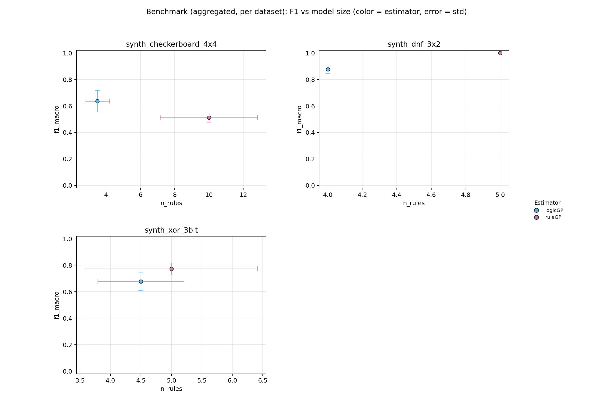
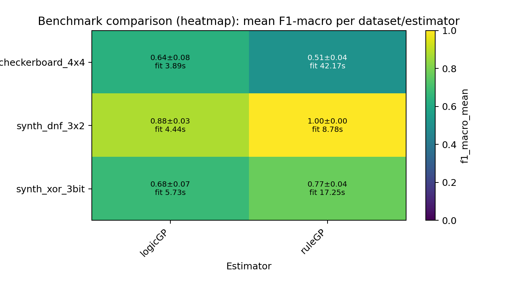

# ScoredRuleSets Paper Benchmark - Rule-Based Classifiers Comparison

## Summary

- **datasets**: `3`
- **estimators**: `2`
- **warning_runs**: `0`
- **warning_models**: `0`
- **top_1_model**: `synth_dnf_3x2 / ruleGP` (f1=1.0000, rules=5.0000, fit_s=8.7784)

## Configuration

- **datasets**: `synth_dnf_3x2, synth_xor_3bit, synth_checkerboard_4x4`
- **estimators**: `logicGP, ruleGP`
- **repeats**: `2`
- **timeout_seconds**: `90s`
- **design**: `8 Rule-Based Classifiers x 3 Datasets (0 real-world, 3 synthetic), 2 repeats`

## Artifacts

- **raw_csv**: [benchmark_results.csv](benchmark_results.csv)
- **raw_json**: [benchmark_results.json](benchmark_results.json)
- **aggregated_csv**: [benchmark_results_aggregated.csv](benchmark_results_aggregated.csv)
- **aggregated_json**: [benchmark_results_aggregated.json](benchmark_results_aggregated.json)
- **plot_png**: [benchmark_results.png](benchmark_results.png)
- **plot_pdf**: [benchmark_results.pdf](benchmark_results.pdf)
- **heatmap_png**: [benchmark_results_heatmap.png](benchmark_results_heatmap.png)
- **heatmap_pdf**: [benchmark_results_heatmap.pdf](benchmark_results_heatmap.pdf)
- **combined_heatmap_png**: [benchmark_results_heatmap_combined.png](benchmark_results_heatmap_combined.png)
- **combined_heatmap_pdf**: [benchmark_results_heatmap_combined.pdf](benchmark_results_heatmap_combined.pdf)
- **combined_dot_png**: [benchmark_results_combined_dot.png](benchmark_results_combined_dot.png)
- **combined_dot_pdf**: [benchmark_results_combined_dot.pdf](benchmark_results_combined_dot.pdf)
- **pareto_png**: [benchmark_results_pareto.png](benchmark_results_pareto.png)
- **pareto_pdf**: [benchmark_results_pareto.pdf](benchmark_results_pareto.pdf)
- **cd_png**: [benchmark_results_cd.png](benchmark_results_cd.png)
- **cd_pdf**: [benchmark_results_cd.pdf](benchmark_results_cd.pdf)
- **wtl_png**: [benchmark_results_wtl.png](benchmark_results_wtl.png)
- **wtl_pdf**: [benchmark_results_wtl.pdf](benchmark_results_wtl.pdf)
- **wtl_size_png**: [benchmark_results_wtl_size.png](benchmark_results_wtl_size.png)
- **wtl_size_pdf**: [benchmark_results_wtl_size.pdf](benchmark_results_wtl_size.pdf)
- **wtl_pareto_png**: [benchmark_results_wtl_pareto.png](benchmark_results_wtl_pareto.png)
- **wtl_pareto_pdf**: [benchmark_results_wtl_pareto.pdf](benchmark_results_wtl_pareto.pdf)
- **wtl_triangular_png**: [benchmark_results_wtl_triangular.png](benchmark_results_wtl_triangular.png)
- **wtl_triangular_pdf**: [benchmark_results_wtl_triangular.pdf](benchmark_results_wtl_triangular.pdf)
- **efficiency_png**: [benchmark_results_efficiency.png](benchmark_results_efficiency.png)
- **efficiency_pdf**: [benchmark_results_efficiency.pdf](benchmark_results_efficiency.pdf)

## Plot Preview

_Heatmap add-on: compact overview of aggregated F1 values and fit times per dataset/estimator._

## Notes

- Paper Benchmark: 8 rule-based classifiers on 10 selected datasets.
- Real-world datasets: sklearn_breast_cancer, sklearn_wine, uci_car_evaluation, uci_heart_disease.
- Synthetic datasets chosen for concept diversity: DNF rules, overlapping rules, MONK-3 noise, XOR/parity, class imbalance, geometric complexity.
- ExSTraCS (LRC) applies Lossy Rule Compaction post-hoc (interval merge + conservative pruning; 0-6% F1 loss, 29-98% rule reduction).
- Timeout per run: 90s. 2 repeats, random_state=42.

## Top per Dataset

### synth_dnf_3x2

- **best_model**: `ruleGP` (f1=1.0000, rules=5.0000, fit_s=8.7784)
- **smallest_model**: `logicGP` (rules=4.0000, atoms=5.0000, f1=0.8774)
- **fastest_model**: `logicGP` (fit_s=4.4378, f1=0.8774, rules=4.0000)

### synth_xor_3bit

- **best_model**: `ruleGP` (f1=0.7729, rules=5.0000, fit_s=17.2495)
- **smallest_model**: `logicGP` (rules=4.5000, atoms=6.5000, f1=0.6784)
- **fastest_model**: `logicGP` (fit_s=5.7334, f1=0.6784, rules=4.5000)

### synth_checkerboard_4x4

- **best_model**: `logicGP` (f1=0.6359, rules=3.5000, fit_s=3.8945)
- **smallest_model**: `logicGP` (rules=3.5000, atoms=3.5000, f1=0.6359)
- **fastest_model**: `logicGP` (fit_s=3.8945, f1=0.6359, rules=3.5000)

## Pareto Front (F1 vs Model Size)

### synth_dnf_3x2

| estimator | f1_mean | atoms | rules |
| --- | ---: | ---: | ---: |
| ruleGP | 1.0000 | 6.0000 | 5.0000 |
| logicGP | 0.8774 | 5.0000 | 4.0000 |

### synth_xor_3bit

| estimator | f1_mean | atoms | rules |
| --- | ---: | ---: | ---: |
| ruleGP | 0.7729 | 9.5000 | 5.0000 |
| logicGP | 0.6784 | 6.5000 | 4.5000 |

### synth_checkerboard_4x4

| estimator | f1_mean | atoms | rules |
| --- | ---: | ---: | ---: |
| logicGP | 0.6359 | 3.5000 | 3.5000 |

## Leaderboard

| rank | dataset | estimator | repeats | f1_mean | f1_err | fit_s | rules | atoms |
| ---: | --- | --- | ---: | ---: | ---: | ---: | ---: | ---: |
| 1 | synth_dnf_3x2 | ruleGP | 2 | 1.0000 | 0.0000 | 8.7784 | 5.0000 | 6.0000 |
| 2 | synth_dnf_3x2 | logicGP | 2 | 0.8774 | 0.0331 | 4.4378 | 4.0000 | 5.0000 |
| 3 | synth_xor_3bit | ruleGP | 2 | 0.7729 | 0.0448 | 17.2495 | 5.0000 | 9.5000 |
| 4 | synth_xor_3bit | logicGP | 2 | 0.6784 | 0.0687 | 5.7334 | 4.5000 | 6.5000 |
| 5 | synth_checkerboard_4x4 | logicGP | 2 | 0.6359 | 0.0819 | 3.8945 | 3.5000 | 3.5000 |
| 6 | synth_checkerboard_4x4 | ruleGP | 2 | 0.5112 | 0.0350 | 42.1705 | 10.0000 | 17.5000 |

## Dataset: synth_dnf_3x2

- **best_model**: `ruleGP` (f1=1.0000, rules=5.0000, fit_s=8.7784)
- **smallest_model**: `logicGP` (rules=4.0000, atoms=5.0000, f1=0.8774)
- **fastest_model**: `logicGP` (fit_s=4.4378, f1=0.8774, rules=4.0000)

| rank | dataset | estimator | repeats | f1_mean | f1_err | fit_s | rules | atoms |
| ---: | --- | --- | ---: | ---: | ---: | ---: | ---: | ---: |
| 1 | synth_dnf_3x2 | ruleGP | 2 | 1.0000 | 0.0000 | 8.7784 | 5.0000 | 6.0000 |
| 2 | synth_dnf_3x2 | logicGP | 2 | 0.8774 | 0.0331 | 4.4378 | 4.0000 | 5.0000 |

## Dataset: synth_xor_3bit

- **best_model**: `ruleGP` (f1=0.7729, rules=5.0000, fit_s=17.2495)
- **smallest_model**: `logicGP` (rules=4.5000, atoms=6.5000, f1=0.6784)
- **fastest_model**: `logicGP` (fit_s=5.7334, f1=0.6784, rules=4.5000)

| rank | dataset | estimator | repeats | f1_mean | f1_err | fit_s | rules | atoms |
| ---: | --- | --- | ---: | ---: | ---: | ---: | ---: | ---: |
| 1 | synth_xor_3bit | ruleGP | 2 | 0.7729 | 0.0448 | 17.2495 | 5.0000 | 9.5000 |
| 2 | synth_xor_3bit | logicGP | 2 | 0.6784 | 0.0687 | 5.7334 | 4.5000 | 6.5000 |

## Dataset: synth_checkerboard_4x4

- **best_model**: `logicGP` (f1=0.6359, rules=3.5000, fit_s=3.8945)
- **smallest_model**: `logicGP` (rules=3.5000, atoms=3.5000, f1=0.6359)
- **fastest_model**: `logicGP` (fit_s=3.8945, f1=0.6359, rules=3.5000)

| rank | dataset | estimator | repeats | f1_mean | f1_err | fit_s | rules | atoms |
| ---: | --- | --- | ---: | ---: | ---: | ---: | ---: | ---: |
| 1 | synth_checkerboard_4x4 | logicGP | 2 | 0.6359 | 0.0819 | 3.8945 | 3.5000 | 3.5000 |
| 2 | synth_checkerboard_4x4 | ruleGP | 2 | 0.5112 | 0.0350 | 42.1705 | 10.0000 | 17.5000 |
