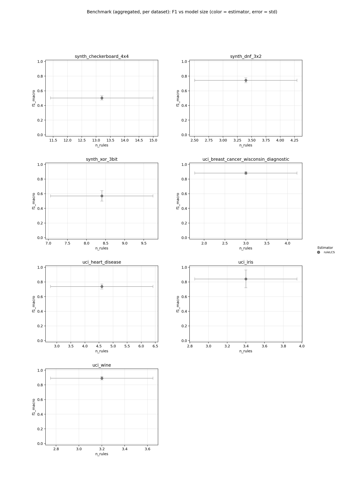
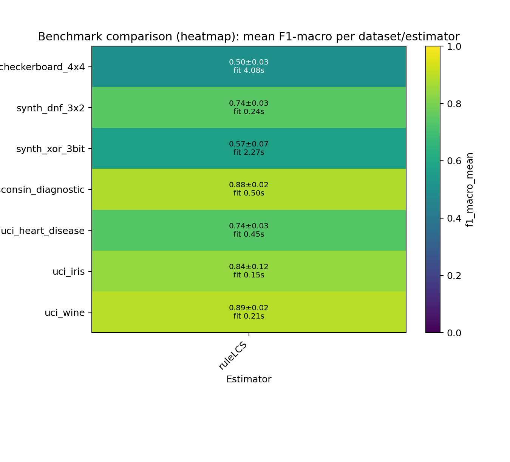

# ScoredRuleSets Paper Benchmark - Rule-Based Classifiers Comparison

## Summary

- **datasets**: `7`
- **estimators**: `2`
- **warning_runs**: `0`
- **warning_models**: `0`
- **top_1_model**: `synth_dnf_3x2 / ruleLCS2` (f1=1.0000, rules=9.0000, fit_s=14.9221)

## Configuration

- **datasets**: `sklearn_breast_cancer, sklearn_wine, sklearn_iris, uci_heart_disease, synth_dnf_3x2, synth_xor_3bit, synth_checkerboard_4x4`
- **estimators**: `ruleLCS, ruleLCS2`
- **repeats**: `5`
- **timeout_seconds**: `300s`
- **design**: `8 Rule-Based Classifiers x 7 Datasets (4 real-world, 3 synthetic), 5 repeats`

## Artifacts

- **raw_csv**: [benchmark_results.csv](benchmark_results.csv)
- **raw_json**: [benchmark_results.json](benchmark_results.json)
- **aggregated_csv**: [benchmark_results_aggregated.csv](benchmark_results_aggregated.csv)
- **aggregated_json**: [benchmark_results_aggregated.json](benchmark_results_aggregated.json)
- **plot_png**: [benchmark_results.png](benchmark_results.png)
- **plot_pdf**: [benchmark_results.pdf](benchmark_results.pdf)
- **heatmap_png**: [benchmark_results_heatmap.png](benchmark_results_heatmap.png)
- **heatmap_pdf**: [benchmark_results_heatmap.pdf](benchmark_results_heatmap.pdf)
- **combined_heatmap_png**: [benchmark_results_heatmap_combined.png](benchmark_results_heatmap_combined.png)
- **combined_heatmap_pdf**: [benchmark_results_heatmap_combined.pdf](benchmark_results_heatmap_combined.pdf)
- **combined_dot_png**: [benchmark_results_combined_dot.png](benchmark_results_combined_dot.png)
- **combined_dot_pdf**: [benchmark_results_combined_dot.pdf](benchmark_results_combined_dot.pdf)
- **pareto_png**: [benchmark_results_pareto.png](benchmark_results_pareto.png)
- **pareto_pdf**: [benchmark_results_pareto.pdf](benchmark_results_pareto.pdf)
- **cd_png**: [benchmark_results_cd.png](benchmark_results_cd.png)
- **cd_pdf**: [benchmark_results_cd.pdf](benchmark_results_cd.pdf)
- **wtl_png**: [benchmark_results_wtl.png](benchmark_results_wtl.png)
- **wtl_pdf**: [benchmark_results_wtl.pdf](benchmark_results_wtl.pdf)
- **wtl_size_png**: [benchmark_results_wtl_size.png](benchmark_results_wtl_size.png)
- **wtl_size_pdf**: [benchmark_results_wtl_size.pdf](benchmark_results_wtl_size.pdf)
- **wtl_pareto_png**: [benchmark_results_wtl_pareto.png](benchmark_results_wtl_pareto.png)
- **wtl_pareto_pdf**: [benchmark_results_wtl_pareto.pdf](benchmark_results_wtl_pareto.pdf)
- **wtl_triangular_png**: [benchmark_results_wtl_triangular.png](benchmark_results_wtl_triangular.png)
- **wtl_triangular_pdf**: [benchmark_results_wtl_triangular.pdf](benchmark_results_wtl_triangular.pdf)
- **efficiency_png**: [benchmark_results_efficiency.png](benchmark_results_efficiency.png)
- **efficiency_pdf**: [benchmark_results_efficiency.pdf](benchmark_results_efficiency.pdf)

## Plot Preview

_Heatmap add-on: compact overview of aggregated F1 values and fit times per dataset/estimator._

## Notes

- Paper Benchmark: 8 rule-based classifiers on 10 selected datasets.
- Real-world datasets: sklearn_breast_cancer, sklearn_wine, uci_car_evaluation, uci_heart_disease.
- Synthetic datasets chosen for concept diversity: DNF rules, overlapping rules, MONK-3 noise, XOR/parity, class imbalance, geometric complexity.
- ExSTraCS (LRC) applies Lossy Rule Compaction post-hoc (interval merge + conservative pruning; 0-6% F1 loss, 29-98% rule reduction).
- Timeout per run: 300s. 5 repeats, random_state=42.

## Top per Dataset

### synth_dnf_3x2

- **best_model**: `ruleLCS2` (f1=1.0000, rules=9.0000, fit_s=14.9221)
- **smallest_model**: `ruleLCS` (rules=3.4000, atoms=5.2000, f1=0.7424)
- **fastest_model**: `ruleLCS` (fit_s=0.2399, f1=0.7424, rules=3.4000)

### synth_xor_3bit

- **best_model**: `ruleLCS2` (f1=0.9988, rules=5.2000, fit_s=7.9429)
- **smallest_model**: `ruleLCS2` (rules=5.2000, atoms=13.8000, f1=0.9988)
- **fastest_model**: `ruleLCS` (fit_s=2.3469, f1=0.5695, rules=8.4000)

### uci_breast_cancer_wisconsin_diagnostic

- **best_model**: `ruleLCS2` (f1=0.9249, rules=8.0000, fit_s=8.3536)
- **smallest_model**: `ruleLCS` (rules=3.0000, atoms=2.8000, f1=0.8826)
- **fastest_model**: `ruleLCS` (fit_s=0.5096, f1=0.8826, rules=3.0000)

### synth_checkerboard_4x4

- **best_model**: `ruleLCS2` (f1=0.8999, rules=16.0000, fit_s=11.3085)
- **smallest_model**: `ruleLCS` (rules=13.2000, atoms=34.2000, f1=0.5024)
- **fastest_model**: `ruleLCS` (fit_s=4.0630, f1=0.5024, rules=13.2000)

### uci_wine

- **best_model**: `ruleLCS` (f1=0.8914, rules=3.2000, fit_s=0.2130)
- **smallest_model**: `ruleLCS` (rules=3.2000, atoms=3.8000, f1=0.8914)
- **fastest_model**: `ruleLCS` (fit_s=0.2130, f1=0.8914, rules=3.2000)

### uci_iris

- **best_model**: `ruleLCS` (f1=0.8419, rules=3.4000, fit_s=0.1561)
- **smallest_model**: `ruleLCS` (rules=3.4000, atoms=2.8000, f1=0.8419)
- **fastest_model**: `ruleLCS` (fit_s=0.1561, f1=0.8419, rules=3.4000)

### uci_heart_disease

- **best_model**: `ruleLCS` (f1=0.7378, rules=4.6000, fit_s=0.4623)
- **smallest_model**: `ruleLCS` (rules=4.6000, atoms=7.6000, f1=0.7378)
- **fastest_model**: `ruleLCS` (fit_s=0.4623, f1=0.7378, rules=4.6000)

## Pareto Front (F1 vs Model Size)

### synth_dnf_3x2

| estimator | f1_mean | atoms | rules |
| --- | ---: | ---: | ---: |
| ruleLCS2 | 1.0000 | 25.2000 | 9.0000 |
| ruleLCS | 0.7424 | 5.2000 | 3.4000 |

### synth_xor_3bit

| estimator | f1_mean | atoms | rules |
| --- | ---: | ---: | ---: |
| ruleLCS2 | 0.9988 | 13.8000 | 5.2000 |

### uci_breast_cancer_wisconsin_diagnostic

| estimator | f1_mean | atoms | rules |
| --- | ---: | ---: | ---: |
| ruleLCS2 | 0.9249 | 34.0000 | 8.0000 |
| ruleLCS | 0.8826 | 2.8000 | 3.0000 |

### synth_checkerboard_4x4

| estimator | f1_mean | atoms | rules |
| --- | ---: | ---: | ---: |
| ruleLCS2 | 0.8999 | 58.2000 | 16.0000 |
| ruleLCS | 0.5024 | 34.2000 | 13.2000 |

### uci_wine

| estimator | f1_mean | atoms | rules |
| --- | ---: | ---: | ---: |
| ruleLCS | 0.8914 | 3.8000 | 3.2000 |

### uci_iris

| estimator | f1_mean | atoms | rules |
| --- | ---: | ---: | ---: |
| ruleLCS | 0.8419 | 2.8000 | 3.4000 |

### uci_heart_disease

| estimator | f1_mean | atoms | rules |
| --- | ---: | ---: | ---: |
| ruleLCS | 0.7378 | 7.6000 | 4.6000 |

## Leaderboard

| rank | dataset | estimator | repeats | f1_mean | f1_err | fit_s | rules | atoms |
| ---: | --- | --- | ---: | ---: | ---: | ---: | ---: | ---: |
| 1 | synth_dnf_3x2 | ruleLCS2 | 5 | 1.0000 | 0.0000 | 14.9221 | 9.0000 | 25.2000 |
| 2 | synth_xor_3bit | ruleLCS2 | 5 | 0.9988 | 0.0027 | 7.9429 | 5.2000 | 13.8000 |
| 3 | uci_breast_cancer_wisconsin_diagnostic | ruleLCS2 | 5 | 0.9249 | 0.0327 | 8.3536 | 8.0000 | 34.0000 |
| 4 | synth_checkerboard_4x4 | ruleLCS2 | 5 | 0.8999 | 0.0379 | 11.3085 | 16.0000 | 58.2000 |
| 5 | uci_wine | ruleLCS | 5 | 0.8914 | 0.0229 | 0.2130 | 3.2000 | 3.8000 |
| 6 | uci_breast_cancer_wisconsin_diagnostic | ruleLCS | 5 | 0.8826 | 0.0182 | 0.5096 | 3.0000 | 2.8000 |
| 7 | uci_iris | ruleLCS | 5 | 0.8419 | 0.1217 | 0.1561 | 3.4000 | 2.8000 |
| 8 | uci_iris | ruleLCS2 | 5 | 0.8258 | 0.1047 | 3.2601 | 6.0000 | 11.2000 |
| 9 | uci_wine | ruleLCS2 | 5 | 0.8249 | 0.0962 | 2.7837 | 3.6000 | 9.8000 |
| 10 | synth_dnf_3x2 | ruleLCS | 5 | 0.7424 | 0.0336 | 0.2399 | 3.4000 | 5.2000 |
| 11 | uci_heart_disease | ruleLCS | 5 | 0.7378 | 0.0342 | 0.4623 | 4.6000 | 7.6000 |
| 12 | uci_heart_disease | ruleLCS2 | 5 | 0.7248 | 0.0489 | 14.7831 | 13.4000 | 46.8000 |
| 13 | synth_xor_3bit | ruleLCS | 5 | 0.5695 | 0.0712 | 2.3469 | 8.4000 | 19.2000 |
| 14 | synth_checkerboard_4x4 | ruleLCS | 5 | 0.5024 | 0.0286 | 4.0630 | 13.2000 | 34.2000 |

## Dataset: synth_dnf_3x2

- **best_model**: `ruleLCS2` (f1=1.0000, rules=9.0000, fit_s=14.9221)
- **smallest_model**: `ruleLCS` (rules=3.4000, atoms=5.2000, f1=0.7424)
- **fastest_model**: `ruleLCS` (fit_s=0.2399, f1=0.7424, rules=3.4000)

| rank | dataset | estimator | repeats | f1_mean | f1_err | fit_s | rules | atoms |
| ---: | --- | --- | ---: | ---: | ---: | ---: | ---: | ---: |
| 1 | synth_dnf_3x2 | ruleLCS2 | 5 | 1.0000 | 0.0000 | 14.9221 | 9.0000 | 25.2000 |
| 2 | synth_dnf_3x2 | ruleLCS | 5 | 0.7424 | 0.0336 | 0.2399 | 3.4000 | 5.2000 |

## Dataset: synth_xor_3bit

- **best_model**: `ruleLCS2` (f1=0.9988, rules=5.2000, fit_s=7.9429)
- **smallest_model**: `ruleLCS2` (rules=5.2000, atoms=13.8000, f1=0.9988)
- **fastest_model**: `ruleLCS` (fit_s=2.3469, f1=0.5695, rules=8.4000)

| rank | dataset | estimator | repeats | f1_mean | f1_err | fit_s | rules | atoms |
| ---: | --- | --- | ---: | ---: | ---: | ---: | ---: | ---: |
| 1 | synth_xor_3bit | ruleLCS2 | 5 | 0.9988 | 0.0027 | 7.9429 | 5.2000 | 13.8000 |
| 2 | synth_xor_3bit | ruleLCS | 5 | 0.5695 | 0.0712 | 2.3469 | 8.4000 | 19.2000 |

## Dataset: uci_breast_cancer_wisconsin_diagnostic

- **best_model**: `ruleLCS2` (f1=0.9249, rules=8.0000, fit_s=8.3536)
- **smallest_model**: `ruleLCS` (rules=3.0000, atoms=2.8000, f1=0.8826)
- **fastest_model**: `ruleLCS` (fit_s=0.5096, f1=0.8826, rules=3.0000)

| rank | dataset | estimator | repeats | f1_mean | f1_err | fit_s | rules | atoms |
| ---: | --- | --- | ---: | ---: | ---: | ---: | ---: | ---: |
| 1 | uci_breast_cancer_wisconsin_diagnostic | ruleLCS2 | 5 | 0.9249 | 0.0327 | 8.3536 | 8.0000 | 34.0000 |
| 2 | uci_breast_cancer_wisconsin_diagnostic | ruleLCS | 5 | 0.8826 | 0.0182 | 0.5096 | 3.0000 | 2.8000 |

## Dataset: synth_checkerboard_4x4

- **best_model**: `ruleLCS2` (f1=0.8999, rules=16.0000, fit_s=11.3085)
- **smallest_model**: `ruleLCS` (rules=13.2000, atoms=34.2000, f1=0.5024)
- **fastest_model**: `ruleLCS` (fit_s=4.0630, f1=0.5024, rules=13.2000)

| rank | dataset | estimator | repeats | f1_mean | f1_err | fit_s | rules | atoms |
| ---: | --- | --- | ---: | ---: | ---: | ---: | ---: | ---: |
| 1 | synth_checkerboard_4x4 | ruleLCS2 | 5 | 0.8999 | 0.0379 | 11.3085 | 16.0000 | 58.2000 |
| 2 | synth_checkerboard_4x4 | ruleLCS | 5 | 0.5024 | 0.0286 | 4.0630 | 13.2000 | 34.2000 |

## Dataset: uci_wine

- **best_model**: `ruleLCS` (f1=0.8914, rules=3.2000, fit_s=0.2130)
- **smallest_model**: `ruleLCS` (rules=3.2000, atoms=3.8000, f1=0.8914)
- **fastest_model**: `ruleLCS` (fit_s=0.2130, f1=0.8914, rules=3.2000)

| rank | dataset | estimator | repeats | f1_mean | f1_err | fit_s | rules | atoms |
| ---: | --- | --- | ---: | ---: | ---: | ---: | ---: | ---: |
| 1 | uci_wine | ruleLCS | 5 | 0.8914 | 0.0229 | 0.2130 | 3.2000 | 3.8000 |
| 2 | uci_wine | ruleLCS2 | 5 | 0.8249 | 0.0962 | 2.7837 | 3.6000 | 9.8000 |

## Dataset: uci_iris

- **best_model**: `ruleLCS` (f1=0.8419, rules=3.4000, fit_s=0.1561)
- **smallest_model**: `ruleLCS` (rules=3.4000, atoms=2.8000, f1=0.8419)
- **fastest_model**: `ruleLCS` (fit_s=0.1561, f1=0.8419, rules=3.4000)

| rank | dataset | estimator | repeats | f1_mean | f1_err | fit_s | rules | atoms |
| ---: | --- | --- | ---: | ---: | ---: | ---: | ---: | ---: |
| 1 | uci_iris | ruleLCS | 5 | 0.8419 | 0.1217 | 0.1561 | 3.4000 | 2.8000 |
| 2 | uci_iris | ruleLCS2 | 5 | 0.8258 | 0.1047 | 3.2601 | 6.0000 | 11.2000 |

## Dataset: uci_heart_disease

- **best_model**: `ruleLCS` (f1=0.7378, rules=4.6000, fit_s=0.4623)
- **smallest_model**: `ruleLCS` (rules=4.6000, atoms=7.6000, f1=0.7378)
- **fastest_model**: `ruleLCS` (fit_s=0.4623, f1=0.7378, rules=4.6000)

| rank | dataset | estimator | repeats | f1_mean | f1_err | fit_s | rules | atoms |
| ---: | --- | --- | ---: | ---: | ---: | ---: | ---: | ---: |
| 1 | uci_heart_disease | ruleLCS | 5 | 0.7378 | 0.0342 | 0.4623 | 4.6000 | 7.6000 |
| 2 | uci_heart_disease | ruleLCS2 | 5 | 0.7248 | 0.0489 | 14.7831 | 13.4000 | 46.8000 |
