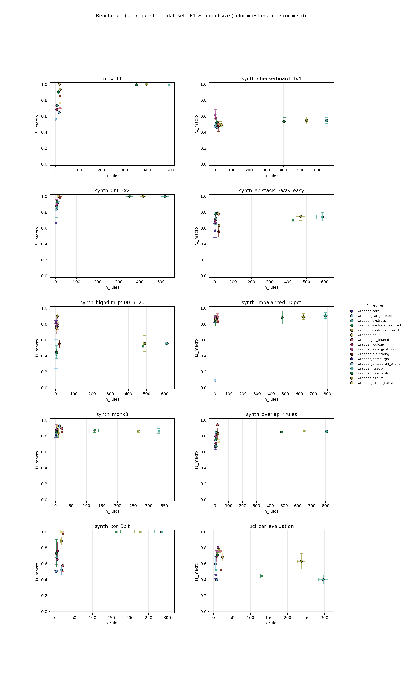
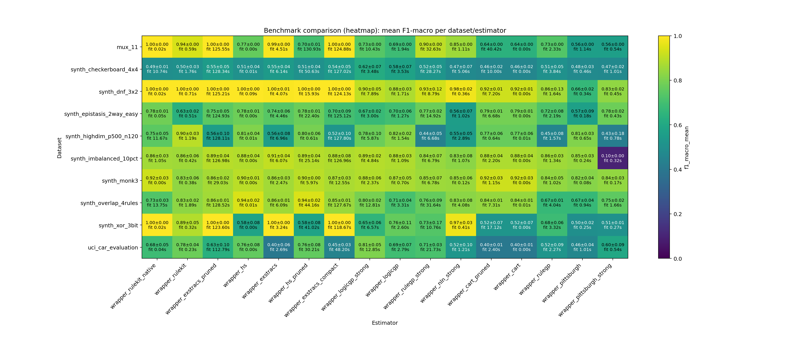

# ScoredRuleSets Standard Benchmark

## Summary

- **datasets**: `10`
- **estimators**: `16`
- **warning_runs**: `0`
- **warning_models**: `0`
- **top_1_model**: `synth_dnf_3x2 / wrapper_rulekit_native` (f1=1.0000, rules=11.0000, fit_s=0.0177)

## Configuration

- **config**: `Mode: standard`

## Artifacts

- **raw_csv**: [benchmark_results.csv](benchmark_results.csv)
- **raw_json**: [benchmark_results.json](benchmark_results.json)
- **aggregated_csv**: [benchmark_results_aggregated.csv](benchmark_results_aggregated.csv)
- **aggregated_json**: [benchmark_results_aggregated.json](benchmark_results_aggregated.json)
- **plot_png**: [benchmark_results.png](benchmark_results.png)
- **plot_pdf**: [benchmark_results.pdf](benchmark_results.pdf)
- **heatmap_png**: [benchmark_results_heatmap.png](benchmark_results_heatmap.png)
- **heatmap_pdf**: [benchmark_results_heatmap.pdf](benchmark_results_heatmap.pdf)
- **combined_heatmap_png**: [benchmark_results_heatmap_combined.png](benchmark_results_heatmap_combined.png)
- **combined_heatmap_pdf**: [benchmark_results_heatmap_combined.pdf](benchmark_results_heatmap_combined.pdf)
- **combined_dot_png**: [benchmark_results_combined_dot.png](benchmark_results_combined_dot.png)
- **combined_dot_pdf**: [benchmark_results_combined_dot.pdf](benchmark_results_combined_dot.pdf)
- **pareto_png**: [benchmark_results_pareto.png](benchmark_results_pareto.png)
- **pareto_pdf**: [benchmark_results_pareto.pdf](benchmark_results_pareto.pdf)
- **cd_png**: [benchmark_results_cd.png](benchmark_results_cd.png)
- **cd_pdf**: [benchmark_results_cd.pdf](benchmark_results_cd.pdf)
- **wtl_png**: [benchmark_results_wtl.png](benchmark_results_wtl.png)
- **wtl_pdf**: [benchmark_results_wtl.pdf](benchmark_results_wtl.pdf)
- **wtl_size_png**: [benchmark_results_wtl_size.png](benchmark_results_wtl_size.png)
- **wtl_size_pdf**: [benchmark_results_wtl_size.pdf](benchmark_results_wtl_size.pdf)
- **wtl_pareto_png**: [benchmark_results_wtl_pareto.png](benchmark_results_wtl_pareto.png)
- **wtl_pareto_pdf**: [benchmark_results_wtl_pareto.pdf](benchmark_results_wtl_pareto.pdf)
- **wtl_triangular_png**: [benchmark_results_wtl_triangular.png](benchmark_results_wtl_triangular.png)
- **wtl_triangular_pdf**: [benchmark_results_wtl_triangular.pdf](benchmark_results_wtl_triangular.pdf)
- **efficiency_png**: [benchmark_results_efficiency.png](benchmark_results_efficiency.png)
- **efficiency_pdf**: [benchmark_results_efficiency.pdf](benchmark_results_efficiency.pdf)
- **dual_cd_png**: [benchmark_results_dual_cd.png](benchmark_results_dual_cd.png)
- **dual_cd_pdf**: [benchmark_results_dual_cd.pdf](benchmark_results_dual_cd.pdf)
- **rank2d_png**: [benchmark_results_rank2d.png](benchmark_results_rank2d.png)
- **rank2d_pdf**: [benchmark_results_rank2d.pdf](benchmark_results_rank2d.pdf)

## Plot Preview

_Heatmap add-on: compact overview of aggregated F1 values and fit times per dataset/estimator._

## Notes

- Reports regeneriert von vorhandenen benchmark results.
- 10 real datasets, broad estimator selection

## Top per Dataset

### synth_dnf_3x2

- **best_model**: `wrapper_rulekit_native` (f1=1.0000, rules=11.0000, fit_s=0.0177)
- **smallest_model**: `wrapper_pittsburgh` (rules=2.3333, atoms=2.0000, f1=0.6641)
- **fastest_model**: `wrapper_cart` (fit_s=0.0012, f1=0.9244, rules=11.0000)

### mux_11

- **best_model**: `wrapper_rulekit_native` (f1=1.0000, rules=17.0000, fit_s=0.0212)
- **smallest_model**: `wrapper_pittsburgh_strong` (rules=2.0000, atoms=1.0000, f1=0.5625)
- **fastest_model**: `wrapper_cart` (fit_s=0.0012, f1=0.6437, rules=16.0000)

### synth_xor_3bit

- **best_model**: `wrapper_rulekit_native` (f1=1.0000, rules=18.6667, fit_s=0.0219)
- **smallest_model**: `wrapper_pittsburgh` (rules=2.0000, atoms=1.3333, f1=0.4986)
- **fastest_model**: `wrapper_cart` (fit_s=0.0015, f1=0.5218, rules=16.0000)

### synth_overlap_4rules

- **best_model**: `wrapper_hs` (f1=0.9420, rules=20.0000, fit_s=0.0079)
- **smallest_model**: `wrapper_pittsburgh` (rules=3.0000, atoms=3.6667, f1=0.6688)
- **fastest_model**: `wrapper_cart` (fit_s=0.0058, f1=0.8431, rules=12.0000)

### synth_monk3

- **best_model**: `wrapper_cart` (f1=0.9250, rules=13.0000, fit_s=0.0011)
- **smallest_model**: `wrapper_pittsburgh` (rules=2.0000, atoms=1.0000, f1=0.8190)
- **fastest_model**: `wrapper_cart` (fit_s=0.0011, f1=0.9250, rules=13.0000)

### synth_imbalanced_10pct

- **best_model**: `wrapper_exstracs` (f1=0.9063, rules=786.3333, fit_s=6.0732)
- **smallest_model**: `wrapper_pittsburgh` (rules=2.0000, atoms=1.0000, f1=0.8465)
- **fastest_model**: `wrapper_hs` (fit_s=0.0037, f1=0.8844, rules=20.0000)

### synth_highdim_p500_n120

- **best_model**: `wrapper_rulekit` (f1=0.8976, rules=9.0000, fit_s=1.1892)
- **smallest_model**: `wrapper_pittsburgh_strong` (rules=2.0000, atoms=1.0000, f1=0.4260)
- **fastest_model**: `wrapper_hs` (fit_s=0.0057, f1=0.8124, rules=8.6667)

### uci_car_evaluation

- **best_model**: `wrapper_logicgp_strong` (f1=0.8059, rules=12.0000, fit_s=12.8517)
- **smallest_model**: `wrapper_pittsburgh_strong` (rules=5.6667, atoms=9.3333, f1=0.5977)
- **fastest_model**: `wrapper_cart` (fit_s=0.0007, f1=0.3993, rules=8.0000)

### synth_epistasis_2way_easy

- **best_model**: `wrapper_cart` (f1=0.7891, rules=16.0000, fit_s=0.0013)
- **smallest_model**: `wrapper_pittsburgh` (rules=2.3333, atoms=2.6667, f1=0.5681)
- **fastest_model**: `wrapper_cart` (fit_s=0.0013, f1=0.7891, rules=16.0000)

### synth_checkerboard_4x4

- **best_model**: `wrapper_logicgp_strong` (f1=0.6159, rules=3.3333, fit_s=3.4780)
- **smallest_model**: `wrapper_pittsburgh` (rules=2.0000, atoms=1.3333, f1=0.4775)
- **fastest_model**: `wrapper_cart` (fit_s=0.0039, f1=0.4579, rules=14.6667)

## Pareto Front (F1 vs Model Size)

### synth_dnf_3x2

| estimator | f1_mean | atoms | rules |
| --- | ---: | ---: | ---: |
| wrapper_hs_pruned | 1.0000 | 18.0000 | 15.0000 |
| wrapper_rulegp_strong | 0.9326 | 6.3333 | 5.6667 |
| wrapper_logicgp | 0.8751 | 5.6667 | 4.3333 |
| wrapper_pittsburgh | 0.6641 | 2.0000 | 2.3333 |

### mux_11

| estimator | f1_mean | atoms | rules |
| --- | ---: | ---: | ---: |
| wrapper_rulekit_native | 1.0000 | 56.0000 | 17.0000 |
| wrapper_rulegp_strong | 0.9022 | 29.0000 | 13.0000 |
| wrapper_logicgp_strong | 0.7344 | 10.0000 | 6.0000 |
| wrapper_logicgp | 0.6856 | 9.0000 | 5.0000 |
| wrapper_pittsburgh_strong | 0.5625 | 1.0000 | 2.0000 |

### synth_xor_3bit

| estimator | f1_mean | atoms | rules |
| --- | ---: | ---: | ---: |
| wrapper_rulekit_native | 1.0000 | 67.0000 | 18.6667 |
| wrapper_rulekit | 0.8865 | 34.3333 | 16.0000 |
| wrapper_logicgp | 0.7624 | 8.0000 | 6.0000 |
| wrapper_rulegp_strong | 0.7335 | 6.0000 | 3.3333 |
| wrapper_rulegp | 0.6848 | 5.6667 | 3.6667 |
| wrapper_pittsburgh_strong | 0.5062 | 2.0000 | 2.3333 |
| wrapper_pittsburgh | 0.4986 | 1.3333 | 2.0000 |

### synth_overlap_4rules

| estimator | f1_mean | atoms | rules |
| --- | ---: | ---: | ---: |
| wrapper_hs_pruned | 0.9420 | 48.0000 | 20.0000 |
| wrapper_cart_pruned | 0.8431 | 28.0000 | 12.0000 |
| wrapper_logicgp_strong | 0.7962 | 6.6667 | 6.0000 |
| wrapper_pittsburgh | 0.6688 | 3.6667 | 3.0000 |

### synth_monk3

| estimator | f1_mean | atoms | rules |
| --- | ---: | ---: | ---: |
| wrapper_rulekit_native | 0.9250 | 11.3333 | 6.0000 |
| wrapper_logicgp_strong | 0.8845 | 3.6667 | 4.0000 |
| wrapper_logicgp | 0.8736 | 3.3333 | 3.0000 |
| wrapper_rulegp | 0.8377 | 2.0000 | 2.3333 |
| wrapper_pittsburgh | 0.8190 | 1.0000 | 2.0000 |

### synth_imbalanced_10pct

| estimator | f1_mean | atoms | rules |
| --- | ---: | ---: | ---: |
| wrapper_exstracs | 0.9063 | 6779.3333 | 786.3333 |
| wrapper_exstracs_pruned | 0.8939 | 5306.3333 | 629.0000 |
| wrapper_hs_pruned | 0.8876 | 35.0000 | 20.0000 |
| wrapper_logicgp_strong | 0.8871 | 3.6667 | 3.0000 |
| wrapper_logicgp | 0.8794 | 2.3333 | 3.0000 |
| wrapper_rulegp | 0.8587 | 1.6667 | 2.0000 |
| wrapper_pittsburgh | 0.8465 | 1.0000 | 2.0000 |

### synth_highdim_p500_n120

| estimator | f1_mean | atoms | rules |
| --- | ---: | ---: | ---: |
| wrapper_rulekit | 0.8976 | 35.0000 | 9.0000 |
| wrapper_logicgp | 0.8239 | 2.0000 | 2.0000 |
| wrapper_pittsburgh | 0.8121 | 1.6667 | 2.3333 |
| wrapper_pittsburgh_strong | 0.4260 | 1.0000 | 2.0000 |

### uci_car_evaluation

| estimator | f1_mean | atoms | rules |
| --- | ---: | ---: | ---: |
| wrapper_logicgp_strong | 0.8059 | 12.3333 | 12.0000 |
| wrapper_logicgp | 0.6936 | 9.0000 | 8.6667 |
| wrapper_rulegp | 0.5229 | 6.6667 | 6.6667 |

### synth_epistasis_2way_easy

| estimator | f1_mean | atoms | rules |
| --- | ---: | ---: | ---: |
| wrapper_cart_pruned | 0.7891 | 26.3333 | 16.0000 |
| wrapper_pittsburgh_strong | 0.7797 | 4.0000 | 3.0000 |
| wrapper_logicgp | 0.6979 | 3.6667 | 3.3333 |
| wrapper_logicgp_strong | 0.6723 | 2.0000 | 3.0000 |

### synth_checkerboard_4x4

| estimator | f1_mean | atoms | rules |
| --- | ---: | ---: | ---: |
| wrapper_logicgp_strong | 0.6159 | 3.3333 | 3.3333 |
| wrapper_pittsburgh | 0.4775 | 1.3333 | 2.0000 |

## Leaderboard

| rank | dataset | estimator | repeats | f1_mean | f1_err | fit_s | rules | atoms |
| ---: | --- | --- | ---: | ---: | ---: | ---: | ---: | ---: |
| 1 | synth_dnf_3x2 | wrapper_rulekit_native | 3 | 1.0000 | 0.0000 | 0.0177 | 11.0000 | 26.0000 |
| 2 | mux_11 | wrapper_rulekit_native | 3 | 1.0000 | 0.0000 | 0.0212 | 17.0000 | 56.0000 |
| 3 | synth_xor_3bit | wrapper_rulekit_native | 3 | 1.0000 | 0.0000 | 0.0219 | 18.6667 | 67.0000 |
| 4 | synth_dnf_3x2 | wrapper_hs | 3 | 1.0000 | 0.0000 | 0.0900 | 15.0000 | 65.0000 |
| 5 | synth_dnf_3x2 | wrapper_rulekit | 3 | 1.0000 | 0.0000 | 0.7082 | 12.0000 | 30.0000 |
| 6 | synth_xor_3bit | wrapper_exstracs | 3 | 1.0000 | 0.0000 | 3.2382 | 285.3333 | 1159.3333 |
| 7 | synth_dnf_3x2 | wrapper_hs_pruned | 3 | 1.0000 | 0.0000 | 15.9250 | 15.0000 | 18.0000 |
| 8 | synth_xor_3bit | wrapper_exstracs_compact | 3 | 1.0000 | 0.0000 | 118.6710 | 163.3333 | 298.3333 |
| 9 | synth_xor_3bit | wrapper_exstracs_pruned | 3 | 1.0000 | 0.0000 | 123.6027 | 228.0000 | 534.0000 |
| 10 | mux_11 | wrapper_exstracs_pruned | 3 | 0.9985 | 0.0000 | 125.5541 | 397.0000 | 1683.6667 |
| 11 | synth_dnf_3x2 | wrapper_exstracs_pruned | 3 | 0.9973 | 0.0031 | 125.2052 | 415.6667 | 1275.3333 |
| 12 | synth_dnf_3x2 | wrapper_exstracs_compact | 3 | 0.9973 | 0.0024 | 124.1287 | 351.0000 | 1118.0000 |
| 13 | synth_dnf_3x2 | wrapper_exstracs | 3 | 0.9959 | 0.0071 | 4.0671 | 519.3333 | 1726.6667 |
| 14 | mux_11 | wrapper_exstracs_compact | 3 | 0.9953 | 0.0003 | 124.8830 | 353.0000 | 1559.6667 |
| 15 | mux_11 | wrapper_exstracs | 3 | 0.9917 | 0.0000 | 4.5130 | 495.0000 | 2199.0000 |
| 16 | synth_dnf_3x2 | wrapper_nln_strong | 3 | 0.9783 | 0.0152 | 0.3558 | 21.0000 | 58.3333 |
| 17 | synth_xor_3bit | wrapper_nln_strong | 3 | 0.9745 | 0.0262 | 0.4143 | 21.0000 | 71.6667 |
| 18 | synth_overlap_4rules | wrapper_hs | 3 | 0.9420 | 0.0175 | 0.0079 | 20.0000 | 96.0000 |
| 19 | synth_overlap_4rules | wrapper_hs_pruned | 3 | 0.9420 | 0.0175 | 44.1560 | 20.0000 | 48.0000 |
| 20 | mux_11 | wrapper_rulekit | 3 | 0.9375 | 0.0000 | 0.5886 | 21.0000 | 74.0000 |
| 21 | synth_dnf_3x2 | wrapper_rulegp_strong | 3 | 0.9326 | 0.1168 | 8.7861 | 5.6667 | 6.3333 |
| 22 | synth_monk3 | wrapper_cart | 3 | 0.9250 | 0.0266 | 0.0011 | 13.0000 | 49.3333 |
| 23 | synth_monk3 | wrapper_rulekit_native | 3 | 0.9250 | 0.0266 | 0.0035 | 6.0000 | 11.3333 |
| 24 | synth_monk3 | wrapper_cart_pruned | 3 | 0.9250 | 0.0266 | 1.1496 | 13.0000 | 17.6667 |
| 25 | synth_dnf_3x2 | wrapper_cart | 3 | 0.9244 | 0.0100 | 0.0012 | 11.0000 | 40.0000 |
| 26 | synth_dnf_3x2 | wrapper_cart_pruned | 3 | 0.9244 | 0.0100 | 7.2047 | 11.0000 | 15.6667 |
| 27 | synth_imbalanced_10pct | wrapper_exstracs | 3 | 0.9063 | 0.0369 | 6.0732 | 786.3333 | 6779.3333 |
| 28 | synth_dnf_3x2 | wrapper_logicgp_strong | 3 | 0.9047 | 0.0529 | 7.8916 | 5.3333 | 7.0000 |
| 29 | mux_11 | wrapper_rulegp_strong | 3 | 0.9022 | 0.0000 | 32.6307 | 13.0000 | 29.0000 |
| 30 | synth_highdim_p500_n120 | wrapper_rulekit | 3 | 0.8976 | 0.0325 | 1.1892 | 9.0000 | 35.0000 |
| 31 | synth_monk3 | wrapper_hs | 3 | 0.8957 | 0.0056 | 0.0011 | 20.0000 | 106.0000 |
| 32 | synth_monk3 | wrapper_hs_pruned | 3 | 0.8953 | 0.0050 | 5.9734 | 20.0000 | 29.6667 |
| 33 | synth_imbalanced_10pct | wrapper_exstracs_pruned | 3 | 0.8939 | 0.0381 | 126.9790 | 629.0000 | 5306.3333 |
| 34 | synth_imbalanced_10pct | wrapper_hs_pruned | 3 | 0.8876 | 0.0434 | 25.1421 | 20.0000 | 35.0000 |
| 35 | synth_imbalanced_10pct | wrapper_logicgp_strong | 3 | 0.8871 | 0.0172 | 4.8407 | 3.0000 | 3.6667 |
| 36 | synth_xor_3bit | wrapper_rulekit | 3 | 0.8865 | 0.0542 | 0.3204 | 16.0000 | 34.3333 |
| 37 | synth_monk3 | wrapper_logicgp_strong | 3 | 0.8845 | 0.0588 | 2.3733 | 4.0000 | 3.6667 |
| 38 | synth_imbalanced_10pct | wrapper_hs | 3 | 0.8844 | 0.0444 | 0.0037 | 20.0000 | 110.3333 |
| 39 | synth_imbalanced_10pct | wrapper_exstracs_compact | 3 | 0.8804 | 0.0784 | 126.9579 | 479.3333 | 4190.3333 |
| 40 | synth_imbalanced_10pct | wrapper_logicgp | 3 | 0.8794 | 0.0269 | 1.0925 | 3.0000 | 2.3333 |
| 41 | synth_imbalanced_10pct | wrapper_cart | 3 | 0.8774 | 0.0367 | 0.0047 | 9.6667 | 33.3333 |
| 42 | synth_imbalanced_10pct | wrapper_cart_pruned | 3 | 0.8774 | 0.0367 | 2.2020 | 9.6667 | 12.6667 |
| 43 | synth_dnf_3x2 | wrapper_logicgp | 3 | 0.8751 | 0.0260 | 1.7052 | 4.3333 | 5.6667 |
| 44 | synth_monk3 | wrapper_exstracs_compact | 3 | 0.8736 | 0.0283 | 12.5493 | 126.6667 | 187.0000 |
| 45 | synth_monk3 | wrapper_logicgp | 3 | 0.8736 | 0.0504 | 0.6992 | 3.0000 | 3.3333 |
| 46 | synth_monk3 | wrapper_exstracs_pruned | 3 | 0.8649 | 0.0228 | 29.0274 | 266.3333 | 323.0000 |
| 47 | synth_imbalanced_10pct | wrapper_rulekit_native | 3 | 0.8626 | 0.0250 | 1.0457 | 5.0000 | 8.0000 |
| 48 | synth_overlap_4rules | wrapper_exstracs_pruned | 3 | 0.8619 | 0.0140 | 128.5231 | 646.0000 | 4478.0000 |
| 49 | synth_monk3 | wrapper_exstracs | 3 | 0.8615 | 0.0319 | 2.4676 | 333.0000 | 1022.3333 |
| 50 | synth_dnf_3x2 | wrapper_rulegp | 3 | 0.8611 | 0.1263 | 1.6427 | 6.3333 | 6.0000 |
| 51 | synth_imbalanced_10pct | wrapper_rulegp | 3 | 0.8587 | 0.0297 | 1.3374 | 2.0000 | 1.6667 |
| 52 | synth_overlap_4rules | wrapper_exstracs | 3 | 0.8565 | 0.0119 | 6.0874 | 807.3333 | 5652.6667 |
| 53 | synth_imbalanced_10pct | wrapper_rulekit | 3 | 0.8555 | 0.0564 | 0.4150 | 9.6667 | 54.3333 |
| 54 | mux_11 | wrapper_nln_strong | 3 | 0.8534 | 0.0000 | 1.1051 | 20.0000 | 67.0000 |
| 55 | synth_monk3 | wrapper_rulegp_strong | 3 | 0.8528 | 0.0707 | 6.7774 | 3.3333 | 4.6667 |
| 56 | synth_monk3 | wrapper_nln_strong | 3 | 0.8506 | 0.0647 | 0.1217 | 21.0000 | 68.3333 |
| 57 | synth_overlap_4rules | wrapper_exstracs_compact | 3 | 0.8491 | 0.0082 | 127.6688 | 481.6667 | 3549.0000 |
| 58 | synth_imbalanced_10pct | wrapper_pittsburgh | 3 | 0.8465 | 0.0282 | 0.2375 | 2.0000 | 1.0000 |
| 59 | synth_imbalanced_10pct | wrapper_rulegp_strong | 3 | 0.8441 | 0.0695 | 6.7878 | 4.0000 | 6.0000 |
| 60 | synth_overlap_4rules | wrapper_cart | 3 | 0.8431 | 0.0131 | 0.0058 | 12.0000 | 45.0000 |
| 61 | synth_overlap_4rules | wrapper_cart_pruned | 3 | 0.8431 | 0.0131 | 7.3077 | 12.0000 | 28.0000 |
| 62 | synth_monk3 | wrapper_rulegp | 3 | 0.8377 | 0.0459 | 1.0241 | 2.3333 | 2.0000 |
| 63 | synth_monk3 | wrapper_pittsburgh_strong | 3 | 0.8376 | 0.0317 | 0.1714 | 2.6667 | 2.3333 |
| 64 | synth_dnf_3x2 | wrapper_pittsburgh_strong | 3 | 0.8336 | 0.0162 | 0.4490 | 4.0000 | 7.0000 |
| 65 | synth_monk3 | wrapper_rulekit | 3 | 0.8333 | 0.0629 | 0.3783 | 9.6667 | 16.6667 |
| 66 | synth_overlap_4rules | wrapper_rulekit | 3 | 0.8306 | 0.0173 | 1.8927 | 23.3333 | 229.6667 |
| 67 | synth_overlap_4rules | wrapper_nln_strong | 3 | 0.8275 | 0.0751 | 4.0793 | 21.0000 | 81.6667 |
| 68 | synth_imbalanced_10pct | wrapper_nln_strong | 3 | 0.8256 | 0.0779 | 1.0748 | 21.0000 | 79.6667 |
| 69 | synth_highdim_p500_n120 | wrapper_logicgp | 3 | 0.8239 | 0.0160 | 1.5434 | 2.0000 | 2.0000 |
| 70 | synth_monk3 | wrapper_pittsburgh | 3 | 0.8190 | 0.0394 | 0.0831 | 2.0000 | 1.0000 |
| 71 | synth_highdim_p500_n120 | wrapper_hs | 3 | 0.8124 | 0.0354 | 0.0057 | 8.6667 | 27.6667 |
| 72 | synth_highdim_p500_n120 | wrapper_pittsburgh | 3 | 0.8121 | 0.0322 | 0.6518 | 2.3333 | 1.6667 |
| 73 | uci_car_evaluation | wrapper_logicgp_strong | 3 | 0.8059 | 0.0527 | 12.8517 | 12.0000 | 12.3333 |
| 74 | synth_overlap_4rules | wrapper_logicgp_strong | 3 | 0.7962 | 0.0240 | 12.8057 | 6.0000 | 6.6667 |
| 75 | synth_highdim_p500_n120 | wrapper_hs_pruned | 3 | 0.7960 | 0.0639 | 0.6149 | 8.6667 | 15.3333 |
| 76 | synth_epistasis_2way_easy | wrapper_cart | 3 | 0.7891 | 0.0052 | 0.0013 | 16.0000 | 64.0000 |
| 77 | synth_epistasis_2way_easy | wrapper_cart_pruned | 3 | 0.7891 | 0.0052 | 6.6752 | 16.0000 | 26.3333 |
| 78 | synth_epistasis_2way_easy | wrapper_rulekit_native | 3 | 0.7841 | 0.0059 | 0.0536 | 19.6667 | 56.3333 |
| 79 | synth_epistasis_2way_easy | wrapper_pittsburgh_strong | 3 | 0.7797 | 0.0184 | 0.4339 | 3.0000 | 4.0000 |
| 80 | synth_epistasis_2way_easy | wrapper_hs | 3 | 0.7783 | 0.0102 | 0.0018 | 20.0000 | 94.6667 |
| 81 | synth_highdim_p500_n120 | wrapper_logicgp_strong | 3 | 0.7772 | 0.0995 | 5.8659 | 3.6667 | 4.0000 |
| 82 | synth_epistasis_2way_easy | wrapper_hs_pruned | 3 | 0.7766 | 0.0095 | 22.4024 | 20.0000 | 44.0000 |
| 83 | uci_car_evaluation | wrapper_rulekit | 3 | 0.7752 | 0.0361 | 0.2260 | 15.0000 | 57.3333 |
| 84 | synth_epistasis_2way_easy | wrapper_rulegp_strong | 3 | 0.7740 | 0.0237 | 14.9164 | 5.6667 | 10.6667 |
| 85 | synth_highdim_p500_n120 | wrapper_cart | 3 | 0.7683 | 0.0576 | 0.0063 | 8.6667 | 27.6667 |
| 86 | synth_highdim_p500_n120 | wrapper_cart_pruned | 3 | 0.7683 | 0.0576 | 0.6380 | 8.6667 | 15.6667 |
| 87 | mux_11 | wrapper_hs | 3 | 0.7655 | 0.0001 | 0.0017 | 20.0000 | 95.6667 |
| 88 | synth_xor_3bit | wrapper_logicgp | 3 | 0.7624 | 0.1113 | 2.5967 | 6.0000 | 8.0000 |
| 89 | synth_overlap_4rules | wrapper_rulegp_strong | 3 | 0.7622 | 0.0937 | 31.6397 | 10.6667 | 16.6667 |
| 90 | uci_car_evaluation | wrapper_hs | 3 | 0.7609 | 0.0766 | 0.0015 | 20.0000 | 113.3333 |
| 91 | uci_car_evaluation | wrapper_hs_pruned | 3 | 0.7609 | 0.0766 | 30.2078 | 20.0000 | 33.3333 |
| 92 | synth_overlap_4rules | wrapper_pittsburgh_strong | 3 | 0.7536 | 0.0174 | 1.6594 | 4.0000 | 7.6667 |
| 93 | synth_highdim_p500_n120 | wrapper_rulekit_native | 3 | 0.7490 | 0.0475 | 11.6652 | 4.6667 | 14.0000 |
| 94 | synth_epistasis_2way_easy | wrapper_exstracs_pruned | 3 | 0.7480 | 0.0549 | 124.9258 | 469.3333 | 1675.6667 |
| 95 | synth_epistasis_2way_easy | wrapper_exstracs | 3 | 0.7405 | 0.0552 | 4.4608 | 586.3333 | 2306.3333 |
| 96 | mux_11 | wrapper_logicgp_strong | 3 | 0.7344 | 0.0000 | 10.4310 | 6.0000 | 10.0000 |
| 97 | mux_11 | wrapper_rulegp | 3 | 0.7342 | 0.0000 | 2.3291 | 7.0000 | 12.0000 |
| 98 | synth_xor_3bit | wrapper_rulegp_strong | 3 | 0.7335 | 0.1727 | 10.7646 | 3.3333 | 6.0000 |
| 99 | synth_overlap_4rules | wrapper_rulekit_native | 3 | 0.7267 | 0.0306 | 13.7456 | 30.0000 | 94.0000 |
| 100 | synth_epistasis_2way_easy | wrapper_rulegp | 3 | 0.7234 | 0.0791 | 2.1858 | 5.0000 | 7.6667 |
| 101 | uci_car_evaluation | wrapper_rulegp_strong | 3 | 0.7116 | 0.0285 | 21.7335 | 10.6667 | 14.6667 |
| 102 | synth_overlap_4rules | wrapper_logicgp | 3 | 0.7072 | 0.0441 | 3.3089 | 7.0000 | 6.6667 |
| 103 | mux_11 | wrapper_hs_pruned | 3 | 0.7033 | 0.0065 | 130.9250 | 20.0000 | 45.3333 |
| 104 | synth_epistasis_2way_easy | wrapper_exstracs_compact | 3 | 0.7004 | 0.0864 | 125.1213 | 426.3333 | 1614.3333 |
| 105 | synth_epistasis_2way_easy | wrapper_logicgp | 3 | 0.6979 | 0.0626 | 1.2651 | 3.3333 | 3.6667 |
| 106 | uci_car_evaluation | wrapper_logicgp | 3 | 0.6936 | 0.0715 | 2.7893 | 8.6667 | 9.0000 |
| 107 | mux_11 | wrapper_logicgp | 3 | 0.6856 | 0.0000 | 1.9363 | 5.0000 | 9.0000 |
| 108 | synth_xor_3bit | wrapper_rulegp | 3 | 0.6848 | 0.0610 | 3.3242 | 3.6667 | 5.6667 |
| 109 | uci_car_evaluation | wrapper_rulekit_native | 3 | 0.6837 | 0.0476 | 0.0351 | 24.3333 | 119.0000 |
| 110 | synth_epistasis_2way_easy | wrapper_logicgp_strong | 3 | 0.6723 | 0.0192 | 2.9983 | 3.0000 | 2.0000 |
| 111 | synth_overlap_4rules | wrapper_rulegp | 3 | 0.6698 | 0.0102 | 4.0361 | 8.0000 | 10.0000 |
| 112 | synth_overlap_4rules | wrapper_pittsburgh | 3 | 0.6688 | 0.0391 | 0.9423 | 3.0000 | 3.6667 |
| 113 | synth_dnf_3x2 | wrapper_pittsburgh | 3 | 0.6641 | 0.0160 | 0.3391 | 2.3333 | 2.0000 |
| 114 | synth_xor_3bit | wrapper_logicgp_strong | 3 | 0.6542 | 0.0642 | 6.5671 | 4.3333 | 6.0000 |
| 115 | mux_11 | wrapper_cart | 3 | 0.6437 | 0.0000 | 0.0012 | 16.0000 | 64.0000 |
| 116 | mux_11 | wrapper_cart_pruned | 3 | 0.6437 | 0.0000 | 40.4241 | 16.0000 | 47.0000 |
| 117 | synth_epistasis_2way_easy | wrapper_rulekit | 3 | 0.6340 | 0.0185 | 0.5098 | 24.0000 | 102.3333 |
| 118 | uci_car_evaluation | wrapper_exstracs_pruned | 3 | 0.6320 | 0.0961 | 112.7883 | 237.3333 | 439.6667 |
| 119 | synth_checkerboard_4x4 | wrapper_logicgp_strong | 3 | 0.6159 | 0.0675 | 3.4780 | 3.3333 | 3.3333 |
| 120 | uci_car_evaluation | wrapper_pittsburgh_strong | 3 | 0.5977 | 0.0921 | 0.5404 | 5.6667 | 9.3333 |
| 121 | synth_xor_3bit | wrapper_hs | 3 | 0.5787 | 0.0774 | 0.0016 | 20.0000 | 104.6667 |
| 122 | synth_xor_3bit | wrapper_hs_pruned | 3 | 0.5787 | 0.0774 | 41.0172 | 20.0000 | 47.0000 |
| 123 | synth_checkerboard_4x4 | wrapper_logicgp | 3 | 0.5759 | 0.0661 | 3.5304 | 5.6667 | 10.0000 |
| 124 | synth_epistasis_2way_easy | wrapper_pittsburgh | 3 | 0.5681 | 0.0870 | 0.1842 | 2.3333 | 2.6667 |
| 125 | mux_11 | wrapper_pittsburgh_strong | 3 | 0.5625 | 0.0000 | 0.5450 | 2.0000 | 1.0000 |
| 126 | mux_11 | wrapper_pittsburgh | 3 | 0.5625 | 0.0000 | 1.1402 | 2.0000 | 1.0000 |
| 127 | synth_epistasis_2way_easy | wrapper_nln_strong | 3 | 0.5560 | 0.0673 | 1.0164 | 21.0000 | 104.6667 |
| 128 | synth_highdim_p500_n120 | wrapper_exstracs | 3 | 0.5559 | 0.0823 | 6.9648 | 612.6667 | 5304.6667 |
| 129 | synth_highdim_p500_n120 | wrapper_exstracs_pruned | 3 | 0.5558 | 0.0987 | 128.1138 | 490.3333 | 4278.6667 |
| 130 | synth_highdim_p500_n120 | wrapper_nln_strong | 3 | 0.5541 | 0.0501 | 2.8932 | 21.0000 | 67.0000 |
| 131 | synth_checkerboard_4x4 | wrapper_exstracs_pruned | 3 | 0.5476 | 0.0460 | 128.3429 | 534.6667 | 3815.6667 |
| 132 | synth_checkerboard_4x4 | wrapper_exstracs | 3 | 0.5458 | 0.0382 | 6.1424 | 651.6667 | 4814.0000 |
| 133 | synth_checkerboard_4x4 | wrapper_exstracs_compact | 3 | 0.5353 | 0.0478 | 127.0202 | 404.0000 | 2993.6667 |
| 134 | uci_car_evaluation | wrapper_nln_strong | 3 | 0.5246 | 0.1006 | 1.2064 | 20.0000 | 39.3333 |
| 135 | uci_car_evaluation | wrapper_rulegp | 3 | 0.5229 | 0.0882 | 2.2711 | 6.6667 | 6.6667 |
| 136 | synth_highdim_p500_n120 | wrapper_exstracs_compact | 3 | 0.5227 | 0.0979 | 127.7957 | 479.6667 | 4229.0000 |
| 137 | synth_checkerboard_4x4 | wrapper_rulegp_strong | 3 | 0.5219 | 0.0464 | 28.2663 | 11.6667 | 21.0000 |
| 138 | synth_xor_3bit | wrapper_cart | 3 | 0.5218 | 0.0657 | 0.0015 | 16.0000 | 64.0000 |
| 139 | synth_xor_3bit | wrapper_cart_pruned | 3 | 0.5218 | 0.0657 | 17.1193 | 16.0000 | 43.6667 |
| 140 | synth_checkerboard_4x4 | wrapper_hs | 3 | 0.5068 | 0.0445 | 0.0069 | 20.0000 | 112.6667 |
| 141 | synth_checkerboard_4x4 | wrapper_rulegp | 3 | 0.5067 | 0.0533 | 3.8406 | 6.6667 | 9.3333 |
| 142 | synth_checkerboard_4x4 | wrapper_hs_pruned | 3 | 0.5065 | 0.0446 | 50.6287 | 20.0000 | 38.6667 |
| 143 | synth_xor_3bit | wrapper_pittsburgh_strong | 3 | 0.5062 | 0.0063 | 0.2694 | 2.3333 | 2.0000 |
| 144 | synth_checkerboard_4x4 | wrapper_rulekit | 3 | 0.5008 | 0.0325 | 1.7647 | 31.0000 | 393.6667 |
| 145 | synth_xor_3bit | wrapper_pittsburgh | 3 | 0.4986 | 0.0167 | 0.2523 | 2.0000 | 1.3333 |
| 146 | synth_checkerboard_4x4 | wrapper_rulekit_native | 3 | 0.4924 | 0.0091 | 10.7419 | 39.0000 | 162.6667 |
| 147 | synth_checkerboard_4x4 | wrapper_pittsburgh | 3 | 0.4775 | 0.0265 | 0.4573 | 2.0000 | 1.3333 |
| 148 | synth_checkerboard_4x4 | wrapper_pittsburgh_strong | 3 | 0.4749 | 0.0155 | 1.0122 | 3.0000 | 3.6667 |
| 149 | synth_checkerboard_4x4 | wrapper_nln_strong | 3 | 0.4745 | 0.0668 | 5.0580 | 21.0000 | 58.0000 |
| 150 | uci_car_evaluation | wrapper_pittsburgh | 3 | 0.4612 | 0.0446 | 1.0058 | 6.0000 | 9.0000 |
| 151 | synth_checkerboard_4x4 | wrapper_cart_pruned | 3 | 0.4584 | 0.0202 | 9.9958 | 14.6667 | 34.3333 |
| 152 | synth_checkerboard_4x4 | wrapper_cart | 3 | 0.4579 | 0.0200 | 0.0039 | 14.6667 | 57.3333 |
| 153 | synth_highdim_p500_n120 | wrapper_rulegp | 3 | 0.4501 | 0.0817 | 1.5699 | 4.0000 | 4.6667 |
| 154 | uci_car_evaluation | wrapper_exstracs_compact | 3 | 0.4476 | 0.0274 | 48.1976 | 131.0000 | 217.0000 |
| 155 | synth_highdim_p500_n120 | wrapper_rulegp_strong | 3 | 0.4409 | 0.0458 | 6.6782 | 4.6667 | 4.0000 |
| 156 | synth_highdim_p500_n120 | wrapper_pittsburgh_strong | 3 | 0.4260 | 0.1822 | 0.7759 | 2.0000 | 1.0000 |
| 157 | uci_car_evaluation | wrapper_exstracs | 3 | 0.4013 | 0.0568 | 2.6863 | 296.3333 | 966.6667 |
| 158 | uci_car_evaluation | wrapper_cart | 3 | 0.3993 | 0.0147 | 0.0007 | 8.0000 | 28.0000 |
| 159 | uci_car_evaluation | wrapper_cart_pruned | 3 | 0.3993 | 0.0147 | 2.3989 | 8.0000 | 13.0000 |
| 160 | synth_imbalanced_10pct | wrapper_pittsburgh_strong | 3 | 0.0975 | 0.0000 | 0.3153 | 2.0000 | 2.0000 |

## Dataset: synth_dnf_3x2

- **best_model**: `wrapper_rulekit_native` (f1=1.0000, rules=11.0000, fit_s=0.0177)
- **smallest_model**: `wrapper_pittsburgh` (rules=2.3333, atoms=2.0000, f1=0.6641)
- **fastest_model**: `wrapper_cart` (fit_s=0.0012, f1=0.9244, rules=11.0000)

| rank | dataset | estimator | repeats | f1_mean | f1_err | fit_s | rules | atoms |
| ---: | --- | --- | ---: | ---: | ---: | ---: | ---: | ---: |
| 1 | synth_dnf_3x2 | wrapper_rulekit_native | 3 | 1.0000 | 0.0000 | 0.0177 | 11.0000 | 26.0000 |
| 2 | synth_dnf_3x2 | wrapper_hs | 3 | 1.0000 | 0.0000 | 0.0900 | 15.0000 | 65.0000 |
| 3 | synth_dnf_3x2 | wrapper_rulekit | 3 | 1.0000 | 0.0000 | 0.7082 | 12.0000 | 30.0000 |
| 4 | synth_dnf_3x2 | wrapper_hs_pruned | 3 | 1.0000 | 0.0000 | 15.9250 | 15.0000 | 18.0000 |
| 5 | synth_dnf_3x2 | wrapper_exstracs_pruned | 3 | 0.9973 | 0.0031 | 125.2052 | 415.6667 | 1275.3333 |
| 6 | synth_dnf_3x2 | wrapper_exstracs_compact | 3 | 0.9973 | 0.0024 | 124.1287 | 351.0000 | 1118.0000 |
| 7 | synth_dnf_3x2 | wrapper_exstracs | 3 | 0.9959 | 0.0071 | 4.0671 | 519.3333 | 1726.6667 |
| 8 | synth_dnf_3x2 | wrapper_nln_strong | 3 | 0.9783 | 0.0152 | 0.3558 | 21.0000 | 58.3333 |
| 9 | synth_dnf_3x2 | wrapper_rulegp_strong | 3 | 0.9326 | 0.1168 | 8.7861 | 5.6667 | 6.3333 |
| 10 | synth_dnf_3x2 | wrapper_cart | 3 | 0.9244 | 0.0100 | 0.0012 | 11.0000 | 40.0000 |
| 11 | synth_dnf_3x2 | wrapper_cart_pruned | 3 | 0.9244 | 0.0100 | 7.2047 | 11.0000 | 15.6667 |
| 12 | synth_dnf_3x2 | wrapper_logicgp_strong | 3 | 0.9047 | 0.0529 | 7.8916 | 5.3333 | 7.0000 |
| 13 | synth_dnf_3x2 | wrapper_logicgp | 3 | 0.8751 | 0.0260 | 1.7052 | 4.3333 | 5.6667 |
| 14 | synth_dnf_3x2 | wrapper_rulegp | 3 | 0.8611 | 0.1263 | 1.6427 | 6.3333 | 6.0000 |
| 15 | synth_dnf_3x2 | wrapper_pittsburgh_strong | 3 | 0.8336 | 0.0162 | 0.4490 | 4.0000 | 7.0000 |
| 16 | synth_dnf_3x2 | wrapper_pittsburgh | 3 | 0.6641 | 0.0160 | 0.3391 | 2.3333 | 2.0000 |

## Dataset: mux_11

- **best_model**: `wrapper_rulekit_native` (f1=1.0000, rules=17.0000, fit_s=0.0212)
- **smallest_model**: `wrapper_pittsburgh_strong` (rules=2.0000, atoms=1.0000, f1=0.5625)
- **fastest_model**: `wrapper_cart` (fit_s=0.0012, f1=0.6437, rules=16.0000)

| rank | dataset | estimator | repeats | f1_mean | f1_err | fit_s | rules | atoms |
| ---: | --- | --- | ---: | ---: | ---: | ---: | ---: | ---: |
| 1 | mux_11 | wrapper_rulekit_native | 3 | 1.0000 | 0.0000 | 0.0212 | 17.0000 | 56.0000 |
| 2 | mux_11 | wrapper_exstracs_pruned | 3 | 0.9985 | 0.0000 | 125.5541 | 397.0000 | 1683.6667 |
| 3 | mux_11 | wrapper_exstracs_compact | 3 | 0.9953 | 0.0003 | 124.8830 | 353.0000 | 1559.6667 |
| 4 | mux_11 | wrapper_exstracs | 3 | 0.9917 | 0.0000 | 4.5130 | 495.0000 | 2199.0000 |
| 5 | mux_11 | wrapper_rulekit | 3 | 0.9375 | 0.0000 | 0.5886 | 21.0000 | 74.0000 |
| 6 | mux_11 | wrapper_rulegp_strong | 3 | 0.9022 | 0.0000 | 32.6307 | 13.0000 | 29.0000 |
| 7 | mux_11 | wrapper_nln_strong | 3 | 0.8534 | 0.0000 | 1.1051 | 20.0000 | 67.0000 |
| 8 | mux_11 | wrapper_hs | 3 | 0.7655 | 0.0001 | 0.0017 | 20.0000 | 95.6667 |
| 9 | mux_11 | wrapper_logicgp_strong | 3 | 0.7344 | 0.0000 | 10.4310 | 6.0000 | 10.0000 |
| 10 | mux_11 | wrapper_rulegp | 3 | 0.7342 | 0.0000 | 2.3291 | 7.0000 | 12.0000 |
| 11 | mux_11 | wrapper_hs_pruned | 3 | 0.7033 | 0.0065 | 130.9250 | 20.0000 | 45.3333 |
| 12 | mux_11 | wrapper_logicgp | 3 | 0.6856 | 0.0000 | 1.9363 | 5.0000 | 9.0000 |
| 13 | mux_11 | wrapper_cart | 3 | 0.6437 | 0.0000 | 0.0012 | 16.0000 | 64.0000 |
| 14 | mux_11 | wrapper_cart_pruned | 3 | 0.6437 | 0.0000 | 40.4241 | 16.0000 | 47.0000 |
| 15 | mux_11 | wrapper_pittsburgh_strong | 3 | 0.5625 | 0.0000 | 0.5450 | 2.0000 | 1.0000 |
| 16 | mux_11 | wrapper_pittsburgh | 3 | 0.5625 | 0.0000 | 1.1402 | 2.0000 | 1.0000 |

## Dataset: synth_xor_3bit

- **best_model**: `wrapper_rulekit_native` (f1=1.0000, rules=18.6667, fit_s=0.0219)
- **smallest_model**: `wrapper_pittsburgh` (rules=2.0000, atoms=1.3333, f1=0.4986)
- **fastest_model**: `wrapper_cart` (fit_s=0.0015, f1=0.5218, rules=16.0000)

| rank | dataset | estimator | repeats | f1_mean | f1_err | fit_s | rules | atoms |
| ---: | --- | --- | ---: | ---: | ---: | ---: | ---: | ---: |
| 1 | synth_xor_3bit | wrapper_rulekit_native | 3 | 1.0000 | 0.0000 | 0.0219 | 18.6667 | 67.0000 |
| 2 | synth_xor_3bit | wrapper_exstracs | 3 | 1.0000 | 0.0000 | 3.2382 | 285.3333 | 1159.3333 |
| 3 | synth_xor_3bit | wrapper_exstracs_compact | 3 | 1.0000 | 0.0000 | 118.6710 | 163.3333 | 298.3333 |
| 4 | synth_xor_3bit | wrapper_exstracs_pruned | 3 | 1.0000 | 0.0000 | 123.6027 | 228.0000 | 534.0000 |
| 5 | synth_xor_3bit | wrapper_nln_strong | 3 | 0.9745 | 0.0262 | 0.4143 | 21.0000 | 71.6667 |
| 6 | synth_xor_3bit | wrapper_rulekit | 3 | 0.8865 | 0.0542 | 0.3204 | 16.0000 | 34.3333 |
| 7 | synth_xor_3bit | wrapper_logicgp | 3 | 0.7624 | 0.1113 | 2.5967 | 6.0000 | 8.0000 |
| 8 | synth_xor_3bit | wrapper_rulegp_strong | 3 | 0.7335 | 0.1727 | 10.7646 | 3.3333 | 6.0000 |
| 9 | synth_xor_3bit | wrapper_rulegp | 3 | 0.6848 | 0.0610 | 3.3242 | 3.6667 | 5.6667 |
| 10 | synth_xor_3bit | wrapper_logicgp_strong | 3 | 0.6542 | 0.0642 | 6.5671 | 4.3333 | 6.0000 |
| 11 | synth_xor_3bit | wrapper_hs | 3 | 0.5787 | 0.0774 | 0.0016 | 20.0000 | 104.6667 |
| 12 | synth_xor_3bit | wrapper_hs_pruned | 3 | 0.5787 | 0.0774 | 41.0172 | 20.0000 | 47.0000 |
| 13 | synth_xor_3bit | wrapper_cart | 3 | 0.5218 | 0.0657 | 0.0015 | 16.0000 | 64.0000 |
| 14 | synth_xor_3bit | wrapper_cart_pruned | 3 | 0.5218 | 0.0657 | 17.1193 | 16.0000 | 43.6667 |
| 15 | synth_xor_3bit | wrapper_pittsburgh_strong | 3 | 0.5062 | 0.0063 | 0.2694 | 2.3333 | 2.0000 |
| 16 | synth_xor_3bit | wrapper_pittsburgh | 3 | 0.4986 | 0.0167 | 0.2523 | 2.0000 | 1.3333 |

## Dataset: synth_overlap_4rules

- **best_model**: `wrapper_hs` (f1=0.9420, rules=20.0000, fit_s=0.0079)
- **smallest_model**: `wrapper_pittsburgh` (rules=3.0000, atoms=3.6667, f1=0.6688)
- **fastest_model**: `wrapper_cart` (fit_s=0.0058, f1=0.8431, rules=12.0000)

| rank | dataset | estimator | repeats | f1_mean | f1_err | fit_s | rules | atoms |
| ---: | --- | --- | ---: | ---: | ---: | ---: | ---: | ---: |
| 1 | synth_overlap_4rules | wrapper_hs | 3 | 0.9420 | 0.0175 | 0.0079 | 20.0000 | 96.0000 |
| 2 | synth_overlap_4rules | wrapper_hs_pruned | 3 | 0.9420 | 0.0175 | 44.1560 | 20.0000 | 48.0000 |
| 3 | synth_overlap_4rules | wrapper_exstracs_pruned | 3 | 0.8619 | 0.0140 | 128.5231 | 646.0000 | 4478.0000 |
| 4 | synth_overlap_4rules | wrapper_exstracs | 3 | 0.8565 | 0.0119 | 6.0874 | 807.3333 | 5652.6667 |
| 5 | synth_overlap_4rules | wrapper_exstracs_compact | 3 | 0.8491 | 0.0082 | 127.6688 | 481.6667 | 3549.0000 |
| 6 | synth_overlap_4rules | wrapper_cart | 3 | 0.8431 | 0.0131 | 0.0058 | 12.0000 | 45.0000 |
| 7 | synth_overlap_4rules | wrapper_cart_pruned | 3 | 0.8431 | 0.0131 | 7.3077 | 12.0000 | 28.0000 |
| 8 | synth_overlap_4rules | wrapper_rulekit | 3 | 0.8306 | 0.0173 | 1.8927 | 23.3333 | 229.6667 |
| 9 | synth_overlap_4rules | wrapper_nln_strong | 3 | 0.8275 | 0.0751 | 4.0793 | 21.0000 | 81.6667 |
| 10 | synth_overlap_4rules | wrapper_logicgp_strong | 3 | 0.7962 | 0.0240 | 12.8057 | 6.0000 | 6.6667 |
| 11 | synth_overlap_4rules | wrapper_rulegp_strong | 3 | 0.7622 | 0.0937 | 31.6397 | 10.6667 | 16.6667 |
| 12 | synth_overlap_4rules | wrapper_pittsburgh_strong | 3 | 0.7536 | 0.0174 | 1.6594 | 4.0000 | 7.6667 |
| 13 | synth_overlap_4rules | wrapper_rulekit_native | 3 | 0.7267 | 0.0306 | 13.7456 | 30.0000 | 94.0000 |
| 14 | synth_overlap_4rules | wrapper_logicgp | 3 | 0.7072 | 0.0441 | 3.3089 | 7.0000 | 6.6667 |
| 15 | synth_overlap_4rules | wrapper_rulegp | 3 | 0.6698 | 0.0102 | 4.0361 | 8.0000 | 10.0000 |
| 16 | synth_overlap_4rules | wrapper_pittsburgh | 3 | 0.6688 | 0.0391 | 0.9423 | 3.0000 | 3.6667 |

## Dataset: synth_monk3

- **best_model**: `wrapper_cart` (f1=0.9250, rules=13.0000, fit_s=0.0011)
- **smallest_model**: `wrapper_pittsburgh` (rules=2.0000, atoms=1.0000, f1=0.8190)
- **fastest_model**: `wrapper_cart` (fit_s=0.0011, f1=0.9250, rules=13.0000)

| rank | dataset | estimator | repeats | f1_mean | f1_err | fit_s | rules | atoms |
| ---: | --- | --- | ---: | ---: | ---: | ---: | ---: | ---: |
| 1 | synth_monk3 | wrapper_cart | 3 | 0.9250 | 0.0266 | 0.0011 | 13.0000 | 49.3333 |
| 2 | synth_monk3 | wrapper_rulekit_native | 3 | 0.9250 | 0.0266 | 0.0035 | 6.0000 | 11.3333 |
| 3 | synth_monk3 | wrapper_cart_pruned | 3 | 0.9250 | 0.0266 | 1.1496 | 13.0000 | 17.6667 |
| 4 | synth_monk3 | wrapper_hs | 3 | 0.8957 | 0.0056 | 0.0011 | 20.0000 | 106.0000 |
| 5 | synth_monk3 | wrapper_hs_pruned | 3 | 0.8953 | 0.0050 | 5.9734 | 20.0000 | 29.6667 |
| 6 | synth_monk3 | wrapper_logicgp_strong | 3 | 0.8845 | 0.0588 | 2.3733 | 4.0000 | 3.6667 |
| 7 | synth_monk3 | wrapper_exstracs_compact | 3 | 0.8736 | 0.0283 | 12.5493 | 126.6667 | 187.0000 |
| 8 | synth_monk3 | wrapper_logicgp | 3 | 0.8736 | 0.0504 | 0.6992 | 3.0000 | 3.3333 |
| 9 | synth_monk3 | wrapper_exstracs_pruned | 3 | 0.8649 | 0.0228 | 29.0274 | 266.3333 | 323.0000 |
| 10 | synth_monk3 | wrapper_exstracs | 3 | 0.8615 | 0.0319 | 2.4676 | 333.0000 | 1022.3333 |
| 11 | synth_monk3 | wrapper_rulegp_strong | 3 | 0.8528 | 0.0707 | 6.7774 | 3.3333 | 4.6667 |
| 12 | synth_monk3 | wrapper_nln_strong | 3 | 0.8506 | 0.0647 | 0.1217 | 21.0000 | 68.3333 |
| 13 | synth_monk3 | wrapper_rulegp | 3 | 0.8377 | 0.0459 | 1.0241 | 2.3333 | 2.0000 |
| 14 | synth_monk3 | wrapper_pittsburgh_strong | 3 | 0.8376 | 0.0317 | 0.1714 | 2.6667 | 2.3333 |
| 15 | synth_monk3 | wrapper_rulekit | 3 | 0.8333 | 0.0629 | 0.3783 | 9.6667 | 16.6667 |
| 16 | synth_monk3 | wrapper_pittsburgh | 3 | 0.8190 | 0.0394 | 0.0831 | 2.0000 | 1.0000 |

## Dataset: synth_imbalanced_10pct

- **best_model**: `wrapper_exstracs` (f1=0.9063, rules=786.3333, fit_s=6.0732)
- **smallest_model**: `wrapper_pittsburgh` (rules=2.0000, atoms=1.0000, f1=0.8465)
- **fastest_model**: `wrapper_hs` (fit_s=0.0037, f1=0.8844, rules=20.0000)

| rank | dataset | estimator | repeats | f1_mean | f1_err | fit_s | rules | atoms |
| ---: | --- | --- | ---: | ---: | ---: | ---: | ---: | ---: |
| 1 | synth_imbalanced_10pct | wrapper_exstracs | 3 | 0.9063 | 0.0369 | 6.0732 | 786.3333 | 6779.3333 |
| 2 | synth_imbalanced_10pct | wrapper_exstracs_pruned | 3 | 0.8939 | 0.0381 | 126.9790 | 629.0000 | 5306.3333 |
| 3 | synth_imbalanced_10pct | wrapper_hs_pruned | 3 | 0.8876 | 0.0434 | 25.1421 | 20.0000 | 35.0000 |
| 4 | synth_imbalanced_10pct | wrapper_logicgp_strong | 3 | 0.8871 | 0.0172 | 4.8407 | 3.0000 | 3.6667 |
| 5 | synth_imbalanced_10pct | wrapper_hs | 3 | 0.8844 | 0.0444 | 0.0037 | 20.0000 | 110.3333 |
| 6 | synth_imbalanced_10pct | wrapper_exstracs_compact | 3 | 0.8804 | 0.0784 | 126.9579 | 479.3333 | 4190.3333 |
| 7 | synth_imbalanced_10pct | wrapper_logicgp | 3 | 0.8794 | 0.0269 | 1.0925 | 3.0000 | 2.3333 |
| 8 | synth_imbalanced_10pct | wrapper_cart | 3 | 0.8774 | 0.0367 | 0.0047 | 9.6667 | 33.3333 |
| 9 | synth_imbalanced_10pct | wrapper_cart_pruned | 3 | 0.8774 | 0.0367 | 2.2020 | 9.6667 | 12.6667 |
| 10 | synth_imbalanced_10pct | wrapper_rulekit_native | 3 | 0.8626 | 0.0250 | 1.0457 | 5.0000 | 8.0000 |
| 11 | synth_imbalanced_10pct | wrapper_rulegp | 3 | 0.8587 | 0.0297 | 1.3374 | 2.0000 | 1.6667 |
| 12 | synth_imbalanced_10pct | wrapper_rulekit | 3 | 0.8555 | 0.0564 | 0.4150 | 9.6667 | 54.3333 |
| 13 | synth_imbalanced_10pct | wrapper_pittsburgh | 3 | 0.8465 | 0.0282 | 0.2375 | 2.0000 | 1.0000 |
| 14 | synth_imbalanced_10pct | wrapper_rulegp_strong | 3 | 0.8441 | 0.0695 | 6.7878 | 4.0000 | 6.0000 |
| 15 | synth_imbalanced_10pct | wrapper_nln_strong | 3 | 0.8256 | 0.0779 | 1.0748 | 21.0000 | 79.6667 |
| 16 | synth_imbalanced_10pct | wrapper_pittsburgh_strong | 3 | 0.0975 | 0.0000 | 0.3153 | 2.0000 | 2.0000 |

## Dataset: synth_highdim_p500_n120

- **best_model**: `wrapper_rulekit` (f1=0.8976, rules=9.0000, fit_s=1.1892)
- **smallest_model**: `wrapper_pittsburgh_strong` (rules=2.0000, atoms=1.0000, f1=0.4260)
- **fastest_model**: `wrapper_hs` (fit_s=0.0057, f1=0.8124, rules=8.6667)

| rank | dataset | estimator | repeats | f1_mean | f1_err | fit_s | rules | atoms |
| ---: | --- | --- | ---: | ---: | ---: | ---: | ---: | ---: |
| 1 | synth_highdim_p500_n120 | wrapper_rulekit | 3 | 0.8976 | 0.0325 | 1.1892 | 9.0000 | 35.0000 |
| 2 | synth_highdim_p500_n120 | wrapper_logicgp | 3 | 0.8239 | 0.0160 | 1.5434 | 2.0000 | 2.0000 |
| 3 | synth_highdim_p500_n120 | wrapper_hs | 3 | 0.8124 | 0.0354 | 0.0057 | 8.6667 | 27.6667 |
| 4 | synth_highdim_p500_n120 | wrapper_pittsburgh | 3 | 0.8121 | 0.0322 | 0.6518 | 2.3333 | 1.6667 |
| 5 | synth_highdim_p500_n120 | wrapper_hs_pruned | 3 | 0.7960 | 0.0639 | 0.6149 | 8.6667 | 15.3333 |
| 6 | synth_highdim_p500_n120 | wrapper_logicgp_strong | 3 | 0.7772 | 0.0995 | 5.8659 | 3.6667 | 4.0000 |
| 7 | synth_highdim_p500_n120 | wrapper_cart | 3 | 0.7683 | 0.0576 | 0.0063 | 8.6667 | 27.6667 |
| 8 | synth_highdim_p500_n120 | wrapper_cart_pruned | 3 | 0.7683 | 0.0576 | 0.6380 | 8.6667 | 15.6667 |
| 9 | synth_highdim_p500_n120 | wrapper_rulekit_native | 3 | 0.7490 | 0.0475 | 11.6652 | 4.6667 | 14.0000 |
| 10 | synth_highdim_p500_n120 | wrapper_exstracs | 3 | 0.5559 | 0.0823 | 6.9648 | 612.6667 | 5304.6667 |
| 11 | synth_highdim_p500_n120 | wrapper_exstracs_pruned | 3 | 0.5558 | 0.0987 | 128.1138 | 490.3333 | 4278.6667 |
| 12 | synth_highdim_p500_n120 | wrapper_nln_strong | 3 | 0.5541 | 0.0501 | 2.8932 | 21.0000 | 67.0000 |
| 13 | synth_highdim_p500_n120 | wrapper_exstracs_compact | 3 | 0.5227 | 0.0979 | 127.7957 | 479.6667 | 4229.0000 |
| 14 | synth_highdim_p500_n120 | wrapper_rulegp | 3 | 0.4501 | 0.0817 | 1.5699 | 4.0000 | 4.6667 |
| 15 | synth_highdim_p500_n120 | wrapper_rulegp_strong | 3 | 0.4409 | 0.0458 | 6.6782 | 4.6667 | 4.0000 |
| 16 | synth_highdim_p500_n120 | wrapper_pittsburgh_strong | 3 | 0.4260 | 0.1822 | 0.7759 | 2.0000 | 1.0000 |

## Dataset: uci_car_evaluation

- **best_model**: `wrapper_logicgp_strong` (f1=0.8059, rules=12.0000, fit_s=12.8517)
- **smallest_model**: `wrapper_pittsburgh_strong` (rules=5.6667, atoms=9.3333, f1=0.5977)
- **fastest_model**: `wrapper_cart` (fit_s=0.0007, f1=0.3993, rules=8.0000)

| rank | dataset | estimator | repeats | f1_mean | f1_err | fit_s | rules | atoms |
| ---: | --- | --- | ---: | ---: | ---: | ---: | ---: | ---: |
| 1 | uci_car_evaluation | wrapper_logicgp_strong | 3 | 0.8059 | 0.0527 | 12.8517 | 12.0000 | 12.3333 |
| 2 | uci_car_evaluation | wrapper_rulekit | 3 | 0.7752 | 0.0361 | 0.2260 | 15.0000 | 57.3333 |
| 3 | uci_car_evaluation | wrapper_hs | 3 | 0.7609 | 0.0766 | 0.0015 | 20.0000 | 113.3333 |
| 4 | uci_car_evaluation | wrapper_hs_pruned | 3 | 0.7609 | 0.0766 | 30.2078 | 20.0000 | 33.3333 |
| 5 | uci_car_evaluation | wrapper_rulegp_strong | 3 | 0.7116 | 0.0285 | 21.7335 | 10.6667 | 14.6667 |
| 6 | uci_car_evaluation | wrapper_logicgp | 3 | 0.6936 | 0.0715 | 2.7893 | 8.6667 | 9.0000 |
| 7 | uci_car_evaluation | wrapper_rulekit_native | 3 | 0.6837 | 0.0476 | 0.0351 | 24.3333 | 119.0000 |
| 8 | uci_car_evaluation | wrapper_exstracs_pruned | 3 | 0.6320 | 0.0961 | 112.7883 | 237.3333 | 439.6667 |
| 9 | uci_car_evaluation | wrapper_pittsburgh_strong | 3 | 0.5977 | 0.0921 | 0.5404 | 5.6667 | 9.3333 |
| 10 | uci_car_evaluation | wrapper_nln_strong | 3 | 0.5246 | 0.1006 | 1.2064 | 20.0000 | 39.3333 |
| 11 | uci_car_evaluation | wrapper_rulegp | 3 | 0.5229 | 0.0882 | 2.2711 | 6.6667 | 6.6667 |
| 12 | uci_car_evaluation | wrapper_pittsburgh | 3 | 0.4612 | 0.0446 | 1.0058 | 6.0000 | 9.0000 |
| 13 | uci_car_evaluation | wrapper_exstracs_compact | 3 | 0.4476 | 0.0274 | 48.1976 | 131.0000 | 217.0000 |
| 14 | uci_car_evaluation | wrapper_exstracs | 3 | 0.4013 | 0.0568 | 2.6863 | 296.3333 | 966.6667 |
| 15 | uci_car_evaluation | wrapper_cart | 3 | 0.3993 | 0.0147 | 0.0007 | 8.0000 | 28.0000 |
| 16 | uci_car_evaluation | wrapper_cart_pruned | 3 | 0.3993 | 0.0147 | 2.3989 | 8.0000 | 13.0000 |

## Dataset: synth_epistasis_2way_easy

- **best_model**: `wrapper_cart` (f1=0.7891, rules=16.0000, fit_s=0.0013)
- **smallest_model**: `wrapper_pittsburgh` (rules=2.3333, atoms=2.6667, f1=0.5681)
- **fastest_model**: `wrapper_cart` (fit_s=0.0013, f1=0.7891, rules=16.0000)

| rank | dataset | estimator | repeats | f1_mean | f1_err | fit_s | rules | atoms |
| ---: | --- | --- | ---: | ---: | ---: | ---: | ---: | ---: |
| 1 | synth_epistasis_2way_easy | wrapper_cart | 3 | 0.7891 | 0.0052 | 0.0013 | 16.0000 | 64.0000 |
| 2 | synth_epistasis_2way_easy | wrapper_cart_pruned | 3 | 0.7891 | 0.0052 | 6.6752 | 16.0000 | 26.3333 |
| 3 | synth_epistasis_2way_easy | wrapper_rulekit_native | 3 | 0.7841 | 0.0059 | 0.0536 | 19.6667 | 56.3333 |
| 4 | synth_epistasis_2way_easy | wrapper_pittsburgh_strong | 3 | 0.7797 | 0.0184 | 0.4339 | 3.0000 | 4.0000 |
| 5 | synth_epistasis_2way_easy | wrapper_hs | 3 | 0.7783 | 0.0102 | 0.0018 | 20.0000 | 94.6667 |
| 6 | synth_epistasis_2way_easy | wrapper_hs_pruned | 3 | 0.7766 | 0.0095 | 22.4024 | 20.0000 | 44.0000 |
| 7 | synth_epistasis_2way_easy | wrapper_rulegp_strong | 3 | 0.7740 | 0.0237 | 14.9164 | 5.6667 | 10.6667 |
| 8 | synth_epistasis_2way_easy | wrapper_exstracs_pruned | 3 | 0.7480 | 0.0549 | 124.9258 | 469.3333 | 1675.6667 |
| 9 | synth_epistasis_2way_easy | wrapper_exstracs | 3 | 0.7405 | 0.0552 | 4.4608 | 586.3333 | 2306.3333 |
| 10 | synth_epistasis_2way_easy | wrapper_rulegp | 3 | 0.7234 | 0.0791 | 2.1858 | 5.0000 | 7.6667 |
| 11 | synth_epistasis_2way_easy | wrapper_exstracs_compact | 3 | 0.7004 | 0.0864 | 125.1213 | 426.3333 | 1614.3333 |
| 12 | synth_epistasis_2way_easy | wrapper_logicgp | 3 | 0.6979 | 0.0626 | 1.2651 | 3.3333 | 3.6667 |
| 13 | synth_epistasis_2way_easy | wrapper_logicgp_strong | 3 | 0.6723 | 0.0192 | 2.9983 | 3.0000 | 2.0000 |
| 14 | synth_epistasis_2way_easy | wrapper_rulekit | 3 | 0.6340 | 0.0185 | 0.5098 | 24.0000 | 102.3333 |
| 15 | synth_epistasis_2way_easy | wrapper_pittsburgh | 3 | 0.5681 | 0.0870 | 0.1842 | 2.3333 | 2.6667 |
| 16 | synth_epistasis_2way_easy | wrapper_nln_strong | 3 | 0.5560 | 0.0673 | 1.0164 | 21.0000 | 104.6667 |

## Dataset: synth_checkerboard_4x4

- **best_model**: `wrapper_logicgp_strong` (f1=0.6159, rules=3.3333, fit_s=3.4780)
- **smallest_model**: `wrapper_pittsburgh` (rules=2.0000, atoms=1.3333, f1=0.4775)
- **fastest_model**: `wrapper_cart` (fit_s=0.0039, f1=0.4579, rules=14.6667)

| rank | dataset | estimator | repeats | f1_mean | f1_err | fit_s | rules | atoms |
| ---: | --- | --- | ---: | ---: | ---: | ---: | ---: | ---: |
| 1 | synth_checkerboard_4x4 | wrapper_logicgp_strong | 3 | 0.6159 | 0.0675 | 3.4780 | 3.3333 | 3.3333 |
| 2 | synth_checkerboard_4x4 | wrapper_logicgp | 3 | 0.5759 | 0.0661 | 3.5304 | 5.6667 | 10.0000 |
| 3 | synth_checkerboard_4x4 | wrapper_exstracs_pruned | 3 | 0.5476 | 0.0460 | 128.3429 | 534.6667 | 3815.6667 |
| 4 | synth_checkerboard_4x4 | wrapper_exstracs | 3 | 0.5458 | 0.0382 | 6.1424 | 651.6667 | 4814.0000 |
| 5 | synth_checkerboard_4x4 | wrapper_exstracs_compact | 3 | 0.5353 | 0.0478 | 127.0202 | 404.0000 | 2993.6667 |
| 6 | synth_checkerboard_4x4 | wrapper_rulegp_strong | 3 | 0.5219 | 0.0464 | 28.2663 | 11.6667 | 21.0000 |
| 7 | synth_checkerboard_4x4 | wrapper_hs | 3 | 0.5068 | 0.0445 | 0.0069 | 20.0000 | 112.6667 |
| 8 | synth_checkerboard_4x4 | wrapper_rulegp | 3 | 0.5067 | 0.0533 | 3.8406 | 6.6667 | 9.3333 |
| 9 | synth_checkerboard_4x4 | wrapper_hs_pruned | 3 | 0.5065 | 0.0446 | 50.6287 | 20.0000 | 38.6667 |
| 10 | synth_checkerboard_4x4 | wrapper_rulekit | 3 | 0.5008 | 0.0325 | 1.7647 | 31.0000 | 393.6667 |
| 11 | synth_checkerboard_4x4 | wrapper_rulekit_native | 3 | 0.4924 | 0.0091 | 10.7419 | 39.0000 | 162.6667 |
| 12 | synth_checkerboard_4x4 | wrapper_pittsburgh | 3 | 0.4775 | 0.0265 | 0.4573 | 2.0000 | 1.3333 |
| 13 | synth_checkerboard_4x4 | wrapper_pittsburgh_strong | 3 | 0.4749 | 0.0155 | 1.0122 | 3.0000 | 3.6667 |
| 14 | synth_checkerboard_4x4 | wrapper_nln_strong | 3 | 0.4745 | 0.0668 | 5.0580 | 21.0000 | 58.0000 |
| 15 | synth_checkerboard_4x4 | wrapper_cart_pruned | 3 | 0.4584 | 0.0202 | 9.9958 | 14.6667 | 34.3333 |
| 16 | synth_checkerboard_4x4 | wrapper_cart | 3 | 0.4579 | 0.0200 | 0.0039 | 14.6667 | 57.3333 |
